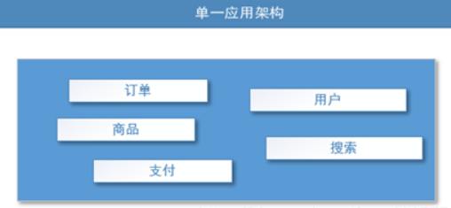
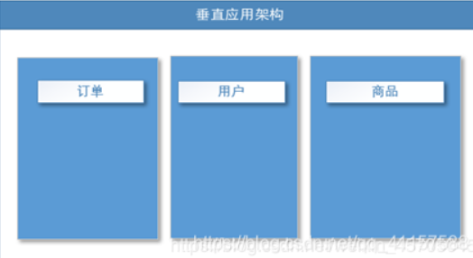
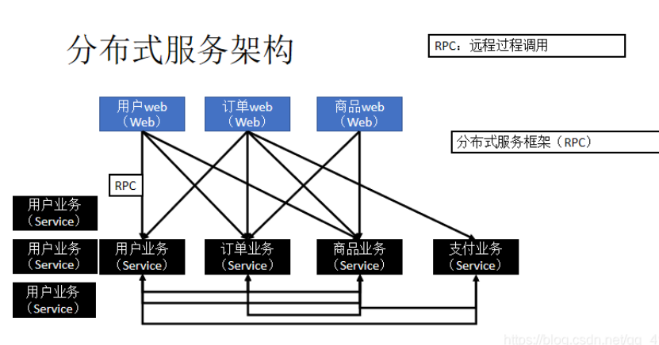
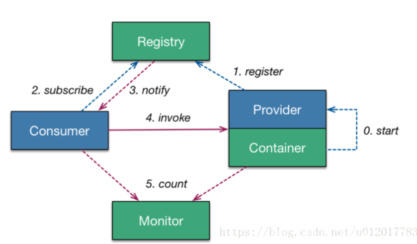
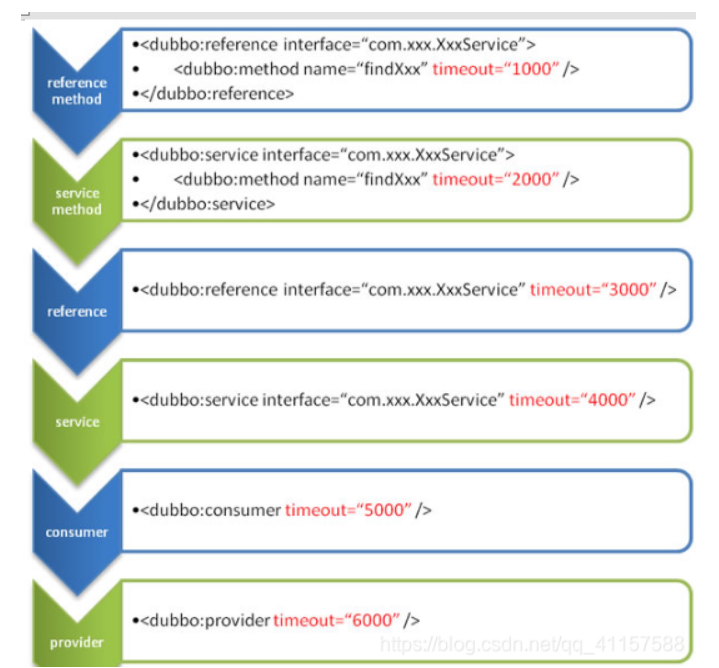
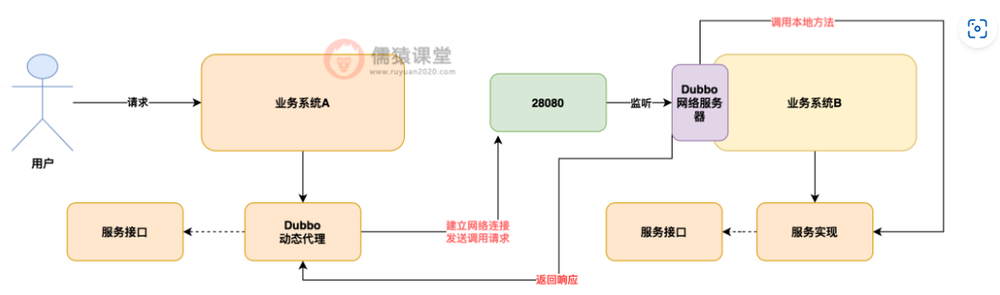

# 分布式简要说明

将一个完整系统拆分成多个服务，将每个服务单独的放到一个服务器中。

## 发展演变

ORM（单一应用架构）：一个项目装到一个服务器中，也可以多个服务每个都撞到一个服务器中。



MVC：讲应用分割成互不相干的小应用，每个小应用独立放到一个服务器上，那个访问量多就多加服务器



分布式架构：



SOA：在分布式应用架构基础上添加调度、治理中心基于访问压力试试管理集群容量，提高利用率。

## RPC简介

RPC：远程过程调用，一种进程间通信方式。允许程序调用另一个地址空间的过程或者函数而不需要显示的编写远程调用的细节。

**工作原理：**

* Client像调用本地服务似的调用远程服务；
* Client stub接收到调用后，将方法、参数序列化
* 客户端通过sockets将消息发送到服务端
* Server stub 收到消息后进行解码（将消息对象反序列化）
* Server stub 根据解码结果调用本地的服务
* 本地服务执行(对于服务端来说是本地执行)并将结果返回给Server stub
* Server stub将返回结果打包成消息（将结果消息对象序列化）
* 服务端通过sockets将消息发送到客户端
* Client stub接收到结果消息，并进行解码（将结果消息发序列化）
* 客户端得到最终结果。

clientstub和serverstub表示客户端存根和服务端存根，用于将本地方法调用转换成适合在网络上传播的请求，并处理从服务器返回的响应。

clientstub：

* **代理功能** ：它扮演本地代理的角色，使得客户端可以像调用本地方法一样调用远程方法。
* **参数序列化** ：将方法的参数序列化（Marshalling）成可以通过网络传输的格式（如二进制流、JSON、XML等）。
* **网络通信** ：通过底层网络协议（如TCP、HTTP）将序列化后的请求发送到服务器。
* **处理响应** ：接收从服务器返回的响应数据，并反序列化（Unmarshalling）成客户端所需的对象或数据。

server stub：

* **请求接收** ：接收从客户端传输过来的请求数据。
* **参数反序列化** ：将请求中的序列化参数反序列化成服务器端可用的参数。
* **调用本地方法** ：使用反序列化后的参数调用本地的服务实现。
* **响应序列化** ：将方法调用的结果序列化成适合在网络上传输的格式。
* **返回结果** ：通过网络将序列化后的响应数据传回给客户端。

RPC调用分为同步调用和异步调用。

# dubbo核心概念

高性能、轻量级的RPC框架。三大核心能力：面向接口的远程方法调用，容错与负载均衡，服务自动注册与发现。

## dubbo设计架构



服务提供者（Provider）：暴露服务的服务提供方，服务提供者在启动时，向注册中心注册自己提供的服务。
服务消费者（Consumer）: 调用远程服务的服务消费方，服务消费者在启动时，向注册中心订阅自己所需的服务，服务消费者，从提供者地址列表中，基于软负载均衡算法，选一台提供者进行调用，如果调用失败，再选另一台调用。
注册中心（Registry）：注册中心返回服务提供者地址列表给消费者，如果有变更，注册中心将基于长连接推送变更数据给消费者。
监控中心（Monitor）：服务消费者和提供者，在内存中累计调用次数和调用时间，定时每分钟发送一次统计数据到监控中心。

# dubbo特性

服务注册中心

- 相比Hessian类RPC框架，Dubbo有自己的服务中心， 写好的服务可以注册到服务中心， 客户端从服务中心寻找服务，然后再到相应的服务提供者机器获取服务。通过服务中心可以实现集群、负载均衡、高可用(容错) 等重要功能。
- 服务中心一般使用zookeeper实现，也有redis和其他一些方式。以使用zookeeper作为服务中心为例，服务提供者启动后会在zookeeper的/dubbo节点下创建提供的服务节点，包含服务提供者ip、port等信息。服务提供者关闭时会从zookeeper中移除对应的服务。
- 服务使用者会从注册中心zookeeper中寻找服务，同一个服务可能会有多个提供者，Dubbo会帮我们找到合适的服务提供者，也就是针对服务提供者的负载均衡。

负载均衡

- random 随机选提供者，并可以给提供者设置权重
- roundrobin 轮询选择提供者
- leastactive 最少活跃调用数，相同活跃数的随机，活跃数：指调用前后计数差。使慢的提供者收到更少请求，因为越慢的提供者的调用前后计数差会越大。
- consistenthash 一致性hash，相同参数的请求发到同一台机器上

简化测试

在开发阶段为了方便测试，通常系统客户端能指定调用某个服务提供者，那么可以在引用服务时加一个url参数去指定服务提供者。 配置如下：

```yml
 <dubbo:reference id="xxxService"interface="com.alibaba.xxx.XxxService"url="dubbo://localhost:20890"/>
```

服务版本，服务分组

在Dubbo配置文件中可以通过制定版本实现连接制定提供者，也就是通过服务版本可以控制服务的不兼容升级；当同一个服务有多种实现时，可以使用服务分组进行区分。

## dubbo配置

### 启动时检查

默认检查时开启的，会在启动时检查依赖的服务是否可用，不可用会抛出异常阻止初始化完成。可以通过check="false"关闭检查

```xml
<!--配置当前消费者的统一规则,当前所有的服务都不启动时检查-->
 <dubbo:consumer check="false"></dubbo:consumer>
```

### 全局超时配置

```xml
全局超时配置
<dubbo:provider timeout="5000" />

指定接口以及特定方法超时配置
<dubbo:provider interface="com.foo.BarService" timeout="2000">
    <dubbo:method name="sayHello" timeout="3000" />
</dubbo:provider>
```

配置原则：dubbo推荐在provider上尽量多配置consumer端属性

配置的覆盖规则：

1. 方法级配置别优于接口级别，即小Scope优先
2. Consumer端配置 优于 Provider配置 优于 全局配置，
3. 最后是Dubbo Hard Code的配置值（见配置文档）

如下图



下图就是将配置加到实现类上

```java
@DubboService(version = "1.0.0",interfaceClass=Service.class)
public class ServiceImpl implements Service{
     public String sayHello(String name){
          return "hello"+name;
     }
}
```

再使用的时候只需要这样：

@DubboReferrence(version = "1.0.0")

private Service service;


# dubbo与springboot整合

1、将服务提供者注册到注册中心(如何暴露服务)
1.1导入Dubbo的依赖 和 zookeeper 客户端

2、让服务消费者去注册中心订阅服务提供者的服务地址
Springboot与Dubbo整合的三种方式
2.1导入dubbo-starter。在application.properties配置属性，使用@Service【暴露服务】，使用@Reference【引用服务】
2.2保留Dubbo 相关的xml配置文件
导入dubbo-starter，使用@ImportResource导入Dubbo的xml配置文件

3、使用 注解API的方式
将每一个组件手动配置到容器中,让dubbo来扫描其他的组件

高可用性：

- 多注册中心，dubbo支持配置多注册中心，一个注册中心不可用自动切换
- 存在多种负载均衡策略，随机、轮询等保证部分服务失效的时候，可以合理分配到服务节点。
- zookeeper宕机后还可以消费dubbo暴露的服务

健壮性：

- **本地缓存** ：Dubbo客户端在启动时会从ZooKeeper注册中心获取服务提供者列表，并将这些信息缓存到本地。当ZooKeeper宕机时，Dubbo客户端可以继续使用本地缓存的服务列表进行调用。
- **服务提供者的稳定性** ：服务提供者在注册到ZooKeeper后，即使ZooKeeper宕机，提供者自身并不会受到影响，继续正常提供服务。

负载均衡策略：

# dubbo原理

用到的时动态代理，这里每个实现类都实现了一个接口，所以dubbo会生成一个针对接口的动态代理对象，注入给了Service这个变量。

且dubbo中没有使用CGLIB做代理，而是使用JDK和Javassist来做动态代理


怎么选择动态代理方式？

<dubbo:provider proxy="jdk" />或<dubbo:consumer proxy="jdk" />  默认情况下使用Javassist来进行动态代理。

 
