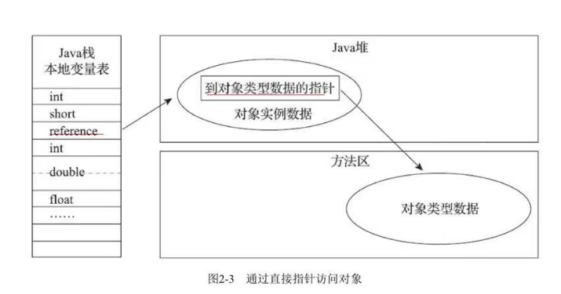
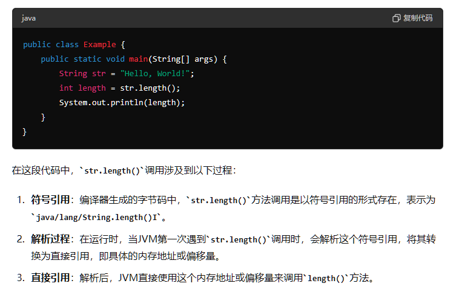
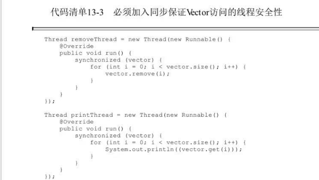

# 简介

JDK：java程序设计语言、Javac、Java类库、Java虚拟机，Java开发工具包

JRE：Java虚拟机+Java类库，Java运行环境

JavaEE-Java企业版,JavaSE-Java标准版,JavaME - JDK版本

Oracle JDK与OpenJdk：一个商用一个开源，二者之间的差距很小。

HotSpot：某种虚拟机（还有classic，Harmony(Apache)等）

# 内存区域

## 概述

虚拟机自动内存管理机制使得不需要为每一个new操作写delete/free代码，不容易出现内存泄漏与溢出问题。

## 运行时数据区域

java代码执行 

### 线程隔离区

#### Java虚拟机栈

每个Java方法执行的时候JVM都会创建一个栈帧，用于存储局部变量表，操作数栈，动态连接等信息。方法从调用到执行完毕意味着入栈到出栈。

局部变量表：存放编译期可知的各种Java虚拟机基本数据类型、对象引用，以局部变量槽表示存储空间。进入一个方法时，方法需要占用的局部变量槽数量是不会变化的。

当线程请求的栈深度大于虚拟机所允许的深度时，会抛出StackOverFlow异常。如果Java虚拟机栈容量可动态扩展，当栈扩展到无法申请足够内存时会抛出OutOfMemory异常。(HotSpot虚拟机栈容量不可动态扩展，不会出现OutOfMemory情况）

#### 本地方法栈

与Java虚拟机栈概念类似。不过Java虚拟机栈执行的Java（字节码）方法，本地方法栈则是为虚拟机适用的本地方法（C，C++，汇编编写的，比较底层的方法）服务。同样存在虚拟机栈的问题。并且他的具体实现方式可以按需要实现，比如有的（Hot-Spot）会把本地方法栈和虚拟机栈合二为一。

#### 程序计数器

记录当前线程执行的字节码的行号指令，每条线程都有一个独立的程序计数器，用于在单核cpu切换线程的时候能恢复到正确位置。不会出现OutOfMemory情况。

### 线程共享区

#### 方法区

用于存储已被虚拟机加载的类型信息、常量、静态变量、即时编译器编译后的代码缓存等数据。（永久代-因为HotSpot虚拟机将收集器的分代扩展到了方法去，或者说使用永久代实现方法区，JDK8中已经废弃了永久代的说法，而是使用在本地内存中实现的元空间），会抛出OutOfMemoryError的异常。

**运行时常量池**-方法区的一部分，用于存放编译器生成的各种字面量和符号引用，将在类加载后存放到运行时常量池。也会抛出OutOfMemoryError的错误

#### 堆

用于存储对象实例；是垃圾收集器管理的区域，堆既可以是固定的也可以是可扩展的，会抛出OutOfMemoryError的异常

### 直接内存

会导致OutOfMemoryError但不属于运行时数据区的一部分。这是NIO引入了一种基于通道和缓冲区的IO方式，可以使用Native函数库直接分配堆外内存，然后通过存储在Java堆中的对象作为这部分内存的引用进行操作。避免在Java堆和Native堆中来回复制。（分配可供堆内直接操作的堆外引用）

## 虚拟机堆中对象分配、布局和访问的全过程

### 对象创建

1 jvm遇到new指令，先检查这个指令的参数能否在常量池中定位到一个类的符号引用，并检查这个符号引用代表的类是否被加载、解析初始化过，没有则先进行类加载过程。之和为新生对象分配内存，内存大小在类加载完成后就确定了。

**内存分配方式：**

- 指针碰撞-规整的Java堆，有新对象指针就往空闲方向移动（仅限于垃圾回收器会将空闲区与分配区分开-空间压缩整理能力。例如serial，parnew）
- 空闲列表-维护一个列表，列表记录哪些内存块可用。（对于cms这种基于清除算法的垃圾收集器，只可以用空闲列表分配）

内存分配的并发问题

- 对分配内存空间做同步处理，CAS配上失败重试
- 每个线程在堆中预分配一块内存，本地线程分配缓冲，只在本地缓存用完需要分配新的内存区时才需要同步。

2 在内存分配完以后，将分配到的内存空间初始化为0。

3 对对象进行必要设置，如何找到对象元数据，对象是哪个类的实例，对象的GC年龄，这些在对象的对象头（对象头根据是否启用偏向锁等有不同的设置方式）中，对象哈希码（调用hashcode时候才会计算）。

4 构造函数的执行。

### 对象内存布局

对象在堆中的布局可以分为：对象头、实例数据、对齐填充。

**对象头**

- MarkWord-存储对象自身运行时数据-哈希码、GC年龄、锁状态标志、线程持有的锁、偏向线程ID、偏向时间戳
- 类型指针-对象指向他的类型元数据的指针，可以找到对象是哪个类的实例。
- 如果对象是一个Java数组，对象头中还要有一块用于记录数组长度的数据。否则无法通过元数据信息推断出数组的大小。
- markword存储内容，32个比特，25个存储哈希，4个存储分代年龄，2个存储锁标志位。

**类的元数据**-加载完类以后除了会生成一个Class类对象，还会在方法区生成一个类的字节码二进制数据（方法代码、变量名、方法名、访问权限等）

**实例数据**

- 各个类型的字段内容

**对齐填充**-不一定需要存在的

#### 对象访问定位

可以通过栈上referrence数据操作堆上的具体对象，只是一个引用，具体定位方式取决于虚拟机。

- 句柄访问，堆中会分配句柄池。一个referrence指向的句柄池对象，两个指针一个指向堆中实例池的对象实例数据，一个指向方法区的对象类型数据。 
- 直接访问，reference存储的就是对象地址。 

好坏，句柄访问多了一个存储空间，但是在移动对象时候只需要改变句柄池中的数据。直接访问开销小。HotSpot采用直接访问的方式。

### OutOfMemoryError实战

#### java堆内存溢出报错 Java heap space

可能由内存溢出或者内存泄漏两种原因导致。

内存溢出：

创建了大量对象，这些对象占据了大量内存导致垃圾回收器无法及时回收。（程序处理大量数据；短时间创建大量对象；缓存数据过多）。

增加堆内存大小；优化高内存消耗处的代码。

内存泄漏：

对象不再使用但仍然被引用，无法被垃圾回收。（应用程序逻辑错误导致对象引用无法解除；不恰当使用第三方库导致对象引用未释放；持有长时间引用的静态集合类未清理）。

使用内存分析工具，查看泄露对象的引用路径找到内存泄漏的对象和代码位置。避免在长生命周期对象中持有短生命周期对象的引用。

#### 虚拟机栈与本地方法栈不足

可能由线程请求栈深度大于虚拟机允许的最大深度，StackOverFlowError

如果虚拟机栈内存运行动态扩展，当扩展栈无法申请到足够内存时候就会报OutOfMemoryError。（HotSpot无法动态扩展，所以不会报这个错误）

#### 方法区与运行时常量池

自JDK7起，原本存在于永久代的字符串常量池被移动到了Java堆中。

在JDK6中限制方法区容量，并循环生成String会报错，OutOfMemoryError:PermGen Space

之后的只有在JDK7及以上中限制堆的容量，循环生成String报错，OutOfMemoryError:Java heap space.

String的intern()方法，会在当前类常量池中查找是否存在于str等值的String如果存在就直接返回这个String的引用，不存在则在常量池中创建一个String并返回引用。

详情可以看到第98页，上面有提单jdk6与7中的intern，因为6中的intern()是永久代的引用，而StringBuilder的toString是堆上的所以不可能相等。而在7中都移到了堆，所以对第一种是相等的，第二种java在一开始就已经移进去了所以会不相等。

方法区-产生大量类来填充直到溢出即可。

JDK8以后永久代便退出了，元空间作为替代者，所以很难让虚拟机出现方法区溢出的异常。但可以设置元空间的最大值，MaxMetaspaceSize

#### 本机直接内存溢出

直接内存由MaxDirectMemorySize指定，由直接内存导致的内存溢出，不会再heap文件看到异常情况。如果内存溢出后dump文件很小，程序又直接或简介使用了DirectMemory，可以检查下这部分内容。

**直接内存**：由ByteBuffer.allocateDirect()分配的内存，由操作系统管理而不是JVM。分配释放的开销大，但是读写性能高。通过减少Java堆与本地内存直接的拷贝次数，对于大数据量如网络文件读写，直接内存可以提升效率。需要显示管理；不受jvm回收机制管理需要手动释放
**堆内存**：由JVM管理，易于使用，垃圾回收及自动管理。对于频繁的IO操作，会有性能瓶颈，因为需要在堆内存和本地内存之间拷贝。

**二者关系**：互补混合使用

# 垃圾收集机制

## 概述

机制管理范围：

堆与方法区。因为程序计数器、虚拟机栈、本地方法栈随着线程或者方法结束时候就自然回收了。

关注的事情：

- 哪些需要回收？
- 什么时候回收？
- 如何回收？

直接调用System.gc()可以触发垃圾回收

## 哪些对象需要回收

### 引用计数法

在对象中添加一个引用计数器，每当有地方引用他就+1，引用失效就-1，当计数=0时候对象就不可再使用。但这种简单的计数无法解决循环引用的问题。Java虚拟机也不是通过这种方式判断对象是否存活。

### 可达性分析算法

通过一系列叫做GC Roots的跟对象作为起点，根据引用关系向下找路径（引用链）。如果对象到GCRoots之间没有任何引用链就说明这个对象不可达/不可被使用。

**GCRoots**:

- 虚拟机栈（栈帧中的本地变量表）引用的对象，各个线程方法中用到的参数、局部遍历、临时变量
- 方法区中类静态属性引用的对象，譬如Java中的static
- 方法区中常量引用的对象，比如字符串常量池中的引用
- 本地方法栈JNI（Native方法）中引用的对象
- Java虚拟机内部的引用，如基本数据类型的Class对象，常驻的异常对象，系统类加载器
- 所有被同步锁（synchronized）持有的对象
- 反映Java虚拟机内部情况的JMXBean、本地代码缓存等
- 有的垃圾回收器是分区域的，所以还有其他区域之间的引用。

```java
public class GCRootsExample {
    private static Object staticVar; // staticVar 是 GC Root

    public static void main(String[] args) {
        Object a = new Object(); // 对象 A
        Object b = new Object(); // 对象 B
        Object c = new Object(); // 对象 C

        staticVar = a; // staticVar 引用了 A
        a = b;         // A 引用了 B
        b = c;         // B 引用了 C

        // 现在引用链为 staticVar -> A -> B -> C
        System.gc(); // 触发 GC
    }
}

```

### 引用

**引用：**

JDK1.2之前-如果Referrence数据存储的数值代表的是另一块内存的起始地址。

JDK1.2之后

- 强引用-传统引用关系 Object obj=new Object()
- 软引用-系统将要内存溢出前，会将这类对象进行第二次回收，如果这次回收内存还不够才会抛出内存溢出异常。SoftReference
- 弱引用-对象只能生存到下一次垃圾收集发生为止。WeakReference
- 虚引用-为了在这个对象被收集器回收时收到一个系统通知.PhantomReference

强引用与弱引用对比参照文件TestReference与TestWeakReference

### 最后一次回避垃圾回收的机会

可达性分析对于不可达的对象要进行两次标记，第一次标记后会进行一次筛选，筛选条件-此对象是否有必要执行finalize方法，如果对象没有覆盖finalize或者finalize方法已经被调用过，那就没必要执行。

如果有必要执行，会放在队列中，Finalizer线程执行他们的finalize方法。如果finalize方法中关联到了引用链（将本身this复制给了对象成员）就解救了。

finalize缺点-不确定性大，无法保证调用顺序。

### 回收方法区

方法区的垃圾回收包括：废弃的常量；不再使用的类型

废弃的常量-没有任何字符串对象引用常量且没有其他地方引用也会发生垃圾回收。

不再使用的类型：

- 类的所有实例都被回收，且不存在该类以及任何派生子类
- 类加载器以及被回收。除非是可替换的类加载器否则很难达成
- 该类的java.lang.Class对象没有地方引用，无法通过反射访问该类的方法。

对满足以上三个条件只是允许被回收，而且还要加虚拟机配置才可以删除。

## 垃圾回收算法

从如何判定对象消亡的角度分为引用计数式垃圾收集以及追踪式垃圾收集。直接垃圾收集与间接垃圾收集。

### 分代收集理论

分代假说：

- 弱分代假说：绝大数对象朝生息死
- 强分代假说：熬过越多次垃圾收集的对象越难被消灭
- 跨代引用假说：跨代引用相较于同代引用是极少的。

根据前两条分代假说形成了垃圾回收器的设计原则，分区域回收，至少分成两个区域新生代和老年代，在新生代中存活对象会逐步晋升到老年代。

对于跨代引用根据第三条假说，只需要在新生代上建立一个全局数据结构（记忆集），记录老年代中的哪一部分存在跨代引用，只有包含了跨代引用的小块内存里的对象才会被加入GCRoots扫描。

**收集：**

部分收集

- 新生代收集
- 老年代收集
- 混合收集

整堆收集：对堆和方法区收集

### 标记-清除算法

标记阶段-判定哪些对象需要收集

清除阶段-回收所有被标记的对象。

缺点

- 执行效率不稳定，需要回收的对象变多就会提升时间效率。
- 容易出现碎片化空间。

### 标记-复制算法

标记阶段-标记存活的

复制阶段-将存活的复制到另外一块区域，现在这块直接清除。

案例：Appel式回收：将新生代分为Eden和两块小Survivor（8：1：1），分配使用Eden和一块Survivor，垃圾回收直接使用另外一块Survivor，剩余的清理.当Survivor不足以容纳存活对象时候，依赖老年代进行担保，这部分对象直接进入老年代。HotSpot的一些虚拟机用的就是这种

### 标记-整理算法

标记-标记存活的

整理-将存活的整理到一端，剩下的清除。

主要针对老年代，存活率较高的情况。

### 比较

标记-整理与标记-清除，移动使内存回收变复杂，不移动使得内存分配更复杂。有一种方式就是大部分时候使用标记清除，受不了再使用标记-整理。

标记整理在移动内存时候需要全部暂停，耗时比较长。标记清除也需要暂停，但时间没有那么长

## 算法细节

### 根节点枚举

必须暂停用户线程，因为需要通过快照的方式记录某一个时刻的情况。

对象上存在一个叫OopMap的数据结构存放对象引用，不需要逐个扫描方法区。

### 安全点

因为在某个对象上都存储OopMap消耗太大，所以只在特定位置（安全点）记录，所以程序必须在到达安全点后才可以暂停。

安全点选择问题：不能太少也不能太频繁。只有有长时间执行（指令序列复用），如方法调用、循环跳转等才有这种情况。

垃圾收集发生时如何跑到最近的安全点：

- 抢先式中断：先终端所有线程，没有到安全点的让他重启跑到安全点再中断。（现在几乎没有虚拟机这样做
- 主动式中断：垃圾收集器需要中断线程时，不主动操作线程，而是让设置标志位，线程会主动轮询标志，当标志为真就在最近的安全点主动挂起。标志的地方和安全点是重合的。（HotSpot将轮询操作精简至一条汇编指令）

### 安全区域

场景：当用户线程处于sleep状态时候呢？

安全区域指：再一段代码内引用关系不会发生变化，任意地方开始进行垃圾收集都是安全的。

用户线程执行到安全区域时候会标记自身，垃圾回收器无需管安全区域内线程。线程离开安全区域是会检查是否已完成了根节点枚举，完成了就继续执行；没完成就一直等待。

进入sleep/block状态以后就进入了安全区域。

### 记忆集与卡表

记忆集：新生代建立记忆集避免将整个老年代加入gc roots扫描。

精度：

- 字长精度：精确到字长，该字含跨代指针
- 对象精度：精确到对象，对象含有跨代指针
- 卡精度：精确到内存区域，使用的是卡表（记忆集的一种具体实现）

**卡表**：字节数组存储，每个元素对应一块区域，存在跨代指针将这个数组元素标为1，只需要筛选为1的数据即可

### 写屏障

HotSpot虚拟机通过写后屏障维护卡表。写屏障相当于对引用赋值的AOP切面。

伪共享问题：多线程修改相互独立变量，如果变量恰好共用一个缓存行就会彼此影响（因为缓存一致性协议（Modified\exclusive\shared\invalid）写回、无效化、同步）导致性能降低。

解决方式：添加一个判断，如果卡表为脏再去修改。（避免不必要的写操作以降低冲突概率）

**缓存一致性协议：**

modified

* 当一个处理器修改了缓存行中的数据时，会将该缓存行的状态置为Modified。
* Modified状态表示该缓存行中的数据已经被修改，与主存中的数据不一致。

exclusive

* 当一个处理器拥有某个缓存行的独占访问权限时，该缓存行的状态为Exclusive。
* Exclusive状态表示该缓存行中的数据与主存中的数据一致，并且当前处理器是唯一一个拥有该数据的处理器。

shared

* 当多个处理器共享同一个缓存行中的数据时，该缓存行的状态为Shared。
* Shared状态表示多个处理器拥有相同的缓存行数据，并且数据与主存中的数据一致。

invalid

* 当一个处理器将缓存行标记为Invalid时，表示该缓存行中的数据无效，即该数据已经过时或者失效。
* Invalid状态可能发生在某个处理器修改了数据后，其他处理器的缓存行需要更新，或者某个处理器不再需要缓存行中的数据时。

### 并发可达性分析

重点需要解决的就是对象消失的问题，也就是三色标记法（推导方法）中本来是黑色的对象错误的标记为白色。

- 赋值器插入了从黑色对象到白色对象的引用。
- 赋值器删除了全部从灰色对象到该白色对象的直接或间接引用。

解决这两个问题需要增量更新和原始快照。

增量更新解决第一个问题：当黑色对象插入新的指向白色的引用关系时就记录下来，再以这些记录的黑色重新扫描一次。

原始快照解决第二个问题：当灰色要删除指向白色的引用关系时，将要删除的引用记录下，再重新扫描一次，按照刚开始的快照来。

## 经典垃圾收集器


**并行**：多条垃圾收集器线程之间关系

**并发**：垃圾收集器与用户线程之间关系

带连线表示可以配合用。

### 新生代

#### serial

适合单核，采用标记-复制算法，需要暂停所有用户线程


#### parnew

采用标记-复制，暂停所有用户线程；多线程垃圾回收。


#### parallel scanvage

标记-复制；多线程；吞吐量优先；并行

存在一个参数UseAdaptiveSizePolicy，这个开关打开后会动态调整细节参数以达到设定的吞吐量。

吞吐量设置：-XX: mAXgcPauseMills

本身就存在老年代收集的收集器：PSMarkSweep但实现方式与SerialOld一样。

#### 比较

parallel scanvage关注于达到可控制的吞吐量，吞吐量=运行用户代码时间/（运行用户代码时间+运行垃圾收集器时间）

cms关注尽可能缩短用户线程的停顿时间

### 老年代

#### CMS

#### SERIAL OLD

标记-整理。


#### PARALLEL OLD

paraller scanvage收集器的老年版本

标记-整理


#### cms

基于标记-清除。优点：并发收集。低停顿

**步骤：**

- 初始标记-标记与GCRoots直接关联引用的对象
- 并发标记-根据对象开始遍历整个GCRoots调用链
- 重新标记-使用增量更新修正新引用
- 并发清除-并发清除已经死亡的对象，不需要移动


缺点：

- CMS堆处理器资源很敏感，并发阶段会占用线程
- 无法处理浮动垃圾（并发标记和重新标记阶段产生的垃圾对象）
- 需要预留内存给用户线程使用，不能像其他收集器引用等待老年代满了再收集
- 存在空间碎片（一个jdk9以后失效的参数-用于指定n次垃圾回收以后进行碎片整理）

不用记：因为CMS于hotspot内存管理、执行等各个子系统关联紧密不符合解耦，规划jdk10时统一垃圾回收接口，cms等都做了重构

### 兼具

#### G1

**特点**

JDK9以后，取代Parallerscanvage+paralellold成为服务端默认的垃圾收集器。

停顿时间模型-支持再M毫秒时间长度上消耗在垃圾收集上不超过N毫秒的目标。

面向堆的任何部分组成回收集（Mixed gc），基于Region（每个Region按需要扮演Eden，Survivor或者老年代角色，对不同Region采取不同措施，还有针对大对象（超过Region大小一般）的Humonogous区域）的堆内布局。

价值优先：跟踪各个Region里回收空间获得的大小以及回收所需时间，维护一个回收优先级。

可以由用户指定停顿时间

整体：标记-整理；局部：标记-复制

**问题及解决方案**

跨Region引用：每个Region维护一个记忆集（key是其他Region起始地，value是卡表索引），Region是记录了双向的引用关系。

并发的标记问题：G1采用原始快照的方式，并创建两个指针，在这两个指针内记录并发阶段的新对象分配

停顿预测模型：衰减均值，记录每个Region的回收耗时、脏卡数量等分析出相应指标。回收哪些Regioin才能在不超过期望停顿时间下获得最高预期。

**步骤**

- 初始标记：标记与GCRoots直接相连的对象。
- 并发标记：做可达性分析，扫描完以后还要对SATB指针内的记录做处理。
- 最终标记：处理并发阶段遗留的记录。
- 筛选回收：排序Region的回收价值，并指定回收计划。


#### cms与G1比较

- G1不会产生大量内存碎片
- 可以指定停顿时间
- G1的额外负载更高
- G1的卡表实现更复杂，而且所有Region都有卡表
- 需要使用写后更新卡表，G1还需要使用写前屏障跟踪并发时指针变化情况。
- G1原始快照可以避免像CMS那样在最终标记阶段停顿时间过长。

#### 总比较

CMS和G1之前的垃圾收集器都会全部停止用户线程，而cms最终依然要做空间碎片的整理还是要暂停。

### 低延迟垃圾收集器

垃圾收集器标准：内存占用、吞吐量（用户代码运行时间占总时间比重）、延迟（停顿时间）

例子：ZGC/Shenandoah，只有初始标记和最终标记由短暂停顿，且停顿时间固定。

#### Shenandoah

基于Region；存在大对象存储；回收价值最高

与G1不同处：支持并发整理，G1回收是并行的但不是并发的；默认不使用分代；放弃了记忆集改用连接矩阵（RegionN有对象指向RegionM，则在矩阵打上标记）记录引用关系。

阶段：

- 初始标记，与G1一样，标记与GC Roots直接相连
- 并发标记，与G1一样，标记全部可达
- 最终标记，与G1一样，原始快照处理新对象
- 并发清理，清理整个区域一个存活对象都没有的Region
- 并发回收。核心差异在于他是用到标记-复制到其他未使用的Region，而且还在移动过程中保证了并发让用户线程可以访问。（通过读屏障以及转发指针）
- 初始引用更新。并发回收后将堆中指向旧对象的引用指向新地址的准备工作，建立一个线程集合点，保证所有收集器线程已经完成了移动任务。造成短暂停顿。
- 并发引用更新。真正开始进行引用更新。
- 最终引用更新。修正存在于GC Roots的引用，最后一次停顿，只与GCroots数量相关
- 并发清理。所有Region都没有存活对象。

**并发回收工作：**

在原有对象布局结构前加一个引用字段，不移动时，该引用指向自己。移动后，将该字段指向新副本。

会存在并发问题。

- 收集器线程复制了副本
- 用户线程更新了字段
- 收集器线程更新转发字段的引用值为新地址

如果事件2发生在1，3之前的话，用户访问操作在旧的对象上。所以这里收集器线程与用户线程的访问只有一个能成功，采用CAS，避免交替进行。

为了实现转发指针，该收集器在读写屏障中加入了额外的转发处理。jdk13中计划修改读屏障的影响，由内存屏障改为基于引用访问屏障（只拦截对象数据类型为引用类型的读写操作）。

#### ZGC垃圾回收器

基于Region，分为小（容量2M）中（容量32M）大型（2M的整数倍，一个大型只会存储一个大对象）

并发整理算法，同样使用读屏障，但是是采用染色指针算法。使用了64位中的剩下可用的46位地址中的4位，来记录对象三色标记状态、是否进入重分配集（被移动过），是否只能通过finalize访问。导致他能管理的内存不超过4TB

优点：

- 一旦Region的存活对象被移走后，这个Region立马可以被回收，而不需要整个堆中指向他的引用都被修正后才能清理
- 减少内存屏障的使用数量
- 染色指针可以作为存储结构来记录更多与对象标记相关的数据。

问题：

- 操作系统、处理器是否支持
- 寻址问题，染色指针可以通过虚拟内存与实际地址之间的映射解决。

流程：

- 并发标记-标记是在指针上而不是对象上
- 并发预备重分配-统计哪些Region要被清除，每次都会扫描全部的Region
- 并发重分配-将重分配对象复制到新的Region，并且维护一个转发表记录新旧对象之间的转发关系。因为染色指针，访问时候就知道这个对象是不是在重分配了，那如果正在的话就直接根据转发表访问新地址。
- 并发重映射-修正全部旧对象的引用

比较

- 完全没有使用记忆集以及写屏障。导致对象分配速度也不会太高。低延迟的目标；内存分配与回收的竞争问题。

### 垃圾收集器权衡

应用的基础设施；JDK发行商；遗留系统，基础设施与JDK比较落后（4-6G以下的堆内存使用cms，更大点考虑G1）；无法使用商业但能使用比较新的版本注重低延迟（zgc）

### 内存分配与回收策略

对象优先在Eden分配。

大对象（长字符串；数组）直接进入老年代。

长期存活的对象进入老年代。

动态对象年龄判定（如果Survivor空间中相同年龄所有对象大小总和大于Survivor空间一半，年龄大于等于该年龄对象直接进入老年代）。

空间分配担保（老年代最大可用连续空间大于新生代所有对象空间）。JDK6之后只要老年代连续空间大于新生代对象总大小或者历次晋升的平均值就会进行MinorGC否则FullGC

# 虚拟机性能监控、故障处理工具

jstack:java堆栈跟踪根据

jhat：虚拟机堆栈转储快照分析工具

JConsole,JMC:可视化工具1

# 调优案例分析与实战

# 类文件结构

## 无关性基石

Java平台无关的基石便是字节码文件，所有的文件最后都会翻译成.class字节码文件。java是平台无关，jvm是语言无关（JRUBY和Groovy都可以转换成字节码文件后运行）。

## class类文件结构

任何一个Class文件都对应着唯一一个类或接口的定义信息。

Class文件采用类型C语言结构体的伪结构来存储数据，这种伪结构只有无符号数（u1,u2,u4,u8）和表（由多个无符号数或者其他表组成的复合数据类型，所有表都以_info结尾，整个Class就是一个表）。这里与Java的伪泛型无关。

### 魔数与class文件版本

头四个字节-魔数，确定文件是否为C虚拟机可以接受的Class文件。

5-8个字节，Class文件版本号。头两个为次版本号，后两个为主版本号。

### 常量池

紧接着主次版本号后面的就是常量池入口，Class文件中的资源仓库。

头两个字节为常量池容量，表示常量池中有多少个常量（常量池容量为0X0016=22说明有21个常量，只有常量池的容量计数从1开始）。

常量池中存放两大类常量：字面量和符号引用。

**字面量**

文本字符串与声明为final的常量值

**符号引用**

- 被模块导出或者开放的包
- 类和接口的全限定名
- 字段的名称和描述符
- 方法的名称和描述符
- 方法句柄和方法类型
- 动态调用点和动态常量

Java的Javac编译时候不存在连接，而是在虚拟机加载Class文件时候做动态连接（C和C++会连接目标文件解析所有符号引用生成一个可执行文件）。Class文件中不会保存各个方法、字段在内存中的布局信息。虚拟机做类加载时候，获取符号引用然后再在类创建运行时解析到具体内存地址。

常量池中的常量每一项常量都是一个表。

常量表有比如CONSTANT_Utf8_info：UTF-8编码的字符串。等总共17类

由于Class文件中方法、字段都需要CONSTANT_Utf8_info型常量来描述名称，所以CONSTANT_Utf8_info型常量的最大长度也就是Java中方法、字段名的最大长度。所以也就是length最大值，u2的65535

### 访问标志

常量池之后的两个字节代表访问标志，用于识别类活接口层次的访问信息，包括：Class是类还是接口；是否为public等。如下图


### 类索引、父类索引与接口索引集合

类索引、父类索引都是u2，接口索引是一组u2。

类索引用于确定类的全限定名，父类索引用于确定父类的全限定名，除了Object以外所有类的父索引都不为0。

这些类索引指向一个类型为CONSTANT_class_info类描述符常量，然后根据该类描述符常量中的索引可以找到一个Constant_UTF8_INFO类型的常量中的全限定名字符串。


对于接口索引

第一个u2数据是接口计数器，如果没有接口则计数值为0，那么接口索引表不占用字节。

全限定名：包名+类名。

### 字段表集合

第一个u2类型为容量计数器，记录有多少个字段。

用于描述接口或者类中声明的遍历。包括类级变量（static变量）以及实例变量（类中的属性）。

Java语言描述一个字段包含的信息：作用域(public，private，protected）；是否实例变量；可变性（final）；并发可见性（volatile,是否强制主从内存读写）;可否被序列化（transit），字段数据类型（基本类型，对象，数组），字段名称；

如字段的名字以及数据类型都只可以通过引用常量池中的常量来描述。


跟随access_flag的是name_index和descriptor_index，都是对常量池项的引用，分别表示字段的简单名称以及字段和方法的描述符。

**简单名称、全限定名、描述符：**

- 全限定名就是例如java/lang/Object这个是类的全限定名，类全名中的.换成/，
- 简单名称就是(inc()的就是inc)，
- 方法和字段的描述符：字段的数据类型，方法的参数列表（数量、类型以及顺序）和返回值


对于数组类型，比如String[][]，他的描述符就是[[Ljava/lang/String

描述符描述方法：先参数列表后返回值，按照参数的顺序放在一组小括号中，比如java.lang.String toString()为()Ljava/lang/String

字段表集合不会列出父类或者父接口中继承的字段，但有可能出现原本代码中不存在的字段，比如内部类为了保持对外部类的访问，编译器会自动添加指向外部类实例的字段。

java中字段无法重载，两个字段的数据类型、修饰符无论是否相同都要使用不同名称，但对于class文件而言只要描述符不完全相同字段重名合法。

### 方法表

包括，访问标志、名称索引、描述符索引、属性表集合。


方法里的Java代码就放在属性表的Code属性中。

Java方法的重载-Overload：除了要与原方法一致的名称以外，还必须有一个不同的特征签名-一个方法中各个参数在常量池中的字段符号引用的集合，而返回值不再特征签名中，。以上是在Java语言中

但在Class文件中，只要描述符不一致的两个方法都可以共存。

### 属性表集合

## 字节码指令简介

Java虚拟机的指令由一个字节长度、代表某种操作含义的数字（操作码）以及气候的参数（操作数）组成。java使用的是操作数栈

# 虚拟机类加载机制

## 类加载时机

类的生命周期中，加载验证准备初始化和卸载五个阶段顺序是确定的。解析阶段可能在初始化之后再开始（解析将符号引用（保存在类文件的常量池中以字符串形式，如全限定名）转化为直接引用（指向对象的直接指针，指向目标的句柄等），过程可能是懒加载的。当一个静态方法被调用时如果该方法引用了其他类或类中的静态字段，JVM可以在第一次使用该引用时候进行解析）也可能在初始化的过程中。


JAVA虚拟机规范只规定了6仲情况必须对类进行初始化（加载、验证、准备一定在之前）

- 遇到new,getstatic,putstatic\invokestatic这四条字节码指令时，如果类型没有进行初始化那必须触发初始化阶段。（生成这四条指令的场景，new实例化对象；读取或设置一个类型的静态字段（被final修饰或已在编译器把结果放入常量池的静态字段除外）；调用一个类的静态方法）。
- 使用反射的方法对类型进行反射调用时，如果类没有进行初始化，必须先触发初始化
- 当初始化类时候，如果父类还没有进行过初始化，必须先触发父类的初始化
- 虚拟机启动时候，需要制定一个主类，会先初始化主类
- 当接口定义了jdk8加入的默认方法（default修饰的接口），如果这个接口的实现类发生初始化，那该接口在其之前被初始化
- 当使用JDK7新加入的动态语言支持时，如果一个java.lang.invoke.MethodHandle实例最后的解析结果为ref_getstatic,ref_putstatic,ref_invokestatic,ref_newinvokestatic四种类型的句柄，并且这个方法句柄对应的类没有进行过初始化，那该接口要在其之前被初始化。

同样以上六种时对一个类型进行主动引用，除此以外，所有引用类型的方式都不会触发初始化，被称为被动引用。

被动引用示例：

- 通过子类引用父类的静态字段不会导致子类初始化 
- 通过数组定义引用类，不会触发类的初始化，这个就不需要图片了
- 常量在编译阶段会存入调用类的常量池（编译阶段常量传播优化已经存到NotInitialization中了），本质上没有直接引用到定义常量的类，不会触发常量类的初始化 

接口与类加载过程的区别在于，第三点类初始化时候需要父类全部初始化过，但是接口在初始化时候并不要求其父接口全部完成了初始化，只有在用到父接口（引用接口中定义的常量）才会初始化

### 类加载过程

#### 加载

加载阶段的事情

- 通过类的全限定名获取类的二进制字节流（从zip，网络中都可以）
- 将字节流代表的静态存储结构转化为方法区的运行时数据结构
- 内存中生成一个Class对象，作为方法区这个类各种数据的访问入口

非数组类型的加载是类加载过程中最可控的阶段，开发人员可以通过自定义类加载器控制字节流的获取方式（重写一个findClass或loadClass方法）

数组类型的加载：

- 数组的组件类型是引用，递归采用加载过程加载这个组件类型
- 如果数组的组件类型不是引用(int[])，将会把数组C标记为与引导类加载器（jvm最底层的类加载器，负载加载核心Java类库，没有父类加载器；用原生代码写的；不可直接访问且没有实例对象）关联。
- 数组的可访问下与他组件类型的可访问性一致，如果不是引用，数组类的可访问下默认为public

#### 验证

验证是连接的第一步，确保Class文件字节流中的信息符合jvm规范的约束要求。

- 文件格式验证-魔数；主次版本号；常量池中是否有不被支持的常量类型等。
- 元数据验证-字节码的信息进行语义分析，类是否有父类；类的父类是否继承了不允许被继承的类（final修饰的类）；类不是抽象类是否实现了父类与接口要求的所有方法。
- 字节码验证-对类的方法体做验证（Class文件的Code属性），方法体中的类型转化有效（没有把父类对象赋值给子类数据）
- 符号引用验证-虚拟机将符号引用转化为直接引用的时候。通过全限定名能否找到对应类。符号引用的类、字段、方法可访问性能否被当前类访问。

#### 准备

为类中定义的变量（被static修饰的静态变量）分配内存并设置类变量初始值时候。概念上这些变量都应该分配到方法区（但方法区本身是逻辑区域），JDK7之前HotSpot使用永久代实现方法区域，JDK8之后类变量随着Class对象一起放在堆中。

**注意点**

静态变量放在堆中，而实例变量在对象实例化的时候随着对象一起分配在Java堆中。

初始值通常情况下是数据类型的零值。

如static int a=3;在准备阶段，初始值是0，此时还没有开始执行任何Java方法，而赋值的putstatic指令是在程序被编译后，存放在类构造器中。

初始值：


如果存在public static final int a=123;这种类常量，那么在准备阶段就会赋值123。对于类中普通的常量，还是在对象创建执行init方法时候赋值。

#### 解析

将常量池中的符号引用（可以定位到目标的字面量）转换为直接引用（直接指向目标的指针）。

java虚拟机规范未规定解析阶段的具体时间，只要求在执行用于操作符号引用的字节码指令时，先对符号引用进行解析。所以虚拟机可以根据需要自行判断类加载时候解析还是符号引用被使用前解析。

对于同一个常量的多次解析请求，除invokedynamic指令以外，虚拟机可以对第一次解析的结果做缓存并将常量标记为已解析状态。对于已经被invokedynamic指令触发过的符号引用，不意味着对其他invokedynamic生效。

解析动作主要针对，接口/字段/类/方法/接口方法/方法类型/方法句柄和调用点限定符（invokedynamic）。

、

**类或接口的解析**

假设当前在类D，要将符号引用N解析为一个类或接口C的直接引用，解析包括以下三个步骤：

- C不是数组，会把N的全限定名传给D的类加载器去加载类C。一旦这个过程出现任何异常，解析失败
- C是一个数组，如果元素为对象，按照第一点加载数组元素类型。接着生成一个代表该数组维度和元素的数组对象
- 如果以上两步没问题，C已经是一个有效的类或接口，还需要进行符号引用验证确认D对C的访问权限。

可访问性，JDK9引入模块化以后，public不意味着任何位置都有他的权限：

- C是public且与D在一个模块内
- C是public不与访问类D在一个模块，但是被访问类C的模块允许被D的模块访问。如果一个模块导出包含某个类的包，并且另外一个模块声明了对这个模块的依赖那么可被访问。
- C不是public但与D在一个包

**字段解析**

先对符号引用解析，也就是字段所属类或者接口的符号引用，如果解析成功，这个类或接口称为C

- 如果C本身包含了简单名称和字段描述符与目标相匹配的字段，直接返回直接引用
- 否则，如果在C实现了接口，按照继承关系向上查看接口与父接口，如果包含了简单名称和字段描述符与目标相匹配的字段，直接返回直接引用
- 否则，如果C不是java.lang.Object会按照继承关系从下向上搜索父类，重复第二步的查找返回
- 否则，查找失败，抛出NoSuchFieldError异常

如果查到了，对字段做权限校验，如果不具备访问权限，抛出java.lang.IllegalAccessError.

**方法解析**

第一步与字段解析一样，获得类C

- 由于在Class文件格式中类的方法与接口方法的符号引用的常量类型定义是分开的，如果在类的方法表中发现C是个接口，直接抛出IncompatibleClassError
- 在类C中查找是否有简单名称和描述符都与目标匹配的方法，有直接返回直接引用
- 类c的父类递归查找，重复第二步
- 在类c实现的接口和父接口查找，重复第二步，如果找到了说明类C是一个抽象类，查找结束，抛出AbstractMethodError
- 否则报错抛出，java.lang.NoSuchMethodError
- 找到了进行权限验证，发现不具备访问权限就抛出异常I

**接口方法解析**

第一步一致，获得接口C

- 与类方法相反，如果发现是个类，直接抛出IncompatibleClassError
- 否则在接口C中查找。。。
- 否则在C的父接口中查找。。。一直查到Object类
- Java的接口支持多重继承，如果有多个符合的，会在多个方法中返回其中一个。但是各家虚拟机可能会采用更严格的约束
- 否则报错抛出，java.lang.NoSuchMethodError

JDK9之前，接口中所有方法都是public，但在jdk9中增加了接口的静态私有方法，也有了模块化访问约束，所以jdk9开始也有可能因为权限控制导致IllegalAccessError

#### 初始化

类加载过程最后一个步骤，直到初始化阶段才开始执行类中编写的代码。

在初始化之前已经赋了0初始化，初始化阶段就是执行类构造器Cilit方法过程，这个不是直接编写的方法而是Javac编译器的产物。

cilit方法是由编译器自动收集类中所有类变量的赋值动作和静态语句块中的语句合并而成，是按在源文件中的顺序决定，只能访问到定义在静态语句块之前的变量，定义在他之后的变量，在前面可以复制但不能访问。 

cilit方法与类的构造函数init不同，不需要显示调用父类构造器，因为会保证父类的cilit方法已经执行。因此第一个被执行Cinit的肯定是Object

cinit不是必须的，如果类没有静态语句块，也没有对变量的赋值，那么就没有cinit

接口不能使用静态语句块，但仍然有变量初始化赋值，所以接口与类都会生成cinit，但接口的cinit不需要执行其父接口的cinit，因为只有当父接口中定义的变量被使用时父接口才会被初始化，接口的实现类在初始化时候也不会执行接口的clinit方法。

java虚拟机必须保证一个类的clinit在多线程时候被正确同步加锁，如果多线程同时初始化一个类，只会有一个线程执行clinit方法，其他线程都会被阻塞直到执行完，如果一个clinit方法有耗时比较长的操作，可能造成多进程阻塞。


但同一个类加载器下，一个类型只会被初始化一次

### 类加载器

#### 类与类加载器

类加载器只用于实现类的加载动作。类+类加载器才能保证类的唯一性，比较两个类是否相等，前提是两个类由一个类加载器加载，一个Class文件在一个jvm中被两个类加载器加载也必定不相等。相等包括equals(),isAssignableFrom(),isInstance方法，也包括instanceOf方法的对象判定。


以上图片对应的getClass没问题，但是第二个就是false，因为此时jvm中存在两个classLoadTest类，一个是虚拟机应用程序类加载器加载的一个是自定义的加载的。

#### 双亲委派机制

jvm的角度只有两种类加载器，一个是启动类加载器（BootstrapClassLoader）由c++实现，虚拟机的一部分；另一种是其他类加载器，独立于虚拟机且全部继承于抽象类java.lang.ClassLoader。

**三层类加载机制：**

启动类加载器：加载<JAVA_HOME>\lib目录下的，无法被直接引用，但在编写自定义类加载器时可以把加载请求委托给引导类加载器。直接使用null替代即可。


扩展类加载器：负责加载<JAVA_HOME>\lib\ext目录中，或者java.ext.dirs系统变量指定路径中的类库。在jdk9中被模块化的天然扩展能力取代，java实现可以在程序中直接使用

应用程序类加载器/系统类加载器：负责加载用户类路径上的所有类库，可以直接使用，如果没有自定义过类加载器，也是默认的类加载器。

**双亲委派机制：**


jdk9之前都是由这三种类加载器配合加载。示例：当需要增加裁判位置之外的class文件来元，或者通过类加载器实现类的隔离、重载。

双亲委派机制要求除了顶层的启动类加载器以外，其余的类加载器都有自己的父类加载器，通常使用组合的关系来复用父加载器的代码。

工作流程：

一个加载器收到了类加载请求，先将请求委派给父加载器完成，每一层如此，一直传递到启动类加载器，父加载器反馈无法完成时候（搜索范围没有所需的类），自家在其才会自己取完成加载。

双亲委派机制组织类加载器之间关系，好处就是java中的类随着类加载器存在优先级的层次关系，比如java.lang.Object，存在在rt.jar中，无论哪个类加载器要加载，始终都是委派给启动类加载器，所以可以保证不论各种类加载器环境中都能保证是同一个类。可以尝试编写一个与rt.jar类库中已有类重名的Java类会发现可以编译无法加载运行。

双亲委派模型实现简单，全部集中在java.lang.ClassLoader的loadClass中。


先检查加载到类型是否已经被加载，没有调用父加载器的loadClass，父加载器为空则默认使用启动类加载器。加入父加载器抛出ClassNotFoundException，才调用自己的findClass()方法尝试加载。

LoadClass-类加载；FindClass-根据名称位置加载Class；defineClass-字节码转class。

双亲委派机制有时要求被破坏，web的tomcat要部署多个应用程序，不同应用程序依赖同一个类库的不同版本，但不同版本类库的类全路径名一样，如果双亲就无法加载多个相同类。tomcat破坏双亲委派的方法是提供隔离机制，每个web容器单独提供一个webAppClassLoader加载器，优先加载web应用自定义的类，加载不到再给CommonClassLoader加载。

#### 破坏双亲委派机制

双亲委派不是强制性模型。

双亲委派的大规模破坏：

- 第一次被破坏发生在jdk1.2，类加载器和抽象类概念已经存在，为了兼容用户的自定义类加载器代码，在引入双亲委派机制时候必须做妥协。添加了一个findClass，引导用户重写findClass而不是loadClass。
- 第二次是模型的自身缺陷，双亲委派保证了基础类型的一致性问题。比如jndi服务，需要基础类型调用用户的代码，但启动类加载器是不认识这些代码的。所以引入线程上下文类加载器，使用这个加载器加载需要的服务代码，是一种符加载器请求子加载器完成累加在的过程。设计SPI的加载都采用这种方式，比如JNDI\JDBC等，一直到jdk6提出了java.util.ServiceLoader（存在一个load方法获取线程上下文加载器来加载classPath中的实现类），以META-INF/services中的配置信息，辅以责任链模式。
- 第三次是为了支持程序动态，比如模块热部署等。如OSGI，通过类加载器实现热部署。

OSGI：

每个模块都有一个类加载器，需要更换模块时候就连着类加载器一起替换实现代码热替换。所以类加载器发展成了网状。收到类加载请求时候按照以下顺序，将以java.*开头的类委派给父类加载器；核心是后面的类加载器查找都是在平级的类加载器中进行。

## java模块化系统

jdk9中引入的java模块化系统，为了实现可配置的封装隔离机制，java虚拟机对类加载架构也做了相应的变动。

### 模块化下的类加载器

扩展类加载器被平台类加载器取代，以因为已经是模块了，天然满足了扩展需求，那就不需要再保留\lib\ext目录。类加载的委派关系也发生了变动


已经有了启动类加载器的类文件，但还是按照return null来返回启动类加载器而不是他的实例，在委派给父加载器加载前，需要判断是否能归属到某一个系统模块中，如果可以，优先委派给负责那个模块的加载器完成加载。

# 虚拟机字节码执行引擎

# 前端编译与优化

## Java语法糖

### 泛型

泛型可以用在类、接口和方法的创建中。

Java选择的泛型是类型擦除是泛型，C#选择的是具现式泛型.C#中的泛型在源码，编译后的中间语言或者运行期里都是存在的List< String >和List< int >是不同的，但是java中在编译后，泛型都被替换成了Raw Type.

所以java中不支持以下操作：


Java泛型采用的是简单地在编译时将ArrayList< Integer >还原会ArrayList，只在元素访问、修改时自动插入一些强制类型转换和检查指令。

#### 擦除法的问题

- 对原始类型成为了麻烦。int和Object转换，通过装箱拆箱解决
- 运行期无法获得泛型类型，所以只能通过加入组件类型进去 
- 导致看起来不合适，比如两个重载方法参数都是List<...>那就没办法编译了。

# 后端编译与优化

## 代码优化技术

方法内联

冗余访问消除

复写传播

无用代码消除

### 最重要的优化技术：方法内联

将方法代码原封不动的赋值到发起调用的方法中，避免发生真实的方法调用。

### 最前沿的：逃逸分析

分析对象动态作用域，一个对象在方法中被定义后，可能被外部方法引用或者外部线程访问到。如果能证明一个对象不会逃逸到方法或线程以外，或者逃逸成都比较第，则可能为这个对象实例采取不同程度的优化。比如栈上分配，就不放到堆里了。同步消除，线程同步消除。

### 语言无关的：公共子表达式消除

如果E已经被计算过，而且E的所有变量值没有变化那么E就是公共子表达式，那就不需要重新计算。

### 语言相关的：数组边界检查消除

比如对于空指针等，java做了相关的校验以及异常就会使得花销变大，可以通过隐式异常处理，直接加一个try catch

# Java内存模型与线程

**处理器、高速缓存、主内存之间交互关系：**


并且除了高速缓存为了充分利用运算单元还会堆输入代码进行乱序执行后重组。

而java虚拟机的内存模型以及即使编译器的指令重排序都会造成一些问题。

## java内存模型

### java内存模型：


Java内存模型中的东西都是在java虚拟机内存的一部分，首先所有变量都在主内存，每条线程都有自己的工作内存，工作内存保存了主内存的副本；线程对变量的所有操作都必须在工作内存中，不能直接读取主内存的数据，不同线程也无法直接访问对方工作内存的变量

### 内存间交互操作

lock:作用于主内存变量，将变量表示为某条线程独占

unlock:处于锁定状态的变量解锁

read:将主内存变量读取到工作内存中的一个特定位置

load:作用于工作内存的变量，把read操作读取到主内存中得到的变量放到工作内存的线程的变量副本

use:作用于工作内存变量，将工作内存中的一个变量的值传递给执行引擎，遇到使用该变量的字节码指令就调用

assign:作用于工作内存的变量，把执行引擎接收的值赋给工作内存的变量，遇到赋值的字节码指令时执行

store:作用于工作内存的变量，将工作内存的变量传递到主内存以便于write使用

write:做用原图主内存，把store操作从工作变量得到的变量的值放入主内存的变量中。

要把变量从主内存拷贝到工作内存，需要按顺序执行read和load操作，同步需要按顺序执行store和write。java内存模型只要求上述两操作要按顺序执行，但不是连续执行。

其他规则：

- 不允许read和load、store和write单独出现
- 不允许线程丢弃他最近的assign操作，即变量在工作内存中改变后必须同步回主内存
- 不允许线程无原因的（没有任何assign）把数据从工作内存同步回主内存
- 一个变量只能在主内存诞生，不允许工作内存直接使用一个未初始化的变量，也就是use,store之前必须先执行assgin和load操作
- 一个变量在同一时刻只允许一条线程对其进行lock，lock可以被同一线程重复执行，执行多少次lock就必须执行多少次unlock
- 如果对一个变量执行lock，会清空工作内存中此变量的值，在执行引擎使用这个变量前需要重新执行load和assgin操作以及初始化变量的值
- 如果一个变量没有执行lock那就不允许执行unlock，也不允许线程对其他线程lock的变量执行unlock
- 对一个变量执行unlock之前，必须先把变量同步回主内存（store和write）

后来就将内存模型简化为了read,write,lock和unlock四种，但只是等价化简，描述变了，设计基础没有变化。

### volatile

一个变量被定义为volatile以后具备两个特性：

- 保证此变量对所有线程可见（一条线程修改了这个变量的值，新值对其他线程是立即可见的）
- 禁止指令重排序优化

对于其中的第一点，加上volatile以后就线程安全了吗？

简单的写多个线程执行num++的操作，20个线程，10000此自增，但是最后的值一定小于200000。

因为num++，包括读，改，写回的操作，那么读取时候保证是最新的，但在执行加加操作时候就不是最新的了，此时的值已经是过期数据了。

由于volatile只能保证可见性，在不符合以下两条规则的运算场景中，仍然要通过加锁（synchronized以及java.util.concurrent中的锁或原子类）来保证原子性。

- 运算结果并不依赖变量的当前值，或者确保只有单一线程修改变量的值
- 变量不需要与其他的状态变量共同参与不变约束。

volatile的使用场景：


线程安全的单例模式


对于有volatile修饰的变量，赋值后会多执行一个lock操作，也就是相当于一个内存屏障的作用，也就是重排序时不能把后面的指令重排序到内存屏障之前的位置

线程T操作两个volatile变量v与w时候

- 只有当T对v的前一个动作是load操作时，T才能对v执行use；只有当t对v的后一个动作时use，才能对v执行load操作。T对v的use操作与load和read相关联，且必须连续出现
  这条规则要求工作内存中每次使用V都要从主内存刷新最新的值，确保能看到其他线程对V的修改
- 当T对v执行的前一个动作时assign时，t才能对v执行store操作；且只有当后一个动作是store时候，t才能对v执行assign操作，assign与store和wirte联动。
  要求在工作内存中，每次修改v后都要立即同步回主内存，确保其他线程可以看到对v的修改
- 假定a是线程T对变量v实施的use或assgin操作，f是和a相关联的load或store操作，假定P是和动作F对变量V的read或write操作；于此类似，假定动作B是线程T对变量W实施的use或assgin动作，假定动作G是和B相关的load或store操作，假定q和G相应的对w的read或write操作，如果a先于b那么p先于q
  这条规则要求对volatile修饰的变量不会被指令重排序优化

### 针对long与double的特殊规则

允许虚拟机对没有被voilatile修饰的64位数据的读写划分为两次32位的操作进行。

如果有多个线程共享一个64位的有可能会出现拿到一个部分更新的数据，不过非常罕见。

### 原子性、可见性有序性

原子性：原子性操作包括，read,load,assgin,use,store和write这六个

可见性：当一个线程修改了共享变量的值时，其他线程能否立马得知。volatile保证了新值能立马同步回主内存，从而保证可见性。除了volatile还有synchronized和final可以保证，synchronized同步块的可见性：对一个变量执行unlock前必须先把变量同步回主内存；final：在构造器中被初始化完，并且构造器没有把this引用传递出去（this引用逃逸（其他线程可能通过引用读取到初始化一半的对象）），那么其他线程可以看见final字段的值。

有序性：java天然的有序性，如果在本线程观察，所有操作都是有序的；如果在一个线程中观察另外一个线程，所有的操作都是无顺序的。

volatile和synchronized保证了有序性，volatile本身包含禁止指令重排的含义，synchronized则是一个变量在同一时刻只允许一条线程对其进行lock，决定了持有同一个锁的两个同步块只能串行进入。

### 先行发生原则

先行发生指的是两个操作之间的偏序关系，比如操作A先于操作B，也就是说操作B之前，a产生的影响能被操作B观察到。

比如int i=1;j=i;i=2;这样。

jvm中的天然先行发生原则：

程序次序规则：一个线程中按照控制流顺序，书写在前面的操作先行发生于书写在后面的操作

管程锁定规则：一个unlock操作先发生于后对同一个锁的lock

volatile变量规则：对一个volatile变量的写操作先行发生于后面对这个数据的读

线程启动规则：线程对象的start方法先发生于此线程的每一个动作

线程终止规则：线程所有操作都先发生于对此线程的终止检测

线程中断规则：对线程的interrupt()方法的调用先行发生于被中断线程的代码检测到中断事件的发生

对象终结规则：一个对象初始化完成先行发生于他的finalize()方法的开始

传递性：如果a先于b，b先于c那么a先于c

java无需任何同步能保证的只有以上的。

示例：


时间先后执行和先行发生原则之间没有因果关系，一切以先行发生原则为准。

一个操作时间上县发生不代表这个操作先行发生，一个操作先行发生也不一定是时间上先发生的，典型例子就是指令重排序。

## java与线程

### 线程的实现

定义：线程是比进程更轻量级的调度执行单位，各个线程可以共享进程资源（内存地址、文件I/O等），线程是Java中处理器资源调度的最基本单位。

实现线程的三种方式：使用内核线程实现（1：1），使用用户现场实现（1：N）

# 线程安全与锁优化

## java中的线程安全：

不可变-只要一个不可变对象被正确构建（没有发生this引用逃逸），如果这个共享数据是一个对象，那就必须是对象能保证行为不会对其状态产生任何影响。如java.lang.String以及枚举类型与java.lang.Number的部分子类，比如Long和Double，BigInteger和BigDecimal。但原子类AtomicInteger和AtomicLong可变。

绝对线程安全-不管运行环境如何调用者都不需要任何额外的挺不错是。

java.util.Vector是一个线程安全的容器，他的所有方法都用synchronized，但是也不意味着调用时候永远不需要同步手段


但会报错，如果一个移除一个读取时候就会报错，



所以必须给vector加上同步限制才行。

相对线程安全-通常意义上的线程安全，确保对对象的单次操作时线程安全的。

线程兼容-对象本身不是线程安全的，但可以通过在调用但使用同步手段来保证对象在并发环境中可以安全使用。平常说一个类不是线程安全的就是指这个情况。

线程对立-不管调用段是否采取了同步措施，都无法在多线程环境中并发使用代码。例子：Thread的suspend()和resume()方法。如果两个线程同时持有一个线程对象，一个尝试中断一个尝试回复，在并发情况下无论调用时是否同步都存在思索风险。还有System.setIn()、System.setOut()

### 线程安全的实现方法

#### 互斥同步

互斥同步-多个线程并发访问时候，保证共享数据同一时刻制备一条线程使用。临界区、互斥量、信号量都是实现互斥的常见方式。

#### synchronized

java中最常用的就是synchronized关键词，这个关键词会在同步块前后加入monitorenter和monitorexit两个字节码指令。这两个字节码指令都需要一个referrence类型的参数来指明要锁定和解锁的对象。如果synchronized指明了对象参数，那就以这个对象的引用作为referrence，如果没有那就根据synchronized修饰的方法类型（如实例方法或者类方法），来决定取代码所在的对象实例还是类型对应的class对象来作为线程持有的锁。

在执行monitorexit指令时，需要尝试获取对象锁，如果对象没有被锁定或者当前线程以及持有对象的锁，就把锁的计数器值+1，而在执行monitorexit时候将计数值-1，当计数值归0，锁就被释放。如果获取对象锁失败，当前线程就阻塞。

总结

- 被synchronized修饰的同步块是可重入的
- synchronized修饰的同步块在持有锁的线程完毕并释放锁之前，会阻塞后面其他线程进入。

比较耗时，因为阻塞或唤醒线程需要操作系统陷入用户态和和心态的转换需要耗费时间。

jdk5起，java类库提供了java.util.concurrent包，其中的java.util.concurrent.locks.Lock方法提供了全新互斥。基于Lock，用户可以以非块结构实现互斥同步。

#### 重入锁ReentrantLock

Lock接口的常见实现，与synchronized一样是可重入的。新增了一些高级功能，主要是：等待可中断，可实现公平锁以及可以绑定多个条件。

- 等待可中断：当持有锁的线程长期不释放锁的时候，正在等待的可以放弃等待
- 公平锁：多个线程等待一个锁的时候，必须按照申请时间一次获取锁。synchronized锁是非公平的，任何线程都有机会获得锁。ReentrantLock默认非公平，但可以通过构造函数要求使用公平锁。
- 锁绑定多个条件，一个锁对象可以绑定多个Condition，synchronized中

在jdk6后，synchronized经过了优化，性能不会弱于重入锁，而且他是在java语法层次的同步，足够清晰。在只需要基础的同步功能时候，推荐使用synchronized，Lock需要确保在finally中释放锁，否则一旦同步块抛出异常可能永远不会释放锁。而且synchronized的优化一直在做，而且jvm也可以在线程和对象元数据中记录synchronized锁的相关信息，使用Lock很难得知具体哪些锁对象是由特定线程持有的。

#### 非阻塞同步

基于冲突检测的乐观并发策略，不管风险先进行操作，如果没有其他线程争用共享数据，那操作就成功了，如果数据被占用产生了冲突，那就进行其他的补偿措施，比如不断重试直到出现没有竞争。这种同步机制北城非阻塞同步也常称为无锁。

而我们要求操作和冲突检测两个步骤必须确保原子性。只能靠硬件才能来实现，这里使用互斥同步就没意义了。

java中靠CAS。

需要三个操作数：内存位置（V），旧的预期值（A），准备设置的新值（B）。当CAB指令执行时，仅当V符合A的时候，处理器才会用B更新V的值，否则不执行更新。但是不管是否更新了V都会返回V的就职，上述处理是一个原子操作，执行期间不会被其他线程打断。

JDK5之后，Java类库中才开始使用CAS操作，sum.misc.Unsafe类中的compareAndSwapInt，hotspot虚拟机内部对这些方法做了特殊处理，编译处理就是一条处理器CAS指令。通过使用automicInteger实现，而automicInteger的increase就是通过compareAndSet


但是CAS操作存在ABA问题，，J.U.C包为了解决这个问题，提供了一个标记的原子引用累哦AtomicStampedReference，可以控制变量值的版本来保证CAS正确。不过这个类很鸡肋，大部分情况下ABA不会影响并发正确性，ABA问题用传统互斥会更高效

#### 无同步方案

同步和线程安全没有必然联系，同步是解决共享数据争用时候正确性的手段，有一些代码天生线程安全：

可重入代码：纯代码，指可以在代码执行任意位置中断转而执行另一端代码，控制权回归后，原来的程序不会出现任何问题，也不会对结果有任何影响。

特征：不依赖全局变量、存储在堆上的数据和共用的系统资源，使用的所有状态量都是从参数中传入且不调用不可重入方法

线程本地存储：如果一段代码中需要的数据必须与其他代码共享，那就要看这些共享数据的代码能否在同一个线程执行。如果能保证就可以把共享数据的可见范围限制在同一个线程内。

## 锁优化

### 自旋锁和自适应自旋

拿不到锁对象自己就内部循环等一下，避免线程切换的开销。短时间的锁占用自旋效果还不错~~~~。

而且自适应自旋锁意味着会根据前一次在同一个锁上的自选时间以及锁的拥有者状态来决定。如果同一个锁对象，自旋等待刚成功获得过锁，并且持有锁的线程正在运行中，那么虚拟机就会认为这次自旋很有可能再次成功，允许自旋更长的时候，如果很少成功，那就省略自旋。

### 锁消除

虚拟机编译器在运行时候，对一些代码要求同步但对被检测到不可能存在共享数据竞争的锁进行消除。锁消除的依据来自于逃逸分析的数据支持，对于没有逃逸可能的代码直接把他们当成栈上数据对待。


例如这里的s1+s2+s3，在jdk5中会转换成StringBuffer的组合。逃逸分析后会发现动态作用域在concatString内，sb的所有引用都不会逃逸到concatString以外，其他线程无法访问倒塌，所以这里虽然有锁但是是安全的。在解释执行时候这里仍然会加锁，但是在服务端编译器的即时编译后，这段代码会忽略所有的同步措施。

### 锁粗化

大多数情况下都是将同步块的作用范围限制的比较小，但是如果一系列操作都对同一个对象反复加锁解锁，甚至加锁操作出现在循环体之中，那即使没有线程竞争也会导致损耗。

上图的就是append()，如果检查到这么一系列零碎的操作，就会把加锁范围扩展到整个操作序列的外部，这样只要加锁一次就好了。

### 轻量级锁

相较于使用操作系统互斥量来实现的传统锁而言。HotSpot虚拟机的对象头分为两部分，第一部分用于存储对象自身的运行时数据，如哈希码，GC分代年龄。这部分数据的长度在32位和64位的java虚拟机中分别会占用32和64个bit，官方称他为Mark头，这是实现轻量级锁和偏向锁的关键。

对象头数据：


轻量级锁的工作过程：代码进入同步块，如果此时同步对象未被锁定-01，虚拟机现在当前线程的栈帧中简历一个锁记录可见，用于存储锁对象目前的MarkWord拷贝，这时线程堆栈和对象头状态如图所示：


加锁是CAS，解锁也是。如果对象MarkWord仍然指向线程的锁记录，就用CAS操作把对象当前的MarkWord和线程赋值的DisplacesMarkWord替换回来。如果能成功替换，那么同步就完成了；如果替换失败说明有其他线程尝试过获取锁，就要在释放锁的同时唤醒被挂起的线程。

轻量级锁提升程序同步性能的依据是：绝大部分锁同步周期都是不存在竞争的，轻量级锁通过CAS避免了使用互斥量的开销，但是如果存在锁竞争，除了互斥量以外还发生了CAS成本会更高

### 偏向锁

指锁会偏向于第一个获得他的线程，如果接下来锁一直没有被其他线程获取，偏向锁的线程将永远不需要同步。

假设当前虚拟机启用了偏向锁，当锁对象第一次被线程获取，虚拟机会把对象头的标志位置为01，偏向模式置为1，同时CAS操作把获取到这个锁的线程的id记录到markword中。如果cas成功，之后持有偏向锁的线程进入这个锁的同步块时，虚拟机都可以不再进行任何同步操作（加锁解锁，以及对markword1的更新）

但一旦出现另外一个线程获取锁，偏向模式就结束了。根据锁对象目前是否处于被锁定的状态块来决定是否撤销偏向（偏向模式设为0），撤销后标志位恢复到未锁定或者轻量级锁定状态。后续的同步操作i就按照轻量级锁的方式去执行


偏向状态的MarkWord空间都用于存储锁的线程ID了，原来对象的哈希码怎么办？

因为java中一个对象如果计算过哈希码，就应该一直保持这个值不变（推荐但不强制），作为大部分对象哈希码来源的hashCode方法，返回的是对象一致性哈希码，能强制保持不变，通过对象头中存储的计算结果保证第一次计算后在调用这个方法取到的哈希值不变。所以如果一个对象已经计算过哈希就无法进入偏向锁状态；同样如果对象正处于偏向锁状态时候，计算哈希值时，偏向状态就会被立即撤销，并且膨胀为重量级锁，在重量级锁1的实现中对象头指向了重量级锁的位置，代表重量级锁的ObjectMonitor中有字段可以记录非加锁状态下的MarkWord，可以用来存储原来的哈希码。

偏向锁也和轻量级锁类似，并非总是对程序有利。如果程序中大部分锁都被多个不同线程访问，那么偏向锁就是多余的。
