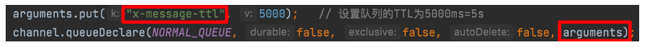
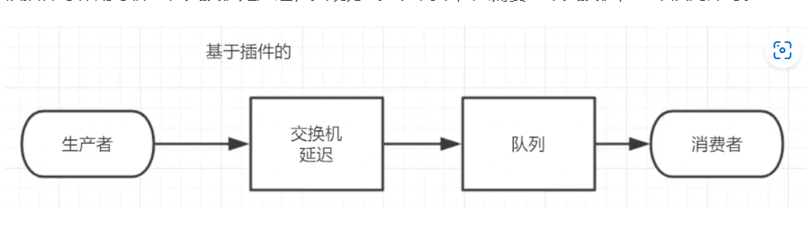

# MessageQueue

## 基本概念

一个FIFO的队列，不过队列中的内容是Message，具有接受、存储、发送功能的技术服务。

逻辑解耦+物理解耦。上游只需要依赖MQ即可。

## MQ应用场景

### 流量削峰

使用消息队列作为缓冲，将消息存储在消息队列中。

 

### 应用解耦

多个系统之间就不会耦合在一起，一个系统出现问题不会影响到他的上游系统

### 异步处理

有些服务调用是异步的，以前一般通过回调API，B运行完以后调用A或者A过一段时间去查询B，这两种都不够优雅。使用消息队列，A调用B以后，只需要监听B处理完成的消息，当B处理完成以后会发送一条消息给MQ，MQ转发给A，这样就可以达到不需要通过之前两种方式就得到异步处理成功的消息。

 

### 分布式事务

在分布式架构的情况下，因为三个服务操作的不是一个数据库，导致无法达到一致性，通过MQ作为二次提交的中间节点，负责存储请求数据，或者基于MQ中的队列数据进行回滚操作，既保证性能又保证业务一致性。

### 数据分发

MQ存在发布订阅机制，不只是简单的一对一关系，还支持一对多或者广播模式，扩展性比较高。

 

## 常用的MQ

### activeMQ

* `优点`：单机吞吐量万级，时效性 ms 级，可用性高，基于主从架构实现高可用性，消息可靠性较低的概率丢失数据
* `缺点`：官方社区现在对 ActiveMQ 5.x  **维护越来越少，高吞吐量场景较少使用** 。

### kafka

这款为大数据而生的消息中间件，以其百万级 TPS 的吞吐量名声大噪，迅速成为大数据领域的宠儿，在数据采集、传输、存储的过程中发挥着举足轻重的作用。目前已经被 LinkedIn，Uber, Twitter, Netflix 等大公司所采纳。

优点：性能卓越，吞吐量高，单机写入 TPS 约在百万条/秒，时效性 ms 级，可用性非常高；其次 kafka 是分布式的，一个数据多个副本，少数机器宕机，不会丢失数据导致服务不可用，消费者采用 Pull 方式获取消息，消息有序，通过控制能够保证所有消息被消费且仅被消费一次。此外 kafka 有优秀的第三方 Kafka Web 管理界面 Kafka-Manager，在日志领域比较成熟，被多家公司和多个开源项目使用；最后 kafka 在功能支持方便面它功能较为简单，主要支持简单的 MQ 功能，在大数据领域的实时计算以及日志采集被大规模使用。
缺点：Kafka 单机超过 64 个队列/分区，Load 会发生明显的飙高现象，队列越多，load 越高，发送消息响应时间变长，使用短轮询方式，实时性取决于轮询间隔时间，消费失败不支持重试；支持消息顺序，但是一台代理宕机后，就会产生消息乱序，社区更新较慢；
选用场景：Kafka 主要特点是基于Pull 的模式来处理消息消费，追求高吞吐量，一开始的目的就是用于日志收集和传输，适合产生大量数据的互联网服务的数据收集业务。大型公司建议可以选用，如果有日志采集功能，肯定是首选 kafka 了。

### RocketMQ

RocketMQ 出自阿里巴巴的开源产品，用 Java 语言实现，在设计时参考了 Kafka，并做出了自己的一些改进。被阿里巴巴广泛应用在订单，交易，充值，流计算，消息推送，日志流式处理，binglog 分发等场景。

优点：单机吞吐量十万级，可用性非常高，采用分布式架构，消息可以做到 0 丢失，MQ 功能较为完善，扩展性好，支持 10 亿级别的消息堆积，不会因为堆积导致性能下降，采用 java 语言实现。
缺点：支持的客户端语言不多，目前是 java 及 c++，其中 c++不成熟；社区活跃度一般,没有在MQ核心中去实现 JMS 等接口，有些系统要迁移需要修改大量代码。
选用场景：天生为金融互联网领域而生，对于可靠性要求很高的场景，尤其是电商里面的订单扣款，以及业务削峰，在大量交易涌入时，后端可能无法及时处理的情况。RoketMQ 在稳定性上可能更值得信赖，这些业务场景在阿里双 11 已经经历了多次考验，如果你的业务有上述并发场景，建议可以选择 RocketMQ。

### RabbitMQ

2007 年发布，是一个在AMQP(高级消息队列协议)基础上完成的，可复用的企业消息系统，是当前最主流的消息中间件之一。

优点：由于 erlang 语言的高并发特性，性能较好；吞吐量到万级，MQ 功能比较完备、健壮、稳定、易用、跨平台、支持多种语言如Python、Ruby、.NET、Java、JMS、C、PHP、ActionScript、XMPP、STOMP等，支持 AJAX 文档齐全；开源提供的管理界面非常棒，用起来很好用，社区活跃度高；更新频率相当高。
缺点：商业版需要收费，学习成本较高。
选用场景：结合 erlang 语言本身的并发优势，性能好时效性微秒级，社区活跃度也比较高，管理界面用起来十分方便，如果你的数据量没有那么大，中小型公司优先选择功能比较完备的 RabbitMQ。

## 消息队列协议

网络协议三要素-语法，语义，时序

而消息中间件采用的并不是http协议，而常见的消息中间件协议有：`OpenWire`、`AMQP`、`MQTT`、`Kafka`、`OpenMessage`协议

### AMQP

应用层协议

是一个提供统一消息服务的应用层标准高级消息队列协议，是应用层协议的一个开放标准，为面向消息的中间件设计。基于此协议的客户端与消息中间件可传递消息，并不受客户端/中间件不同产品，不同的开发语言等条件的限制。

RABBITMQ，ACTIVEMQ

### MQTT协议

基于TCP/IP协议

轻量结构、简单、传输快、不支持事务、没有持久化设计。

适用于计算能力有限、低带宽、网络不稳定的场景。

rabbitMQ,ACTIVEMQ(默认关闭。

### OpenMessage协议

结构简单、速度快、支持事务和持久化。

### Kafka协议

基于TCP/ip

结构简单、速度快、无事务支持、有持久化设计。

## 消息队列持久化

存到磁盘，而不是放在内存中随服务器重启断开而消失

常见持久化方式和对比

 

## 消息的分发策略

 

消息队列存在如下角色：

生产者：负责生成和发送消息到处理中心

消息处理中心：负责消息存储、确认、重试等，一般会包含多个queue

消费者：从处理中心获取消息并做处理

一般的获取方式就是推或者拉，发送的http请求就是一种拉取数据库数据返回的过程。消息队列MQ是一种推送过程。

 

在APP上下了一个订单，系统和服务很多，如何得知这个消息被那个系统或者那些服务或系统消费，就需要一个消费策略。

 

发送消息肯会出现异常，比如用户下订单，MQ接受以后，订单系统故障支付异常，这时候需要中间件支持消息重试机制。也就是：出现问题时，消息不丢失还可以重发。

消息分发策略机制和对比


## 消息队列的高可用和高可靠

高可用：产品在规定条件和时间处于可执行规定功能状态的能力。

### master-slave主从共享数据

 

多个处理器共享存储空间，master负责写入。客户端将消息写入master，master挂掉，slave节点继续服务，形成高可用。

### master-slave主从同步部署

 

写入消息在Master，主节点会同步到slave节点形成副本，如果多个消费者就可以到不同节点消费，就是消息的拷贝和同步会占用很多资源。

### 多主集群同步部署

 

任意节点都可以写入

### 多主集群转发部署

如果插入数据时broker1，元数据会存储数据的相关描述和记录存放的位置，会对描述信息也就是元数据做同步。元数据在不同节点是一致的。

元数据存储了以下内容：

- 主题和队列
- 分区分配
- 节点信息
- 消息偏移量
- 配置和策略

消费者在2中消费发现没有自己消息，就会在自己元数据中查询，查到了直接返回，没查到就将消息的信息携带在请求中转发到其他节点去询问。

 

### Master-slave与Breoker-cluster组合的方案

 

多主多从

### 总结

以上的目的就是为了出现故障消息服务依然可以使用

- 要么消息共享
- 要么消息同步
- 要么元数据共享

# RabbiMQ

## 概念

一个消息中间件，接受、存储和转发消息数据

## AMQP协议

应用层协议

## rabbit mq架构

 

broker:rabbitmq服务，用于接收和分发消息

virtual host：处于多租户和安全因素设计，把amqp的基本组件划分到一个虚拟分组中，类似网络中的namespace概念。当多个不同用户使用同一个rabbitmq提供的服务时，可以划分多个vhost，每个用户在自己的vhost创建exchange或queue等。用于进行逻辑隔离，一个虚拟主机可以有多个exchange和queue，同一个主机里不能有名字相同的exchange。

connection：生产者/消费者与broker之间的TCP连接

channel：网络通道，channel之间是完全隔离的，是在connection内部建立的逻辑连接，如果应用程序支持多线程，通常为每个线程创建单独的channel。。amqp报错channel id帮助客户端和消息处理器识别channel

message：消息，服务与应用程序之间传输的数据，由properties和body组成，properties是对消息进行修饰，比如消息的优先级，延迟等高级特性，body则是消息体的内容

exchange：交换机，message到达broker的第一站，用于根据分发规则、匹配查询表中的routing key，分发消息到queue中去，不具备消息存储的功能。常用的类型由：direct，topic，fanout

bindings：exchange和queue之间的虚拟连接，biding可以包含routing key，binding信息被保存到exchange中的查询表，用于message的分发依据

routing key：一个路由规则，虚拟机用它来确定如何路由一个特定消息

queue：消息队列，保存消息并将它转发给消费者消费。

## 四大核心概念

生产者：生产并发送消息的程序

交换机：交换机是RabbitMq很重要的一部分，一方面接收来自生产者的消息，另一方面将消息推送到队列中。交换机必须指定如何处理接收到的消息，是将消息推送到特定队列还是推送到多个队列，或者把消息丢弃

队列：队列是rabbitMq内部使用的一种数据结构，消息只能存储在队列中，只受主机内存和磁盘限制的约束，本质上是一个大的消息缓冲区。生产者可以将消息发送到一个队列，消费者可以从一个队列接收数据

消费者：消费与接收有相似含义。消费者大多是一个等待接收消息的程序。

 

## 角色分类

- none：不能访问 management plugin
- management：查看自己相关节点信

  - 列出自己可以通过AMQP登入的虚拟机
  - 查看自己的虚拟机节点virtual hosts的queues，exchanges和bindings信息
  - 查看和关闭自己的channels和connections
  - 查看有关自己的虚拟机节点virtual hosts的统计信息。包括其他用户在这个节点virtual hosts中的活动信息
- Policymaker

  - 包含management所有权跟
  - 查看和创建和删除自己的virtual hosts所属的policies和parameters信息
- Monitoring

  - 包含management所有权限
  - 罗列出所有的virtual hosts，包括不能登录的virtual hosts
  - 查看其他用户的connections和channels信息
  - 查看节点级别的数据如clustering和memory使用情况
  - 查看所有的virtual hosts的全局统计信息。
- Administrator

  - 最高权限
  - 可以创建和删除 virtual hosts
  - 可以查看，创建和删除users
  - 查看创建permissions
  - 关闭所有用户的connections

## rabbitmq消息模式

### 模式

#### 简单模式

 

一个生产者一个消费者，一个队列，采用默认交换机

#### 工作模式


一个生产者多个消费者一个队列，默认交换机。

工作模式默认采用轮询的方式，消息逐一分发给每个消费者进行消费。

#### 发布订阅模式


一个生产者一个fanout类型的交换机，多个队列多个消费者。一个生产者消息被多个消费者获取。其中fanout类型就是发布订阅模式，只有订阅的才会收到消息。

#### 路由模式


一个生产者，一个direct类型的交换机，多个队列，交换机和队列通过routing-key进行关联绑定。生产者发消息到交换机要指定routing-key

#### 主题模式


一个生产者一个topic类型的交换机，多个队列，交换机和队列之间通过routing-key进行关联，多个消费者，生产者发消息到交换机并指定routing-key，然后消息根据这交换机与队列之间的routing-key绑定规则进行路由被指定消费者消费。与路由不同的地方在于routing-key存在指定对，更加通用：routing-key规则

* `#`：匹配一个或者多个词，例如`lazy.#` 可以匹配 lazy.xxx 或者 lazy.xxx.xxx
* `*`：只能匹配一个词，例如`lazy.*` 只能匹配 lazy.xxx

#### RPC模式


## rabbitmq交换机

### 交换机简介

RabbitMQ核心思想：生产者消息不会直接发送到队列上；相反，生产者只能将消息发送到交换机。

交换机的类型有四种：直接(direct)、主题(topic)、标题(headers)和扇出(fanout)

**无名交换机**

通过空字符串做标记

 

**临时队列**

每当链接RabbitMQ的时候都需要一个全新空队列，一旦断开了消费者连接，队列将会被自动删除。这就是临时队列。

**绑定**

routing-key，exchange和queue之间的桥梁，告诉exchange和哪个队列进行绑定。

### fanout模式

将接收到的所有消息广播到所有他知道的队列中。

 

fanout相当于是一个广播模式

### direct模式

 

绑定键为green或black的发到Q2，为orange的发到Q1

### topic模式

direct仍存在局限，比如像接受的日志有error和warning，但某个队列只想要error，这时候direct就办不到了，不是办不到是会更加复杂，需要绑定多种关系。

通过省略符这些达到目标需要。

* 星号`*`可以代替一个单词
* 井号`#`可以替代零个或多个单词

 

```
quick.orange.rabbit				被队列 Q1Q2 接收到
lazy.orange.elephant			被队列 Q1Q2 接收到
quick.orange.fox					被队列 Q1 接收到
lazy.brown.fox						被队列 Q2 接收到
lazy.pink.rabbit					虽然满足两个绑定但只被队列 Q2 接收一次
quick.brown.fox						不匹配任何绑定不会被任何队列接收到会被丢弃
quick.orange.male.rabbit	是四个单词不匹配任何绑定会被丢弃
lazy.orange.male.rabbit		是四个单词但匹配 Q2

```

## rabbitmq的一些机制

### 消息应答

存在两种方式-自动应答、手动应答。

默认情况下，RabbitMQ只要发送了消息，便会将消息标记为删除，这样如果消费者挂了，就会丢失这个消息。

为了保证消息在发送过程中不丢失，引入了消息应答机制：消费者在接收消息并且处理完消息后才告知RabbitMQ可以把消息删除了。

**实现方式：**

```java
// 肯定确认
void basicAck(long deliveryTag, boolean multiple)

// 否定确认
void basicNack(long deliveryTag, boolean multiple, boolean requeue)
void basicReject(long deliveryTag, boolean requeue)
```

其中deliveryFlag表示消息标志，multiple表示是否批量应答（true表示批量应答channel上未应答的，比如当前channel上标有tag为5678的，如果收到的tag=8，那么5-8都会被确认收到消息应答）

#### 自动应答

消息发送后就认为已经成功，需要在高吞吐量和数据传输安全性方面权衡。此外由于消费者没有对传递的消息数量做限制，发送方可以传递过载的消息会造成消费者这边由于接收太多消息来不及处理，导致消息积压，使得内存耗尽。

这种模式仅适用于消费者可以高效并以某种速率能够处理这些消息的情况下使用。

#### 手动应答

采用手动应答后的消息自动重新入队可以避免自动应答中消息丢失的情况。

 

### 持久化

手动应答可以处理消费者挂机的情况，但是如果rabbitMQ服务停掉了，消息生产者传递过来的消息如何保证不丢失。默认情况下RabbitMQ退出或者崩溃时，会情况队列和消息，除非告知不要这样。确保消息不丢失需要做两件事：将队列和消息都标记为持久化。

队列持久化：

如果要队列持久化就需要在声明队列的时候把durable参数设置为true

消息持久化：

要想让消息实现持久化需要在消息生产者修改代码，添加`MessageProperties.PERSISTENT_TEXT_PLAIN` 属性。

将消息标记为持久化并不能完全保证不会丢失消息。尽管它告诉 RabbitMQ 将消息保存到磁盘，但是这里依然存在当消息刚准备存储在磁盘的时候 但是还没有存储完，消息还在缓存的一个间隔点。此时并没有真正写入磁盘

### 不公平分发

RabbitMQ本身默认采用轮询的方式，但是某种情况下这种策略并不好，比如两个消费者在处理任务，其中一个快一个慢，还采取轮询这样就不好。

为了避免这种情况，我们可以设置参数 `channel.basicQos(1)`，意思就是每个消费者只能处理完当前消息才能接受新的消息。

 

### 预取值

需要限制未确认的缓冲区的大小，避免缓冲区中无限制的未确认消息问题。

这个时候就可以通过使用 basic.qos 方法设置“`预取计数`”值来完成。 **该值定义通道上允许的未确认消息的最大数量** 。一旦数量达到配置的数量，RabbitMQ 将停止在通道上传递更多消息，除非至少有一个未处理的消息被确认。

### 发布确认

生产者将信道设置为confirm，设置为confirm以后，信道上的消息都会被指派一个唯一ID，一旦消息被投递到所有匹配的队列后，broker就会发送一个确认给生产者（包括唯一ID），生产者就知道消息已经发到了目的队列了，同时也可以设置multiple域。confirm模式最大好处就是他是异步的，一旦发布消息，生产者程序就可以在等信道返回确认的同时继续发送下一条消息，当消息确认后生产者应用就可以通过回调方式来处理确认消息。如果RabbitMQ导致消息丢失，就会发送一条nack消息，生产者程序同样可以在回调方法中处理该nack消息。


默认不开启，如果开启需要调用confirmSelect。


发布确认机制有：单个确认发布、批量确认发布、异步确认发布。前两个是同步确认的，也就是发布一个/一批后只有被确认发布后续的消息才能继续发布。后者是异步确认的方式，只管发布消息即可，消息是否确认通过回调函数接收到。


#### 单个确认发布

发布一个消息后只有他被确认发布，后续的消息才可以被发布。缺点：发布速度特别慢，会阻塞所有后续消息的发布。

#### 批量确认发布

先发布一批消息然后一起确认，缺点：不知道那条消息出现问题了，必须将整个批处理保存在内存中，任然是同步的，也一样阻塞消息发布。

#### 异步确认发布

逻辑更复杂，但是性价比最高，通过回调函数来达到消息可靠性传递。

 

**对比**

* 单独发布消息：同步等待确认，简单，但吞吐量非常有限。
* 批量发布消息：批量同步等待确认，简单，合理的吞吐量，一旦出现问题但很难推断出是那条消息出现了问题。
* 异步处理：最佳性能和资源使用，在出现错误的情况下可以很好地控制，但是实现起来稍微难些

### 死信队列

死信：无法被消费的消息，某些情况下一些特定原因导致队列中的某些信息无法被消费。

场景：

- 为了保证订单业务的消息数据不丢失，要使用Rabbitmq的死信机制，当消息消费发生异常的时候将消息投入到死信队列中
- 用户在上传下单成功并点击支付后在指定时间未支付时自动失效

死信的原因：

- 消息的TTL过期
- 队列达到最大长度
- 消息被拒绝

 


### 延迟队列

队列内部是有序的，存在延时属性，延时队列中的元素希望在指定时间到了以后或之前去除和处理。用于存放要在指定时间被处理的元素队列

场景：

- 订单在十分钟内未支付则自动取消。
- 用户注册成功后，三天内没有登录则进行短信提醒。

但对于数据量比较大，并且时效性较强的场景，如：“订单十分钟内未支付则关闭“，短期内未支付的订单数据可能会有很多，活动期间甚至会达到百万甚至千万级别，对这么庞大的数据量仍旧使用轮询的方式显然是不可取的，很可能在一秒内无法完成所有订单的检查，同时会给数据库带来很大压力，无法满足业务要求而且性能低下。


TTL：

TTL是消息的一个属性也就是一条消息或者该队列中所有消息的的最大存活时间，如果消息或者队列设置了TTL且在时间内未被消费就会称为死信。如果同时配置了队列TTL和消息TTL，较小的那个会被采用，有两种设置方式：

消息设置：

 

队列设置：

 

如果设置了队列的TTL，消息一段过期就会被丢弃或丢到死信队列，如果只设置消息的TTL，即使消息过期，也不一定马上会丢弃，因为消息是否过期是在即将投递到消费者之前判定的，如果当前队列有严重的消息挤压，则已过期的消息还能存活较长时间。

如果不设置TTL那说明永不过期，如果将TTL设置为0则表示除非可以直接投递不然会被丢弃。

延时队列刚好可以让消息在延迟多久之后称为死信并丢到死信队列中，这样消费者只需要一致消费死信队列里的消息就可以了。

通过设置队列TTL+死信实现消息延迟

 

通过设置消息TTL+死信实现消息延迟

 

#### 总结

 

 

两种方式实现延迟队列，通过死信以及通过RabbitMQ的插件来实现。

前一种可能会出现消息挤压导致后面的消息没有在指定延迟时间被消费；另一种通过插件来实现，也就是消息在交换机处延迟，生产者发送消息到延迟交换机等待指定时间再路由到队列。

### 发布确认高级

在生产环境中由于一些不明原因，导致 rabbitmq 重启，在 RabbitMQ 重启期间生产者消息投递失败，导致消息丢失，需要手动处理和恢复。于是，我们开始思考，如何才能进行 RabbitMQ 的消息可靠投递呢？

解决方案就是缓存，当生产者发消息到交换机，但交换机不存在的时候，应该将消息放到缓存中；或者交换机存在队列不存在，当交换机发送不到队列也应该将消息放到缓存中，然后缓存再设置一个定时任务，对没有发送成功的消息重新进行投递。

 

#### 回调接口-消息确认


#### 回调接口-消息回退

在仅开启了生产者确认机制的情况下，交换机接收到消息后，会直接给消息生产者发送确认消息，如果发现该消息不可路由，那么消息会被直接丢弃，但此时生产者是不知道消息被丢弃这个事件的。那么如何让无法被路由的消息能够让生产者感知并做出处理。

我们可以通过设置 `mandatory` 参数可以在当消息传递过程中不可达目的地时将消息返回给生产者。

#### 备份交换机

前面我们提到交换机如果出现了问题接受不到消息，我们就让交换机进行消息确认，让生产者重新发消息。如果队列出问题收不到消息，我们就进行消息回退，也是让生产者重新发消息。还可以给交换机加一个备份交换机，有了备份交换机就不用将消息会退给生产者，而是将无法投递的消息交给备份交换机，让备份交换机通过自己的路由和队列发送给消费者。这种方式还能建立一个报警队列，用独立的消费者进行检测和报警。

 

### 幂等性

用户对同一操作发起的一次或多次请求结果是一致的。


对应消息队列 MQ 中出现的幂等性问题就是消息重复消费。比如消费者在消费 MQ 中的消息时，MQ 已把消息发送给消费者，消费者在给 MQ 返回 ack 时网络中断，故 MQ 未收到确认信息，该条消息会重新发给其他的消费者，或者在网络重连后再次发送给该消费者，但实际上该消费者已成功消费了该条消息，造成消费者的重复消费。

解决方案：

MQ 消费者的幂等性的解决一般使用 **全局ID** ，就是每次完成一次操作应该生成一个唯一标识，比如时间戳、UUID、消息队列中消息的id号等等。这样每次消费消息时都先通过该唯一标识先判断该消息是否已消费过，如果消费过则不再消费，则避免了消息重复消费问题。

业界主流的幂等性解决方案有以下两种操作：

指纹码机制：指纹码是按照一定规则，比如时间戳、其他服务给的唯一信息码而拼接出来的唯一标识，它并不一定是我们系统生成的，基本都是由我们的业务规则拼接而来。然后就利用查询语句进行判断这个指纹码是否存在数据库中，优势就是实现简单，只需要进行拼接即可，然后查询判断是否重复；劣势就是在高并发时，如果是单个数据库会出现写入性能瓶颈，当然也可以采用分库分表提升性能。（不推荐）
Redis 原子性：利用 redis 执行 setnx 命令，天然具有幂等性，从而实现不重复消费。（推荐）

### 优先级队列

有些时候要发送的消息存在优先级，所以会需要一个优先级队列，先推送大的再推送小的。

注意：队列需要设置为优先级队列的同时消息也必须设置消息的优先级才能生效，而且消费者需要等待消息全部发送到队列中才去消费因为这样才有机会对消息进行排序。

 

### 惰性队列

惰性队列会尽可能的将消息存入磁盘中，而在消费者消费到相应的消息时才会被加载到内存中，它的一个重要的设计目标是能够支持更长的队列，即支持更多的消息存储。当消费者由于各种各样的原因(比如消费者下线、宕机亦或者是由于维护而关闭等)而致使长时间内不能消费消息造成堆积时，惰性队列就很有必要了，我们可以将消息存储在磁盘中，避免占用大量内存。


默认情况下，当生产者将消息发送到 RabbitMQ 的时候，队列中的消息会尽可能的存储在内存之中，这样可以更加快速的将消息发送给消费者。即使是持久化的消息，在被写入磁盘的同时也会在内存中驻留一份备份。当 RabbitMQ 需要释放内存的时候，会将内存中的消息换页至磁盘中，这个操作会耗费较长的时间，也会阻塞队列的操作，进而无法接收新的消息。虽然 RabbitMQ 的开发者们一直在升级相关的算法，但是效果始终不太理想，尤其是在消息量特别大的时候。


队列两种模式

default和lazy

default

## RabbitMQ集群

镜像队列，给集群中一个节点发消息，在集群中其他节点上也有备份，避免一个节点宕机造成影响。

 

这样就需要第三方的负载均衡软件来解决问题


### 时间延迟的解决方案

* **主从节点模型** ：
  * 在联合队列的设置中，通常有一个主节点（上游节点）和一个或多个从节点（下游节点）。
  * 主节点负责接收消息，而下游节点则从主节点同步消息。
* **单向同步** ：
  * 消息从主节点同步到下游节点，下游节点不会将消息同步回主节点。这种单向同步减少了数据传输的开销和复杂性，避免了双向同步带来的潜在冲突和进一步的延迟。
* **本地消费** ：
  * 消费者连接到本地的下游节点进行消息消费，这样可以在地理上靠近消费者，减少网络延迟的影响。
  * 即使主节点和下游节点之间有网络延迟，本地消费者可以快速从下游节点获取消息，提高响应速度。
* **消息缓冲** ：
  * 下游节点可以缓冲从主节点同步的消息，即使网络连接暂时中断，下游节点也可以继续提供消息给本地消费者，增加系统的容错性。


### Federation Exchange

联合/联邦队列

假设一个 RabbitMQ 集群中的两台机器分布在异地，一台 broker 位于北京，另一台 broker 深圳位于深圳，彼此之间相距甚远，两者之间的网络延迟是一个不得不面对的问题。其中在北京的业务(Client 北京) 需要连接(broker 北京)，向其中的交换器 exchangeA 发送消息，此时的网络延迟很小，(Client 北京)可以迅速将消息发送至 exchangeA 中，就算在开启了 publisherconfirm 或者事务机制的情况下，也可以迅速收到确认信息。但如果此时有个在深圳的业务(Client 深圳)需要向 exchangeA 发送消息， 由于(Client 深圳) (broker 北京)之间有很大的网络延迟，(Client 深圳) 将发送消息至 exchangeA 会经历一定的延迟，尤其是在开启了 publisherconfirm 机制或者事务机制的情况下，(Client 深圳) 会等待很长的延迟时间来接收(broker 北京)的确认信息，进而必然造成这条发送线程的性能降低，甚至造成一定程度上的阻塞。


将深圳的业务(Client 深圳)部署到北京的机房即可解决这个问题，但是如果(Client 深圳)调用那些原本处在深圳的业务，那么又会引发新的时延问题，总不见得将所有业务全部部署在一个机房，这样容灾又何以实现？ 在 RabbitMQ 进群中，使用 Federation 插件就可以很好地解决这个问题

 


这里有两个节点 node1 和 node2，可以理解为 node1 就在北京，node2 就在深圳，其中 node1 处于 upstream 上游，node2 处于 downstream 下游，为了解决数据异地访问的延迟问题，我们需要做出数据同步，也就是上游的数据忘下游走。这里的数据同步以交换机为节点，也就是上游的 node1 节点的联邦交换机同步数据给下游的 node2 节点的联邦交换机，其中经历了一个配置federation: fed_exchange -> rabbit@node2，也就是给 node1 节点的联邦交换机配置了 node2 节点的地址，也就让 node1 节点能到找到 node2 节点，两边使用的交换机名称相同，以此来同步数据。

### Federation queue

联邦队列可以在多个 Broker 节点(或者集群)之间为单个队列提供均衡负载的功能。一个联邦队列可以连接一个或者多个上游队列(upstream queue)，并从这些上游队列中获取消息以满足本地消费者消费消息需求。

原理图类似联邦交换机如下图所示：node1 的队列想要同步数据给 node2 的队列，就需要将处于下游的 node2 与上游的 node1 进行绑定。

 

在 RabbitMQ 集群中的配置同联邦交换机也类似，首先需要在两个节点上创建名为fed.queue的两个队列，然后将在处于下游(downstream)的 node2 节点配置上游(upstream)的 node1 节点。该步骤前面已经完成，不需要再进行一遍。

### shovel


与 Federation 具备的数据转发功能类似，Shovel 能够可靠持续地从一个 Broker 中的队列（作为 source 源端）拉取数据并转发至另一个 Broker 中的交换机（作为 destination 目的段）。作为源端的队列和作为目的端的交换器可以同时位于同一个 Broker，也可以位于不同的 Broker 上。Shovel 可以翻译为"铲子"，是一种比较形象的比喻，这个"铲子"可以将消息从一方"铲子"另一方。Shovel 行为就像优秀的客户端应用程序能够负责连接源和目的地、负责消息的读写及负责连接失败问题的处理。

原理图如下所示：当我们发送消息给 Q1 时，消息会通过 Shovel 同步给 Q2，也就是说如果我们往 Q1 和 Q2 种各发一条消息，Q1 只有1条消息，而 Q2 会收到2条消息，其中1条来自 Q1 的同步。

 
