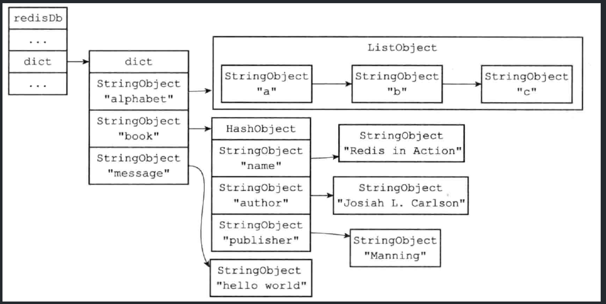
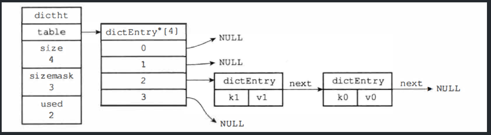
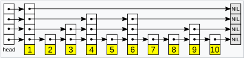
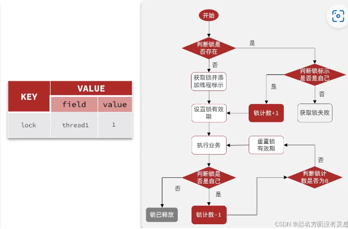
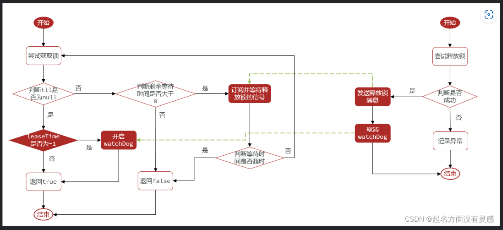
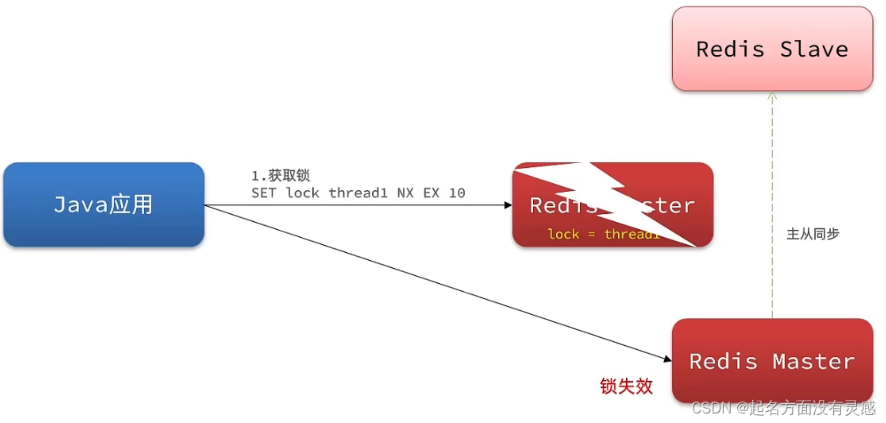
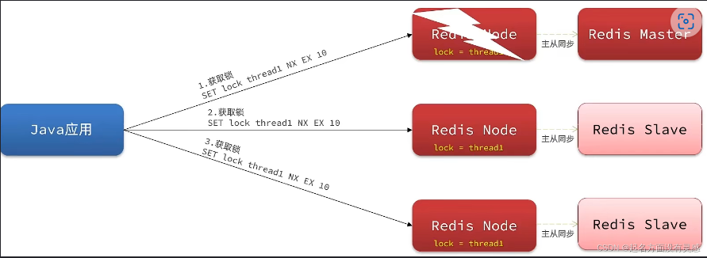

# redis

## 概述

Redis (REmote DIctionary Server) ：用 C 语言开发的一个开源的高性能键值对（key-value）数据库

特征：

* 数据间没有必然的关联关系，**不存关系，只存数据**
* 数据**存储在内存**，存取速度快，解决了磁盘 IO 速度慢的问题
* 内部采用**单线程**机制进行工作
* 高性能，官方测试数据，50 个并发执行 100000 个请求，读的速度是 110000 次/s，写的速度是 81000 次/s
* 多数据类型支持
  * 字符串类型：string（String）
  * 列表类型：list（LinkedList）
  * 散列类型：hash（HashMap）
  * 集合类型：set（HashSet）
  * 有序集合类型：zset/sorted_set（TreeSet）
* 支持持久化，可以进行数据灾难恢复

## nosql

### 概述

NoSQL（Not-Only SQL）：泛指非关系型的数据库，作为关系型数据库的补充

MySQL 支持 ACID 特性，保证可靠性和持久性，读取性能不高，因此需要缓存的来减缓数据库的访问压力

作用：应对基于海量用户和海量数据前提下的数据处理问题

特征：

* 可扩容，可伸缩，SQL 数据关系过于复杂，Nosql 不存关系，只存数据
* 大数据量下高性能，数据不存取在磁盘 IO，存取在内存
* 灵活的数据模型，设计了一些数据存储格式，能保证效率上的提高
* 高可用，集群

## 数据库

### 服务器

redis服务i去将数据库保存在redisServer结构的db数组中，每个数据库之间相互独立共用内存不区分大小。

**在服务器内部**，客户端状态 redisClient 结构的 db 属性记录了目标数据库，是一个指向 redisDb 结构的指针

每个 Redis 客户端都有目标数据库，执行数据库读写命令时目标数据库就会成为这些命令的操作对象，默认情况下 Redis 客户端的目标数据库为 0 号数据库，客户端可以执行 SELECT 命令切换目标数据库，原理是通过修改 redisClient.db 指针指向服务器中不同数据库

```sh
select index	#切换数据库，index从0-15取值
move key db		#数据移动到指定数据库，db是数据库编号
ping			#测试数据库是否连接正常，返回PONG
echo message	#控制台输出信息
```

### 过期删除

### 键空间

#### key space

redis是一个键值对数据库服务器，每个数据库都是一个redisDB结构，redisDB.dict中保存了数据库的所有键值对，这个字典叫做键空间

```c
typedef struct redisDB {
    // 数据库键空间，保存所有键值对
    dict *dict
} redisDB;
```

键空间和用户所见的数据库是直接对应的：

* 键空间的键就是数据库的键，每个键都是一个字符串对象
* 键空间的值就是数据库的值，每个值可以是任意一种 Redis 对象



使用 Redis 命令对数据库进行读写时，服务器不仅会对键空间执行指定的读写操作，还会**进行一些维护操作**：

* 在读取一个键后（读操作和写操作都要对键进行读取），服务器会根据键是否存在来更新服务器的键空间命中 hit 次数或键空间不命中 miss 次数，这两个值可以在 `INFO stats` 命令的 keyspace_hits 属性和 keyspace_misses 属性中查看
* 更新键的 LRU（最后使用）时间，该值可以用于计算键的闲置时间，使用 `OBJECT idletime key` 查看键 key 的闲置时间
* 如果在读取一个键时发现该键已经过期，服务器会**先删除过期键**，再执行其他操作
* 如果客户端使用 WATCH 命令监视了某个键，那么服务器在对被监视的键进行修改之后，会将这个键标记为脏（dirty），从而让事务注意到这个键已经被修改过
* 服务器每次修改一个键之后，都会对 dirty 键计数器的值增1，该计数器会触发服务器的持久化以及复制操作
* 如果服务器开启了数据库通知功能，那么在对键进行修改之后，服务器将按配置发送相应的数据库通知

#### 读写指令

常见键操作指令：

* 增加指令

  ```sh
  set key value				#添加一个字符串类型的键值对

  ```
* 删除指令

  ```sh
  del key						#删除指定key
  unlink key   				#非阻塞删除key，真正的删除会在后续异步操作
  ```
* 更新指令

  ```sh
  rename key newkey			#改名
  renamenx key newkey			#改名
  ```

  值得更新需要参看具体得 Redis 对象得操作方式，比如字符串对象执行 `SET key value` 就可以完成修改
* 查询指令

  ```sh
  exists key					#获取key是否存在
  randomkey					#随机返回一个键
  keys pattern				#查询key
  ```

  KEYS 命令需要**遍历存储的键值对**，操作延时高，一般不被建议用于生产环境中

  查询模式规则：* 匹配任意数量的任意符号、? 配合一个任意符号、[] 匹配一个指定符号

  ```sh
  keys *						#查询所有key
  keys aa*					#查询所有以aa开头
  keys *bb					#查询所有以bb结尾
  keys ??cc					#查询所有前面两个字符任意，后面以cc结尾 
  keys user:?					#查询所有以user:开头，最后一个字符任意
  keys u[st]er:1				#查询所有以u开头，以er:1结尾，中间包含一个字母，s或t
  ```
* 其他指令

  ```sh
  type key					#获取key的类型
  dbsize						#获取当前数据库的数据总量，即key的个数
  flushdb						#清除当前数据库的所有数据(慎用)
  flushall					#清除所有数据(慎用)
  ```

  在执行 FLUSHDB 这样的危险命令之前，最好先执行一个 SELECT 命令，保证当前所操作的数据库是目标数据库

#### 时效设置

客户端可以以秒或毫秒的精度为数据库中的某个键设置生存时间（TimeTo Live, TTL），在经过指定时间之后，服务器就会自动删除生存时间为 0 的键；也可以以 UNIX 时间戳的方式设置过期时间（expire time），当键的过期时间到达，服务器会自动删除这个键

```sh
expire key seconds			#为指定key设置生存时间，单位为秒
pexpire key milliseconds	#为指定key设置生存时间，单位为毫秒
expireat key timestamp		#为指定key设置过期时间，单位为时间戳
pexpireat key mil-timestamp	#为指定key设置过期时间，单位为毫秒时间戳
```

* 实际上 EXPIRE、EXPIRE、EXPIREAT 三个命令**底层都是转换为 PEXPIREAT 命令**来实现的
* SETEX 命令可以在设置一个字符串键的同时为键设置过期时间，但是该命令是一个类型限定命令

redisDb 结构的 expires 字典保存了数据库中所有键的过期时间，字典称为过期字典：

* 键是一个指针，指向键空间中的某个键对象（复用键空间的对象，不会产生内存浪费）
* 值是一个 long long 类型的整数，保存了键的过期时间，是一个毫秒精度的 UNIX 时间戳

```c
typedef struct redisDB {
    // 过期字典，保存所有键的过期时间
    dict *expires
} redisDB;
```

客户端执行 PEXPIREAT 命令，服务器会在数据库的过期字典中关联给定的数据库键和过期时间：

```python
def PEXPIREAT(key, expire_time_in_ms):
	# 如果给定的键不存在于键空间，那么不能设置过期时间
	if key not in redisDb.dict:
		return 0

	# 在过期字典中关联键和过期时间
	redisDB.expires[key] = expire_time_in_ms

	# 过期时间设置成功
	return 1
```

---

#### 时效状态

TTL 和 PTTL 命令通过计算键的过期时间和当前时间之间的差，返回这个键的剩余生存时间

* 返回正数代表该数据在内存中还能存活的时间
* 返回 -1 代表永久性，返回 -2 代表键不存在

```sh
ttl key			#获取key的剩余时间，每次获取会自动变化(减小)，类似于倒计时
pttl key		#获取key的剩余时间，单位是毫秒，每次获取会自动变化(减小)
```

PERSIST 是 PEXPIREAT 命令的反操作，在过期字典中查找给定的键，并解除键和值（过期时间）在过期字典中的关联

```sh
persist key		#切换key从时效性转换为永久性
```

Redis 通过过期字典可以检查一个给定键是否过期：

* 检查给定键是否存在于过期字典：如果存在，那么取得键的过期时间
* 检查当前 UNIX 时间戳是否大于键的过期时间：如果是那么键已经过期，否则键未过期

### 过期删除

#### 删除策略

删除策略就是**针对已过期数据的处理策略**，已过期的数据不一定被立即删除，在不同的场景下使用不同的删除方式会有不同效果，在内存占用与 CPU 占用之间寻找一种平衡，顾此失彼都会造成整体 Redis 性能的下降，甚至引发服务器宕机或内存泄露

针对过期数据有三种删除策略：

- 定时删除
- 惰性删除（被动删除）
- 定期删除

Redis 采用惰性删除和定期删除策略的结合使用

---

#### 定时删除

在设置键的过期时间的同时，创建一个定时器（timer），让定时器在键的过期时间到达时，立即执行对键的删除操作

- 优点：节约内存，到时就删除，快速释放掉不必要的内存占用
- 缺点：对 CPU 不友好，无论 CPU 此时负载多高均占用 CPU，会影响 Redis 服务器响应时间和指令吞吐量
- 总结：用处理器性能换取存储空间（拿时间换空间）

创建一个定时器需要用到 Redis 服务器中的时间事件，而时间事件的实现方式是无序链表，查找一个事件的时间复杂度为 O(N)，并不能高效地处理大量时间事件，所以采用这种方式并不现实

---

#### 惰性删除

数据到达过期时间不做处理，等下次访问到该数据时执行 **expireIfNeeded()** 判断：

* 如果输入键已经过期，那么 expireIfNeeded 函数将输入键从数据库中删除，接着访问就会返回空
* 如果输入键未过期，那么 expireIfNeeded 函数不做动作

所有的 Redis 读写命令在执行前都会调用 expireIfNeeded 函数进行检查，该函数就像一个过滤器，在命令真正执行之前过滤掉过期键

惰性删除的特点：

* 优点：节约 CPU 性能，删除的目标仅限于当前处理的键，不会在删除其他无关的过期键上花费任何 CPU 时间
* 缺点：内存压力很大，出现长期占用内存的数据，如果过期键永远不被访问，这种情况相当于内存泄漏
* 总结：用存储空间换取处理器性能（拿空间换时间）

---

#### 定期删除

定期删除策略是每隔一段时间执行一次删除过期键操作，并通过限制删除操作执行的时长和频率来减少删除操作对 CPU 时间的影响

* 如果删除操作执行得太频繁，或者执行时间太长，就会退化成定时删除策略，将 CPU 时间过多地消耗在删除过期键上
* 如果删除操作执行得太少，或者执行时间太短，定期删除策略又会和惰性删除策略一样，出现浪费内存的情况

定期删除是**周期性轮询 Redis 库中的时效性**数据，从过期字典中随机抽取一部分键检查，利用过期数据占比的方式控制删除频度

- Redis 启动服务器初始化时，读取配置 server.hz 的值，默认为 10，执行指令 info server 可以查看，每秒钟执行 server.hz 次 `serverCron() → activeExpireCycle()`
- activeExpireCycle() 对某个数据库中的每个 expires 进行检测，工作模式：

  * 轮询每个数据库，从数据库中取出一定数量的随机键进行检查，并删除其中的过期键，如果过期 key 的比例超过了 25%，则继续重复此过程，直到过期 key 的比例下降到 25% 以下，或者这次任务的执行耗时超过了 25 毫秒
  * 全局变量 current_db 用于记录 activeExpireCycle() 的检查进度（哪一个数据库），下一次调用时接着该进度处理
  * 随着函数的不断执行，服务器中的所有数据库都会被检查一遍，这时将 current_db 重置为 0，然后再次开始新一轮的检查

定期删除特点：

- CPU 性能占用设置有峰值，检测频度可自定义设置
- 内存压力不是很大，长期占用内存的**冷数据会被持续清理**
- 周期性抽查存储空间（随机抽查，重点抽查）

### 数据淘汰

#### 逐出算法

数据淘汰策略：当新数据进入 Redis 时，在执行每一个命令前，会调用 **freeMemoryIfNeeded()** 检测内存是否充足。如果内存不满足新加入数据的最低存储要求，Redis 要临时删除一些数据为当前指令清理存储空间，清理数据的策略称为**逐出算法**

逐出数据的过程不是 100% 能够清理出足够的可使用的内存空间，如果不成功则反复执行，当对所有数据尝试完毕，如不能达到内存清理的要求，**出现 Redis 内存打满异常**：

```sh
(error) OOM command not allowed when used memory >'maxmemory'
```

#### 策略配置

* 数据删除的策略 policy：3 类 8 种

  第一类：检测易失数据（可能会过期的数据集 server.db[i].expires）：

  ```sh
  volatile-lru	# 对设置了过期时间的 key 选择最近最久未使用使用的数据淘汰
  volatile-lfu	# 对设置了过期时间的 key 选择最近使用次数最少的数据淘汰
  volatile-ttl	# 对设置了过期时间的 key 选择将要过期的数据淘汰
  volatile-random	# 对设置了过期时间的 key 选择任意数据淘汰
  ```

  第二类：检测全库数据（所有数据集 server.db[i].dict ）：

  ```sh
  allkeys-lru		# 对所有 key 选择最近最少使用的数据淘汰
  allkeLyRs-lfu	# 对所有 key 选择最近使用次数最少的数据淘汰
  allkeys-random	# 对所有 key 选择任意数据淘汰，相当于随机
  ```

  第三类：放弃数据驱逐

  ```sh
  no-enviction	#禁止驱逐数据(redis4.0中默认策略)，会引发OOM(Out Of Memory)
  ```

数据淘汰策略配置依据：使用 INFO 命令输出监控信息，查询缓存 hit 和 miss 的次数，根据需求调优 Redis 配置

### 排序机制

#### 基本介绍

Redis 的 SORT 命令可以对列表键、集合键或者有序集合键的值进行排序，并不更改集合中的数据位置，只是查询

```sh
SORT key [ASC/DESC]			#对key中数据排序，默认对数字排序，并不更改集合中的数据位置，只是查询
SORT key ALPHA				#对key中字母排序，按照字典序
```

#### SORT

`SORT <key>` 命令可以对一个包含数字值的键 key 进行排序

假设 `RPUSH numbers 3 1 2`，执行 `SORT numbers` 的详细步骤：

* 创建一个和 key 列表长度相同的数组，数组每项都是 redisSortObject 结构

  ```c
  typedef struct redisSortObject {
      // 被排序键的值
      robj *obj;

      // 权重
      union {
          // 排序数字值时使用
          double score;
          // 排序带有 BY 选项的字符串
          robj *cmpobj;
      } u;
  }
  ```
* 遍历数组，将各个数组项的 obj 指针分别指向 numbers 列表的各个项
* 遍历数组，将 obj 指针所指向的列表项转换成一个 double 类型的浮点数，并将浮点数保存在对应数组项的 u.score 属性里
* 根据数组项 u.score 属性的值，对数组进行数字值排序，排序后的数组项按 u.score 属性的值**从小到大排列**
* 遍历数组，将各个数组项的 obj 指针所指向的值作为排序结果返回给客户端，程序首先访问数组的索引 0，依次向后访问


对于 `SORT key [ASC/DESC]` 函数：

* 在执行升序排序时，排序算法使用的对比函数产生升序对比结果
* 在执行降序排序时，排序算法使用的对比函数产生降序对比结果

#### BY

SORT 命令默认使用被排序键中包含的元素作为排序的权重，元素本身决定了元素在排序之后所处的位置，通过使用 BY 选项，SORT 命令可以指定某些字符串键，或者某个哈希键所包含的某些域（field）来作为元素的权重，对一个键进行排序

```sh
SORT <key> BY <pattern>			# 数值
SORT <key> BY <pattern> ALPHA	# 字符
```

```sh
redis> SADD fruits "apple" "banana" "cherry" 
(integer) 3
redis> SORT fruits ALPHA
1)	"apple"
2)	"banana"
3)	"cherry"
```

```sh
redis> MSET apple-price 8 banana-price 5.5 cherry-price 7 
OK
# 使用水果的价钱进行排序
redis> SORT fruits BY *-price
1)	"banana"
2)	"cherry"
3)	"apple"
```

实现原理：排序时的 u.score 属性就会被设置为对应的权重

#### LIMIT

SORT 命令默认会将排序后的所有元素都返回给客户端，通过 LIMIT 选项可以让 SORT 命令只返回其中一部分已排序的元素

```sh
LIMIT <offset> <count>
```

* offset 参数表示要跳过的已排序元素数量
* count 参数表示跳过给定数量的元素后，要返回的已排序元素数量

```sh
# 对应 a b c d e f  g
redis> SORT alphabet ALPHA LIMIT 2 3
1) 	"c"
2) 	"d"
3) 	"e"
```

实现原理：在排序后的 redisSortObject 结构数组中，将指针移动到数组的索引 2 上，依次访问 array[2]、array[3]、array[4] 这 3 个数组项，并将数组项的 obj 指针所指向的元素返回给客户端

#### GET

SORT 命令默认在对键进行排序后，返回被排序键本身所包含的元素，通过使用 GET 选项， 可以在对键进行排序后，根据被排序的元素以及 GET 选项所指定的模式，查找并返回某些键的值

```sh
SORT <key> GET <pattern>
```

```sh
redis> SADD students "tom" "jack" "sea"
#设置全名
redis> SET tom-name "Tom Li" 
OK 
redis> SET jack-name "Jack Wang" 
OK 
redis> SET sea-name "Sea Zhang"
OK 
```

```sh
redis> SORT students ALPHA GET *-name
1)	"Jack Wang"
2)	"Sea Zhang"
3) 	"Tom Li"
```

实现原理：对 students 进行排序后，对于 jack 元素和 *-name 模式，查找程序返回键 jack-name，然后获取 jack-name 键对应的值

#### STORE

SORT 命令默认只向客户端返回排序结果，而不保存排序结果，通过使用 STORE 选项可以将排序结果保存在指定的键里面

```sh
SORT <key> STORE <sort_key>
```

```sh
redis> SADD students "tom" "jack" "sea"
(integer) 3 
redis> SORT students ALPHA STORE sorted_students 
(integer) 3 
```

实现原理：排序后，检查 sorted_students 键是否存在，如果存在就删除该键，设置 sorted_students 为空白的列表键，遍历排序数组将元素依次放入

#### 执行顺序

调用 SORT 命令，除了 GET 选项之外，改变其他选项的摆放顺序并不会影响命令执行选项的顺序

```sh
SORT <key> ALPHA [ASC/DESC] BY <by-pattern> LIMIT <offset> <count> GET <get-pattern> STORE <store_key>
```

执行顺序：

* 排序：命令会使用 ALPHA 、ASC 或 DESC、BY 这几个选项，对输入键进行排序，并得到一个排序结果集
* 限制排序结果集的长度：使用 LIMIT 选项，对排序结果集的长度进行限制
* 获取外部键：根据排序结果集中的元素以及 GET 选项指定的模式，查找并获取指定键的值，并用这些值来作为新的排序结果集
* 保存排序结果集：使用 STORE 选项，将排序结果集保存到指定的键上面去
* 向客户端返回排序结果集：最后一步命令遍历排序结果集，并依次向客户端返回排序结果集中的元素

## 体系架构

### 事件驱动

#### 基本介绍

Redis 服务器是一个事件驱动程序，服务器需要处理两类事件

* 文件事件 (file event)：服务器通过套接字与客户端（或其他 Redis 服务器）进行连接，而文件事件就是服务器对套接字操作的抽象。服务器与客户端的通信会产生相应的文件事件，服务器通过监听并处理这些事件完成一系列网络通信操作
* 时间事件 (time event)：Redis 服务器中的一些操作（比如 serverCron 函数）需要在指定时间执行，而时间事件就是服务器对这类定时操作的抽象

#### 文件事件

##### 基本组成

Redis 基于 Reactor 模式开发了网络事件处理器，这个处理器被称为文件事件处理器 (file event handler)

* 使用 I/O 多路复用 (multiplexing) 程序来同时监听多个套接字，并根据套接字执行的任务来为套接字关联不同的事件处理器
* 当被监听的套接字准备好执行连接应答 (accept)、 读取 (read)、 写入 (write)、 关闭 (close) 等操作时，与操作相对应的文件事件就会产生，这时文件事件分派器会调用套接字关联好的事件处理器来处理事件

文件事件处理器**以单线程方式运行**，但通过使用  I/O 多路复用程序来监听多个套接字， 既实现了高性能的网络通信模型，又可以很好地与 Redis 服务器中其他同样以单线程方式运行的模块进行对接，保持了 Redis 内部单线程设计的简单性

文件事件处理器的组成结构：


I/O 多路复用程序将所有产生事件的套接字处理请求放入一个**单线程的执行队列**中，通过队列有序、同步的向文件事件分派器传送套接字，上一个套接字产生的事件处理完后，才会继续向分派器传送下一个


Redis 单线程也能高效的原因：

* 纯内存操作
* 核心是基于非阻塞的 IO 多路复用机制，单线程可以高效处理多个请求
* 底层使用 C 语言实现，C 语言实现的程序距离操作系统更近，执行速度相对会更快
* 单线程同时也**避免了多线程的上下文频繁切换问题**，预防了多线程可能产生的竞争问题

##### 多路复用

Redis 的 I/O 多路复用程序的所有功能都是通过包装常见的 select 、epoll、 evport 和 kqueue 这些函数库来实现的，Redis 在 I/O 多路复用程序的实现源码中用 #include 宏定义了相应的规则，编译时自动选择系统中**性能最高的多路复用函数**来作为底层实现

I/O 多路复用程序监听多个套接字的 AE_READABLE 事件和 AE_WRITABLE 事件，这两类事件和套接字操作之间的对应关系如下：

* 当套接字变得**可读**时（客户端对套接字执行 write 操作或者 close 操作），或者有新的**可应答**（acceptable）套接字出现时（客户端对服务器的监听套接字执行 connect 连接操作），套接字产生 AE_READABLE 事件
* 当套接字变得可写时（客户端对套接字执行 read 操作，对于服务器来说就是可以写了），套接字产生 AE_WRITABLE 事件

I/O 多路复用程序允许服务器同时监听套接字的 AE_READABLE 和 AE_WRITABLE 事件， 如果一个套接字同时产生了这两种事件，那么文件事件分派器会优先处理 AE_READABLE  事件， 等 AE_READABLE 事件处理完之后才处理 AE_WRITABLE 事件

##### 处理器

Redis 为文件事件编写了多个处理器，这些事件处理器分别用于实现不同的网络通信需求：

* 连接应答处理器，用于对连接服务器的各个客户端进行应答，Redis 服务器初始化时将该处理器与 AE_READABLE 事件关联
* 命令请求处理器，用于接收客户端传来的命令请求，执行套接字的读入操作，与 AE_READABLE 事件关联
* 命令回复处理器，用于向客户端返回命令的执行结果，执行套接字的写入操作，与 AE_WRITABLE 事件关联
* 复制处理器，当主服务器和从服务器进行复制操作时，主从服务器都需要关联该处理器

Redis 客户端与服务器进行连接并发送命令的整个过程：

* Redis 服务器正在运作监听套接字的 AE_READABLE 事件，关联连接应答处理器
* 当 Redis 客户端向服务器发起连接，监听套接字将产生 AE_READABLE 事件，触发连接应答处理器执行，对客户端的连接请求进行应答，创建客户端套接字以及客户端状态，并将客户端套接字的 **AE_READABLE 事件与命令请求处理器**进行关联
* 客户端向服务器发送命令请求，客户端套接字产生 AE_READABLE 事件，引发命令请求处理器执行，读取客户端的命令内容传给相关程序去执行
* 执行命令会产生相应的命令回复，为了将这些命令回复传送回客户端，服务器会将客户端套接字的 **AE_WRITABLE 事件与命令回复处理器**进行关联
* 当客户端尝试读取命令回复时，客户端套接字产生 AE_WRITABLE 事件，触发命令回复处理器执行，在命令回复全部写入套接字后，服务器就会解除客户端套接字的 AE_WRITABLE 事件与命令回复处理器之间的关联

#### 时间事件

Redis 的时间事件分为以下两类：

* 定时事件：在指定的时间之后执行一次（Redis 中暂时未使用）
* 周期事件：每隔指定时间就执行一次

一个时间事件主要由以下三个属性组成：

* id：服务器为时间事件创建的全局唯一 ID（标识号），从小到大顺序递增，新事件的 ID 比旧事件的 ID 号要大
* when：毫秒精度的 UNIX 时间戳，记录了时间事件的到达（arrive）时间
* timeProc：时间事件处理器，当时间事件到达时，服务器就会调用相应的处理器来处理事件

时间事件是定时事件还是周期性事件取决于时间事件处理器的返回值：

* 定时事件：事件处理器返回 AE_NOMORE，该事件在到达一次后就会被删除
* 周期事件：事件处理器返回非 AE_NOMORE 的整数值，服务器根据该值对事件的 when 属性更新，让该事件在一段时间后再次交付

服务器将所有时间事件都放在一个**无序链表**中，新的时间事件插入到链表的表头：


无序链表指是链表不按 when 属性的大小排序，每当时间事件执行器运行时（单线程循环处理）就必须遍历整个链表，查找所有已到达的时间事件，并调用相应的事件处理器处理

无序链表并不影响时间事件处理器的性能，因为正常模式下的 Redis 服务器**只使用 serverCron 一个时间事件**，在 benchmark 模式下服务器也只使用两个时间事件，所以无序链表不会影响服务器的性能，几乎可以按照一个指针处理

#### 多线程

Redis6.0 引入多线程主要是为了提高网络 IO 读写性能，因为这是 Redis 的一个性能瓶颈（Redis 的瓶颈主要受限于内存和网络），多线程只是用来**处理网络数据的读写和协议解析**， 执行命令仍然是单线程顺序执行，因此不需要担心线程安全问题。

Redis6.0 的多线程默认是禁用的，只使用主线程。如需开启需要修改 redis 配置文件 `redis.conf` ：

```sh
io-threads-do-reads yesCopy to clipboardErrorCopied
```

开启多线程后，还需要设置线程数，否则是不生效的，同样需要修改 redis 配置文件 :

```sh
io-threads 4 #官网建议4核的机器建议设置为2或3个线程，8核的建议设置为6个线程
```


## 数据结构

### 字符串

#### SDS

Redis 构建了简单动态字符串（SDS）的数据类型，作为 Redis 的默认字符串表示，包含字符串的键值对在底层都是由 SDS 实现

```c
struct sdshdr {
    // 记录buf数组中已使用字节的数量，等于 SDS 所保存字符串的长度
    int len;
  
	// 记录buf数组中未使用字节的数量
    int free;
  
    // 【字节】数组，用于保存字符串（不是字符数组）
    char buf[];
};
```

SDS 遵循 C 字符串**以空字符结尾**的惯例，保存空字符的 1 字节不计算在 len 属性，SDS 会自动为空字符分配额外的 1 字节空间和添加空字符到字符串末尾，所以空字符对于 SDS 的使用者来说是完全透明的


### 链表

链表提供了高效的节点重排能力，C 语言并没有内置这种数据结构，所以 Redis 构建了链表数据类型

链表节点：

```c
typedef struct listNode {
    // 前置节点
    struct listNode *prev;
  
    // 后置节点
    struct listNode *next;
  
    // 节点的值
    void *value
} listNode;
```

多个 listNode 通过 prev 和 next 指针组成**双端链表**：


list 链表结构：提供了表头指针 head 、表尾指针 tail 以及链表长度计数器 len

```c
typedef struct list {
    // 表头节点
    listNode *head;
    // 表尾节点
    listNode *tail;
  
    // 链表所包含的节点数量
    unsigned long len;
  
    // 节点值复制函数，用于复制链表节点所保存的值
    void *(*dup) (void *ptr);
    // 节点值释放函数，用于释放链表节点所保存的值
    void (*free) (void *ptr);
    // 节点值对比函数，用于对比链表节点所保存的值和另一个输入值是否相等
    int (*match) (void *ptr, void *key);
} list;
```


Redis 链表的特性：

* 双端：链表节点带有 prev 和 next 指针，获取某个节点的前置节点和后置节点的时间复杂度都是 O(1)
* 无环：表头节点的 prev 指针和表尾节点的 next 指针都指向 NULL，对链表的访问以 NULL 为终点
* 带表头指针和表尾指针： 通过 list 结构的 head 指针和 tail 指针，获取链表的表头节点和表尾节点的时间复杂度为 O(1)
* 带链表长度计数器：使用 len 属性来对 list 持有的链表节点进行计数，获取链表中节点数量的时间复杂度为 O(1)
* 多态：链表节点使用 void * 指针来保存节点值， 并且可以通过 dup、free 、match 三个属性为节点值设置类型特定函数，所以链表可以保存各种**不同类型的值

### 字典

#### 哈希表

Redis 字典使用的哈希表结构：

```c
typedef struct dictht {
    // 哈希表数组，数组中每个元素指向 dictEntry 结构
	dictEntry **table;
  
	// 哈希表大小，数组的长度
	unsigned long size;
  
	// 哈希表大小掩码，用于计算索引值，总是等于 【size-1】
	unsigned long sizemask;
  
	// 该哈希表已有节点的数量 
	unsigned long used;
} dictht;
```

哈希表节点结构：

```c
typedef struct dictEntry {
    // 键
	void *key;
  
	// 值，可以是一个指针，或者整数
	union {
        void *val;	// 指针
        uint64_t u64;
        int64_t s64;
    }
  
	// 指向下个哈希表节点，形成链表，用来解决冲突问题
    struct dictEntry *next;
} dictEntry;
```



#### 字典结构

字典，又称为符号表、关联数组、映射（Map），用于保存键值对的数据结构，字典中的每个键都是独一无二的。底层采用哈希表实现，一个哈希表包含多个哈希表节点，每个节点保存一个键值对

```c
typedef struct dict {
    // 类型特定函数
    dictType *type;
  
    // 私有数据
    void *privdata;
  
    // 哈希表，数组中的每个项都是一个dictht哈希表，
    // 一般情况下字典只使用 ht[0] 哈希表， ht[1] 哈希表只会在对 ht[0] 哈希表进行 rehash 时使用
    dictht ht[2];
  
    // rehash 索引，当 rehash 不在进行时，值为 -1
    int rehashidx;
} dict;
```

type 属性和 privdata 属性是针对不同类型的键值对， 为创建多态字典而设置的：

* type 属性是指向 dictType 结构的指针， 每个 dictType 结构保存了一簇用于操作特定类型键值对的函数， Redis 会为用途不同的字典设置不同的类型特定函数
* privdata 属性保存了需要传给那些类型特定函数的可选参数


#### 哈希冲突

Redis 的哈希表使用链地址法（separate chaining）来解决键哈希冲突， 每个哈希表节点都有一个 next 指针，多个节点通过 next 指针构成一个单向链表，被分配到同一个索引上的多个节点可以用这个单向链表连接起来，这就解决了键冲突的问题

dictEntry 节点组成的链表没有指向链表表尾的指针，为了速度考虑，程序总是将新节点添加到链表的表头位置（**头插法**），时间复杂度为 O(1)

#### 负载因子

负载因子的计算方式：哈希表中的**节点数量** / 哈希表的大小（**长度**）

```c
load_factor = ht[0].used / ht[0].size
```

为了让哈希表的负载因子（load factor）维持在一个合理的范围之内，当哈希表保存的键值对数量太多或者太少时 ，程序会自动对哈希表的大小进行相应的扩展或者收缩

哈希表执行扩容的条件：

* 服务器没有执行 BGSAVE 或者 BGREWRITEAOF 命令，哈希表的负载因子大于等于 1
* 服务器正在执行 BGSAVE 或者 BGREWRITEAOF 命令，哈希表的负载因子大于等于 5

  原因：执行该命令的过程中，Redis 需要创建当前服务器进程的子进程，而大多数操作系统都采用写时复制（copy-on­-write）技术来优化子进程的使用效率，通过提高执行扩展操作的负载因子，尽可能地避免在子进程存在期间进行哈希表扩展操作，可以避免不必要的内存写入操作，最大限度地节约内存

哈希表执行收缩的条件：负载因子小于 0.1（自动执行，servreCron 中检测）

#### 重新散列

- 创建一个新哈希表ht-1，扩展操作ht[1] 的大小为第一个大于等于 $ht[0].used * 2$ 的 2^n，收缩操作ht[1] 的大小为第一个大于等于 $ht[0].used$ 的 2^n
- 将保存在 ht[0] 中所有的键值对重新计算哈希值和索引值，迁移到 ht[1] 上
- 当 ht[0] 包含的所有键值对都迁移到了 ht[1] 之后（ht[0] 变为空表），释放 ht[0]，将 ht[1] 设置为 ht[0]，并在 ht[1] 创建一个新的空白哈希表，为下一次 rehash 做准备

Redis 对 rehash 做了优化，使 rehash 的动作并不是一次性、集中式的完成，而是分多次，渐进式的完成，又叫**渐进式 rehash**

* 为 ht[1] 分配空间，此时字典同时持有 ht[0] 和 ht[1] 两个哈希表
* 在字典中维护了一个索引计数器变量 rehashidx，并将变量的值设为 0，表示 rehash 正式开始
* 在 rehash 进行期间，每次对字典执行增删改查操作时，程序除了执行指定的操作以外，还会顺带将 ht[0] 哈希表在 rehashidx 索引上的所有键值对 rehash 到 ht[1]，rehash 完成之后**将 rehashidx 属性的值增一**
* 随着字典操作的不断执行，最终在某个时间点 ht[0] 的所有键值对都被 rehash 至 ht[1]，将 rehashidx 属性的值设为 -1

渐进式 rehash 期间的哈希表操作：

* 字典的查找、删除、更新操作会在两个哈希表上进行，比如查找一个键会先在 ht[0] 上查找，查找不到就去 ht[1] 继续查找
* 字典的添加操作会直接在 ht[1] 上添加，不在 ht[0] 上进行任何添加

避免了大量键值对导致过长的服务器停止

### 跳跃表

#### 底层结构



如上图所见，增加了多级索引，从上往下。

Redis 只在两个地方应用了跳跃表，一个是实现有序集合键，另一个是在集群节点中用作内部数据结构

### 整数集合

#### 底层结构

用于保存整数值的集合数据结构，是Redis集合键底层实现之一。

整数集合的每个元素都是 contents 数组的一个数组项（item），在数组中按值的大小从小到大**有序排列**，并且数组中**不包含任何重复项

每次向整数集合添加新元素都可能会引起升级，而每次升级都需要对底层数组中的所有元素进行类型转换，所以向整数集合添加新元素的时间复杂度为 O(N)

引发升级的新元素的长度总是比整数集合现有所有元素的长度都大，所以这个新元素的值要么就大于所有现有元素，要么就小于所有现有元素，升级之后新元素的摆放位置：

* 在新元素小于所有现有元素的情况下，新元素会被放置在底层数组的最开头（索引 0）
* 在新元素大于所有现有元素的情况下，新元素会被放置在底层数组的最末尾（索引 length-1）

整数集合升级策略的优点：

* 提升整数集合的灵活性：C 语言是静态类型语言，为了避免类型错误通常不会将两种不同类型的值放在同一个数据结构里面，整数集合可以自动升级底层数组来适应新元素，所以可以随意的添加整数
* 节约内存：要让数组可以同时保存 int16、int32、int64 三种类型的值，可以直接使用 int64_t 类型的数组作为整数集合的底层实现，但是会造成内存浪费，整数集合可以确保升级操作只会在有需要的时候进行，尽量节省内存

整数集合**不支持降级操作**，一旦对数组进行了升级，编码就会一直保持升级后的状态

包括这几个类型的整数INTSET_ENC_INT16、INTSET_ENC_INT32、INTSET_ENC_INT64，之前是16位，升级到32位

### 压缩列表

一个顺序存储数据结构，设计思想是事件换空间。redis中hash、list、[zset](https://so.csdn.net/so/search?q=zset&spm=1001.2101.3001.7020)等数据结构的底层实现，存储数据量较少或者元素值不大的情况下使用了压缩列表。

一个压缩列表可以包含任意多个节点（entry），每个节点可以保存一个字节数组或者一个整数值


* zlbytes：uint32_t 类型 4 字节，记录整个压缩列表占用的内存字节数，在对压缩列表进行内存重分配或者计算 zlend 的位置时使用
* zltail：uint32_t 类型 4 字节，记录压缩列表表尾节点距离起始地址有多少字节，通过这个偏移量程序无须遍历整个压缩列表就可以确定表尾节点的地址
* zllen：uint16_t 类型 2 字节，记录了压缩列表包含的节点数量，当该属性的值小于 UINT16_MAX (65535) 时，该值就是压缩列表中节点的数量；当这个值等于 UINT16_MAX 时节点的真实数量需要遍历整个压缩列表才能计算得出
* entryX：列表节点，压缩列表中的各个节点，**节点的长度由节点保存的内容决定**
* zlend：uint8_t 类型 1 字节，是一个特殊值 0xFF (255)，用于标记压缩列表的末端


列表 zlbytes 属性的值为 0x50 (十进制 80)，表示压缩列表的总长为 80 字节，列表 zltail 属性的值为 0x3c (十进制 60)，假设表的起始地址为 p，计算得出表尾节点 entry3 的地址 p + 60

#### 列表节点

列表节点 entry 的数据结构：


previous_entry_length：以字节为单位记录了压缩列表中前一个节点的长度，程序可以通过指针运算，根据当前节点的起始地址来计算出前一个节点的起始地址，完成**从表尾向表头遍历**操作

* 如果前一节点的长度小于 254 字节，该属性的长度为 1 字节，前一节点的长度就保存在这一个字节里
* 如果前一节点的长度大于等于 254 字节，该属性的长度为 5 字节，其中第一字节会被设置为 0xFE（十进制 254），之后的四个字节则用于保存前一节点的长度

encoding：记录了节点的 content 属性所保存的数据类型和长度

* **长度为 1 字节、2 字节或者 5 字节**，值的最高位为 00、01 或者 10 的是字节数组编码，数组的长度由编码除去最高两位之后的其他位记录，下划线 `_` 表示留空，而 `b`、`x` 等变量则代表实际的二进制数据

  
* 长度为 1 字节，值的最高位为 11 的是整数编码，整数值的类型和长度由编码除去最高两位之后的其他位记录

  

content：每个压缩列表节点可以保存一个字节数组或者一个整数值

* 字节数组可以是以下三种长度的其中一种：

  * 长度小于等于 $63 (2^6-1)$ 字节的字节数组
  * 长度小于等于 $16383(2^{14}-1)$ 字节的字节数组
  * 长度小于等于 $4294967295(2^{32}-1)$ 字节的字节数组
* 整数值则可以是以下六种长度的其中一种：

  * 4 位长，介于 0 至 12 之间的无符号整数
  * 1 字节长的有符号整数
  * 3 字节长的有符号整数
  * int16_t 类型整数
  * int32_t 类型整数
  * int64_t 类型整数

#### 连锁更新

Redis 将在特殊情况下产生的连续多次空间扩展操作称之为连锁更新（cascade update）

假设在一个压缩列表中，有多个连续的、长度介于 250 到 253 字节之间的节点 e1 至 eN。将一个长度大于等于 254 字节的新节点 new 设置为压缩列表的头节点，new 就成为 e1 的前置节点。e1 的 previous_entry_length 属性仅为 1 字节，无法保存新节点 new 的长度，所以要对压缩列表执行空间重分配操作，并将 e1 节点的 previous_entry_length 属性从 1 字节长扩展为 5 字节长。由于 e1 原本的长度介于 250 至 253 字节之间，所以扩展后 e1 的长度就变成了 254 至 257 字节之间，导致 e2 的  previous_entry_length 属性无法保存 e1 的长度，程序需要不断地对压缩列表执行空间重分配操作，直到 eN 为止


删除节点也可能会引发连锁更新，big.length >= 254，small.length < 254，删除 small 节点


连锁更新在最坏情况下需要对压缩列表执行 N 次空间重分配，每次重分配的最坏复杂度为 O(N)，所以连锁更新的最坏复杂度为 O(N^2)

说明：尽管连锁更新的复杂度较高，但出现的记录是非常低的，即使出现只要被更新的节点数量不多，就不会对性能造成影响

## 数据类型

### redisObj

#### 对象系统

Redis 使用对象来表示数据库中的键和值，当在 Redis 数据库中新创建一个键值对时至少会创建两个对象，一个对象用作键值对的键（**键对象**），另一个对象用作键值对的值（**值对象**）

Redis 中对象由一个 redisObject 结构表示，该结构中和保存数据有关的三个属性分别是 type、 encoding、ptr：

```c
typedef struct redisObiect {
	// 类型
	unsigned type:4;
	// 编码
	unsigned encoding:4;
	// 指向底层数据结构的指针
	void *ptr;
  
    // ....
} robj;
```

Redis 并没有直接使用数据结构来实现键值对数据库，而是基于这些数据结构创建了一个对象系统，包含字符串对象、列表对象、哈希对象、集合对象和有序集合对象这五种类型的对象，而每种对象又通过不同的编码映射到不同的底层数据结构

Redis 是一个 Map 类型，其中所有的数据都是采用 key : value 的形式存储，**键对象都是字符串对象**，而值对象有五种基本类型和三种高级类型对象


* 对一个数据库键执行 TYPE 命令，返回的结果为数据库键对应的值对象的类型，而不是键对象的类型
* 对一个数据库键执行 OBJECT ENCODING 命令，查看数据库键对应的值对象的编码

#### 命令多态

Redis 中用于操作键的命令分为两种类型：

* 一种命令可以对任何类型的键执行，比如说 DEL 、EXPIRE、RENAME、 TYPE 等（基于类型的多态）
* 只能对特定类型的键执行，比如 SET 只能对字符串键执行、HSET 对哈希键执行、SADD 对集合键执行，如果类型步匹配会报类型错误： `(error) WRONGTYPE Operation against a key holding the wrong kind of value`

Redis 为了确保只有指定类型的键可以执行某些特定的命令，在执行类型特定的命令之前，先通过值对象 redisObject 结构 type 属性检查操作类型是否正确，然后再决定是否执行指定的命令

对于多态命令，比如列表对象有 ziplist 和 linkedlist 两种实现方式，通过 redisObject 结构 encoding 属性确定具体的编码类型，底层调用对应的 API 实现具体的操作（基于编码的多态）

#### 内存回收

引用计数法，对象的引用计数信息会随着对象的使用状态而不断变化，创建时引用计数 refcount 初始化为 1，每次被一个新程序使用时引用计数加 1，当对象不再被一个程序使用时引用计数值会被减 1，当对象的引用计数值变为 0 时，对象所占用的内存会被释放。

对象的引用计数属性带有对象共享的作用，共享对象机制更节约内存，数据库中保存的相同值对象越多，节约的内存就越多

让多个键共享一个对象的步骤：

* 将数据库键的值指针指向一个现有的值对象
* 将被共享的值对象的引用计数增一

  

Redis 在初始化服务器时创建一万个（配置文件可以修改）字符串对象，包含了**从 0 到 9999 的所有整数值**，当服务器需要用到值为 0 到 9999 的字符串对象时，服务器就会使用这些共享对象，而不是新创建对象。

Redis 不共享包含字符串对象的原因：验证共享对象和目标对象是否相同的复杂度越高，消耗的 CPU 时间也会越多

* 整数值的字符串对象， 验证操作的复杂度为 O(1)
* 字符串值的字符串对象， 验证操作的复杂度为 O(N)
* 如果共享对象是包含了多个值（或者对象的）对象，比如列表对象或者哈希对象，验证操作的复杂度为 O(N^2)

### String

Redis 所有操作都是**原子性**的，采用**单线程**机制，命令是单个顺序执行，无需考虑并发带来影响，原子性就是有一个失败则都失败

字符串对象可以是 int、raw、embstr 三种实现方式

整数编码（int）：字符串对象是一个可以用整数表示的数字时候redis会将其存储为整数类型而不是字符数组。比如"123"存储为123

原始编码（raw）：对于较长的字符串用原始编码以字节数组的形式存储。

嵌入式编码(embstr)：当字符串的长度比较短，直接将字符串数据嵌入到redisObject结构体中，不再单独分配内存。

int 和 embstr 编码的字符串对象在条件满足的情况下，会被转换为 raw 编码的字符串对象：

* int 编码的整数值，执行 APPEND 命令追加一个字符串值，先将整数值转为字符串然后追加，最后得到一个 raw 编码的对象
* Redis 没有为 embstr 编码的字符串对象编写任何相应的修改程序，所以 embstr 对象实际上**是只读的**，执行修改命令会将对象的编码从 embstr 转换成 raw，操作完成后得到一个 raw 编码的对象

#### 操作

指令操作：

* 数据操作：

  ```sh
  set key value			#添加/修改数据添加/修改数据
  del key					#删除数据
  setnx key value			#判定性添加数据，键值为空则设添加
  mset k1 v1 k2 v2...		#添加/修改多个数据，m：Multiple
  append key value		#追加信息到原始信息后部（如果原始信息存在就追加，否则新建）
  ```
* 查询操作

  ```sh
  get key					#获取数据，如果不存在，返回空（nil）
  mget key1 key2...		#获取多个数据
  strlen key				#获取数据字符个数（字符串长度）
  ```
* 设置数值数据增加/减少指定范围的值

  ```sh
  incr key					#key++
  incrby key increment		#key+increment
  incrbyfloat key increment	#对小数操作
  decr key					#key--
  decrby key increment		#key-increment
  ```
* 设置数据具有指定的生命周期

  ```sh
  setex key seconds value  		#设置key-value存活时间，seconds单位是秒
  psetex key milliseconds value	#毫秒级
  ```

单数据操作和多数据操作的选择：

* 单数据执行 3 条指令的过程：3 次发送 + 3 次处理 + 3 次返回
* 多数据执行 1 条指令的过程：1 次发送 + 3 次处理 + 1 次返回（发送和返回的事件略低于单数据）

#### 运用

get user : id : xxxxx : fans  88878787

存储大V的粉丝数量

### hash

hash 类型：底层使用**哈希表**结构实现数据存储


Redis 中的 hash 类似于 Java 中的  `Map<String, Map<Object,object>>`，左边是 key，右边是值，中间叫 field 字段，本质上 **hash 存了一个 key-value 的存储空间**

hash 是指的一个数据类型，并不是一个数据

* 如果 field 数量较少，存储结构优化为**压缩列表结构**（有序）
* 如果 field 数量较多，存储结构使用 HashMap 结构（无序）

#### 操作

指令操作：

* 数据操作

  ```sh
  hset key field value		#添加/修改数据
  hdel key field1 [field2]	#删除数据，[]代表可选
  hsetnx key field value		#设置field的值，如果该field存在则不做任何操作
  hmset key f1 v1 f2 v2...	#添加/修改多个数据
  ```
* 查询操作

  ```sh
  hget key field				#获取指定field对应数据
  hgetall key					#获取指定key所有数据
  hmget key field1 field2...	#获取多个数据
  hexists key field			#获取哈希表中是否存在指定的字段
  hlen key					#获取哈希表中字段的数量
  ```
* 获取哈希表中所有的字段名或字段值

  ```sh
  hkeys key					#获取所有的field
  hvals key					#获取所有的value
  ```
* 设置指定字段的数值数据增加指定范围的值

  ```sh
  hincrby key field increment		#指定字段的数值数据增加指定的值，increment为负数则减少
  hincrbyfloat key field increment#操作小数
  ```

注意事项

1. hash 类型中 value 只能存储字符串，不允许存储其他数据类型，不存在嵌套现象，如果数据未获取到，对应的值为（nil）
2. 每个 hash 可以存储 2^32 - 1 个键值对
3. hash 类型和对象的数据存储形式相似，并且可以灵活添加删除对象属性。但 hash 设计初衷不是为了存储大量对象而设计的，不可滥用，不可将 hash 作为对象列表使用
4. hgetall 操作可以获取全部属性，如果内部 field 过多，遍历整体数据效率就很会低，有可能成为数据访问瓶颈

#### 实现

哈希对象的内部编码有两种：ziplist（压缩列表）、hashtable（哈希表、字典）

* 压缩列表实现哈希对象：同一键值对的节点总是挨在一起，保存键的节点在前，保存值的节点在后

  
* 字典实现哈希对象：字典的每一个键都是一个字符串对象，每个值也是

  

当存储的数据量比较小的情况下，Redis 才使用压缩列表来实现字典类型，具体需要满足两个条件：

- 当键值对数量小于 hash-max-ziplist-entries 配置（默认 512 个）
- 所有键和值的长度都小于 hash-max-ziplist-value 配置（默认 64 字节）

以上两个条件的上限值是可以通过配置文件修改的，当两个条件的任意一个不能被满足时，对象的编码转换操作就会被执行

#### 应用

```sh
user:id:3506728370 → {"name":"春晚","fans":12210862,"blogs":83}
```

对于以上数据，使用单条去存的话，存的条数会很多。但如果用 json 格式，存一条数据就够了。

假如现在粉丝数量发生了变化，要把整个值都改变，但是用单条存就不存在这个问题，只需要改其中一个就可以


### list


#### 操作

指令操作：

* 数据操作

  ```sh
  lpush key value1 [value2]...#从左边添加/修改数据(表头)
  rpush key value1 [value2]...#从右边添加/修改数据(表尾)
  lpop key					#从左边获取并移除第一个数据，类似于出栈/出队
  rpop key					#从右边获取并移除第一个数据
  lrem key count value		#删除指定数据，count=2删除2个，该value可能有多个(重复数据)
  ```
* 查询操作

  ```sh
  lrange key start stop		#从左边遍历数据并指定开始和结束索引，0是第一个索引，-1是终索引
  lindex key index			#获取指定索引数据，没有则为nil，没有索引越界
  llen key					#list中数据长度/个数
  ```
* 规定时间内获取并移除数据

  ```sh
  b							#代表阻塞
  blpop key1 [key2] timeout	#在指定时间内获取指定key(可以多个)的数据，超时则为(nil)
  							#可以从其他客户端写数据，当前客户端阻塞读取数据
  brpop key1 [key2] timeout	#从右边操作
  ```
* 复制操作

  ```sh
  brpoplpush source destination timeout	#从source获取数据放入destination，假如在指定时间内没有任何元素被弹出，则返回一个nil和等待时长。反之，返回一个含有两个元素的列表，第一个元素是被弹出元素的值，第二个元素是等待时长
  ```

注意事项

1. list 中保存的数据都是 string 类型的，数据总容量是有限的，最多 2^32 - 1 个元素（4294967295）
2. list 具有索引的概念，但操作数据时通常以队列的形式进行入队出队，或以栈的形式进行入栈出栈
3. 获取全部数据操作结束索引设置为 -1
4. list 可以对数据进行分页操作，通常第一页的信息来自于 list，第 2 页及更多的信息通过数据库的形式加载

---

#### 实现

在 Redis3.2 版本以前列表对象的内部编码有两种：ziplist（压缩列表）和 linkedlist（链表）

* 压缩列表实现的列表对象：PUSH 1、three、5 三个元素

  
* 链表实现的列表对象：为了简化字符串对象的表示，使用了 StringObject 的结构，底层其实是 sdshdr 结构

  

列表中存储的数据量比较小的时候，列表就会使用一块连续的内存存储，采用压缩列表的方式实现的条件：

* 列表对象保存的所有字符串元素的长度都小于 64 字节
* 列表对象保存的元素数量小于 512 个

以上两个条件的上限值是可以通过配置文件修改的，当两个条件的任意一个不能被满足时，对象的编码转换操作就会被执行

在 Redis3.2 版本 以后对列表数据结构进行了改造，使用 **quicklist（快速列表）**代替了 linkedlist，quicklist 实际上是 ziplist 和 linkedlist 的混合体，将 linkedlist 按段切分，每一段使用 ziplist 来紧凑存储，多个 ziplist 之间使用双向指针串接起来，既满足了快速的插入删除性能，又不会出现太大的空间冗余


#### 应用

主要是保证一个顺序输出，比如存储一组前后节点。

### set

set 类型：与 hash 存储结构哈希表完全相同，只是仅存储键不存储值（nil），所以添加，删除，查找的复杂度都是 O(1)，并且**值是不允许重复且无序的**


#### 操作

指令操作：

* 数据操作

  ```sh
  sadd key member1 [member2]	#添加数据
  srem key member1 [member2]	#删除数据
  ```
* 查询操作

  ```sh
  smembers key				#获取全部数据
  scard key					#获取集合数据总量
  sismember key member		#判断集合中是否包含指定数据
  ```
* 随机操作

  ```sh
  spop key [count]			#随机获取集中的某个数据并将该数据移除集合
  srandmember key [count]		#随机获取集合中指定(数量)的数据

  ```
* 集合的交、并、差

  ```sh
  sinter key1 [key2...]  					#两个集合的交集，不存在为(empty list or set)
  sunion key1 [key2...]  					#两个集合的并集
  sdiff key1 [key2...]					#两个集合的差集

  sinterstore destination key1 [key2...]	#两个集合的交集并存储到指定集合中
  sunionstore destination key1 [key2...]	#两个集合的并集并存储到指定集合中
  sdiffstore destination key1 [key2...]	#两个集合的差集并存储到指定集合中
  ```
* 复制

  ```sh
  smove source destination member			#将指定数据从原始集合中移动到目标集合中
  ```

注意事项

1. set 类型不允许数据重复，如果添加的数据在 set 中已经存在，将只保留一份
2. set 虽然与 hash 的存储结构相同，但是无法启用 hash 中存储值的空间

#### 实现

集合对象的内部编码有两种：intset（整数集合）、hashtable（哈希表、字典）

* 整数集合实现的集合对象：

  
* 字典实现的集合对象：键值对的值为 NULL

  

当集合对象可以同时满足以下两个条件时，对象使用 intset 编码：

* 集合中的元素都是整数值
* 集合中的元素数量小于 set-maxintset-entries配置（默认 512 个）

以上两个条件的上限值是可以通过配置文件修改的

#### 应用

黑白名单；共同关注

### zset

数据存储结构：新的存储模型，可以保存可排序的数据

#### 操作

指令操作：

* 数据操作

  ```sh
  zadd key score1 member1 [score2 member2]	#添加数据
  zrem key member [member ...]				#删除数据
  zremrangebyrank key start stop 				#删除指定索引范围的数据
  zremrangebyscore key min max				#删除指定分数区间内的数据
  zscore key member							#获取指定值的分数
  zincrby key increment member				#指定值的分数增加increment
  ```
* 查询操作

  ```sh
  zrange key start stop [WITHSCORES]		#获取指定范围的数据，升序，WITHSCORES 代表显示分数
  zrevrange key start stop [WITHSCORES]	#获取指定范围的数据，降序

  zrangebyscore key min max [WITHSCORES] [LIMIT offset count]	#按条件获取数据，从小到大
  zrevrangebyscore key max min [WITHSCORES] [...]				#从大到小

  zcard key										#获取集合数据的总量
  zcount key min max								#获取指定分数区间内的数据总量
  zrank key member								#获取数据对应的索引（排名）升序
  zrevrank key member								#获取数据对应的索引（排名）降序
  ```

  * min 与 max 用于限定搜索查询的条件
  * start 与 stop 用于限定查询范围，作用于索引，表示开始和结束索引
  * offset 与 count 用于限定查询范围，作用于查询结果，表示开始位置和数据总量
* 集合的交、并操作

  ```sh
  zinterstore destination numkeys key [key ...]	#两个集合的交集并存储到指定集合中
  zunionstore destination numkeys key [key ...]	#两个集合的并集并存储到指定集合中
  ```

注意事项：

1. score 保存的数据存储空间是 64 位，如果是整数范围是 -9007199254740992~9007199254740992
2. score 保存的数据也可以是一个双精度的 double 值，基于双精度浮点数的特征可能会丢失精度，慎重使用
3. sorted_set 底层存储还是基于 set 结构的，因此数据不能重复，如果重复添加相同的数据，score 值将被反复覆盖，保留最后一次修改的结果

#### 实现

有序集合对象的内部编码有两种：ziplist（压缩列表）和 skiplist（跳跃表）

* 压缩列表实现有序集合对象：ziplist 本身是有序、不可重复的，符合有序集合的特性

  
* 跳跃表实现有序集合对象：**底层是 zset 结构，zset 同时包含字典和跳跃表的结构**，图示字典和跳跃表中重复展示了各个元素的成员和分值，但实际上两者会**通过指针来共享相同元素的成员和分值**，不会产生空间浪费

  ```c
  typedef struct zset {
      zskiplist *zsl;
      dict *dict;
  } zset;
  ```

  

使用字典加跳跃表的优势：

* 字典为有序集合创建了一个**从成员到分值的映射**，用 O(1) 复杂度查找给定成员的分值
* **排序操作使用跳跃表完成**，节省每次重新排序带来的时间成本和空间成本

使用 ziplist 格式存储需要满足以下两个条件：

- 有序集合保存的元素个数要小于 128 个；
- 有序集合保存的所有元素大小都小于 64 字节

当元素比较多时，此时 ziplist 的读写效率会下降，时间复杂度是 O(n)，跳表的时间复杂度是 O(logn)

为什么用跳表而不用平衡树？

* 在做范围查找的时候，跳表操作简单（前进指针或后退指针），平衡树需要回旋查找
* 跳表比平衡树实现简单，平衡树的插入和删除操作可能引发子树的旋转调整，而跳表的插入和删除只需要修改相邻节点的指针

#### 应用

带权任务队列。

### bitmaps

Bitmaps 是二进制位数组（bit array），底层使用 SDS 字符串表示，因为 SDS 是二进制安全的


buf 数组的每个字节用一行表示，buf[1] 是 `'\0'`，保存位数组的顺序和书写位数组的顺序是完全相反的，图示的位数组 0100 1101

数据结构的详解查看 Java → Algorithm → 位图

#### 命令实现

##### GETBIT

GETBIT 命令获取位数组 bitarray 在 offset 偏移量上的二进制位的值

```sh
GETBIT <bitarray> <offset>
```

执行过程：

* 计算 `byte = offset/8`（向下取整）, byte 值记录数据保存在位数组中的索引
* 计算 `bit = (offset mod 8) + 1`，bit 值记录数据在位数组中的第几个二进制位
* 根据 byte 和 bit 值，在位数组 bitarray 中定位 offset 偏移量指定的二进制位，并返回这个位的值

GETBIT 命令执行的所有操作都可以在常数时间内完成，所以时间复杂度为 O(1)

---

##### SETBIT

SETBIT 将位数组 bitarray 在 offset 偏移量上的二进制位的值设置为 value，并向客户端返回二进制位的旧值

```sh
SETBIT <bitarray> <offset> <value> 
```

执行过程：

* 计算 `len = offset/8 + 1`，len 值记录了保存该数据至少需要多少个字节
* 检查 bitarray 键保存的位数组的长度是否小于 len，成立就会将 SDS 扩展为 len 字节（注意空间预分配机制），所有新扩展空间的二进制位的值置为 0
* 计算 `byte = offset/8`（向下取整）, byte 值记录数据保存在位数组中的索引
* 计算 `bit = (offset mod 8) + 1`，bit 值记录数据在位数组中的第几个二进制位
* 根据 byte 和 bit 值，在位数组 bitarray 中定位 offset 偏移量指定的二进制位，首先将指定位现存的值保存在 oldvalue 变量，然后将新值 value 设置为这个二进制位的值
* 向客户端返回 oldvalue 变量的值

---

##### BITCOUNT

BITCOUNT 命令用于统计给定位数组中，值为 1 的二进制位的数量

```sh
BITCOUNT <bitarray> [start end]
```

二进制位统计算法：

* 遍历法：遍历位数组中的每个二进制位
* 查表算法：读取每个字节（8 位）的数据，查表获取数值对应的二进制中有几个 1
* variable-precision SWAR算法：计算汉明距离
* Redis 实现：
  * 如果二进制位的数量大于等于 128 位， 那么使用 variable-precision SWAR 算法来计算二进制位的汉明重量
  * 如果二进制位的数量小于 128 位，那么使用查表算法来计算二进制位的汉明重量

---

##### BITOP

BITOP 命令对指定 key 按位进行交、并、非、异或操作，并将结果保存到指定的键中

```sh
BITOP OPTION destKey key1 [key2...]
```

OPTION 有 AND（与）、OR（或）、 XOR（异或）和 NOT（非）四个选项

AND、OR、XOR 三个命令可以接受多个位数组作为输入，需要遍历输入的每个位数组的每个字节来进行计算，所以命令的复杂度为 O(n^2)；与此相反，NOT 命令只接受一个位数组输入，所以时间复杂度为 O(n)

#### 应用

- **解决 Redis 缓存穿透**，判断给定数据是否存在， 防止缓存穿透
  
- 垃圾邮件过滤，对每一个发送邮件的地址进行判断是否在布隆的黑名单中，如果在就判断为垃圾邮件
- 爬虫去重，爬给定网址的时候对已经爬取过的 URL 去重
- 信息状态统计

### Hyper

基数是数据集去重后元素个数，HyperLogLog 是用来做基数统计的，运用了 LogLog 的算法

```java
{1, 3, 5, 7, 5, 7, 8} 	基数集： {1, 3, 5 ,7, 8} 	基数：5
{1, 1, 1, 1, 1, 7, 1} 	基数集： {1,7} 				基数：2
```

相关指令：

* 添加数据

  ```sh
  pfadd key element [element ...]
  ```
* 统计数据

  ```sh
  pfcount key [key ...]
  ```
* 合并数据

  ```sh
  pfmerge destkey sourcekey [sourcekey...]
  ```

应用场景：

* 用于进行基数统计，不是集合不保存数据，只记录数量而不是具体数据，比如网站的访问量
* 核心是基数估算算法，最终数值存在一定误差
* 误差范围：基数估计的结果是一个带有 0.81% 标准错误的近似值
* 耗空间极小，每个 hyperloglog key 占用了12K的内存用于标记基数
* pfadd 命令不是一次性分配12K内存使用，会随着基数的增加内存逐渐增大
* Pfmerge 命令合并后占用的存储空间为12K，无论合并之前数据量多少

### GEO

GeoHash 是一种地址编码方法，把二维的空间经纬度数据编码成一个字符串

* 添加坐标点

  ```sh
  geoadd key longitude latitude member [longitude latitude member ...]
  georadius key longitude latitude radius m|km|ft|mi [withcoord] [withdist] [withhash] [count count]
  ```
* 获取坐标点

  ```sh
  geopos key member [member ...]
  georadiusbymember key member radius m|km|ft|mi [withcoord] [withdist] [withhash] [count count]
  ```
* 计算距离

  ```sh
  geodist key member1 member2 [unit]	#计算坐标点距离
  geohash key member [member ...]		#计算经纬度
  ```

Redis 应用于地理位置计算

## 事务机制

Redis事务：一次性按顺序执行多个命令，且在过程中不会中断事务取执行其他命令。

Redis事务特性：没有隔离级别，队列中命令在没有提交前都不会实际执行；redis单条命令保证原子性，事务不保证，一条执行失败后面的还会被执行，没有回滚。

流程：

- 事务开始，MULTI 命令的执行标志着事务的开始，通过在客户端状态的 flags 属性中打开 REDIS_MULTI 标识，将执行该命令的客户端从非事务状态切换至事务状态。
- 命令入队，事务队列以先进先出（FIFO）的方式保存入队的命令，每个 Redis 客户端都有事务状态。
- 事务执行，EXEC 提交事务给服务器执行，服务器会遍历这个客户端的事务队列，执行队列中的命令并将执行结果返回。

事务取消的方法：

* 取消事务：

  ```sh
  DISCARD	# 终止当前事务的定义，发生在multi之后，exec之前
  ```

  一般用于事务执行过程中输入了错误的指令，直接取消这次事务，类似于回滚

### WATCH

一个乐观锁（optimistic locking），可以在 EXEC 命令执行之前，监视任意数量的数据库键，并在 EXEC 命令执行时，检查被监视的键是否至少有一个已经被修改过了，如果是服务器将拒绝执行事务，并向客户端返回代表事务执行失败的空回复。

* 添加监控锁
  ```sh
  WATCH key1 [key2……]	#可以监控一个或者多个key
  ```
* 取消对所有 key 的监视
  ```sh
  UNWATCH
  ```

#### 实现原理

每个 Redis 数据库都保存着一个 watched_keys 字典，键是某个被 WATCH 监视的数据库键，值则是一个链表，记录了所有监视相应数据库键的客户端。

### ACID

#### 原子性

事务具有原子性（Atomicity）、一致性（Consistency）、隔离性（Isolation）、持久性（Durability）

原子性指事务队列中的命令要么就全部都执行，要么一个都不执行，但是在命令执行出错时，不会保证原子性（下一节详解）

Redis 不支持事务回滚机制（rollback），即使事务队列中的某个命令在执行期间出现了错误，整个事务也会继续执行下去，直到将事务队列中的所有命令都执行完毕为止

回滚需要程序员在代码中实现，应该尽可能避免：

* 事务操作之前记录数据的状态

  * 单数据：string
  * 多数据：hash、list、set、zset
* 设置指令恢复所有的被修改的项

  * 单数据：直接 set（注意周边属性，例如时效）
  * 多数据：修改对应值或整体克隆复制

#### 一致性

事务具有一致性指的是，数据库在执行事务之前是一致的，那么在事务执行之后，无论事务是否执行成功，数据库也应该仍然是一致的

一致是数据符合数据库的定义和要求，没有包含非法或者无效的错误数据，Redis 通过错误检测和简单的设计来保证事务的一致性：

* 入队错误：命令格式输入错误，出现语法错误造成，**整体事务中所有命令均不会执行**，包括那些语法正确的命令

  
* 执行错误：命令执行出现错误，例如对字符串进行 incr 操作，事务中正确的命令会被执行，运行错误的命令不会被执行

  
* 服务器停机：

  * 如果服务器运行在无持久化的内存模式下，那么重启之后的数据库将是空白的，因此数据库是一致的
  * 如果服务器运行在持久化模式下，重启之后将数据库还原到一致的状态

#### 隔离性

Redis 是一个单线程的执行原理，所以对于隔离性，分以下两种情况：

* 并发操作在 EXEC 命令前执行，隔离性的保证要使用 WATCH 机制来实现，否则隔离性无法保证
* 并发操作在 EXEC 命令后执行，隔离性可以保证

#### 持久性

Redis 并没有为事务提供任何额外的持久化功能，事务的持久性由 Redis 所使用的持久化模式决定

## lua脚本

### 简介

Redis 对 Lua 脚本支持，通过在服务器中嵌入 Lua 环境，客户端可以使用 Lua 脚本直接在服务器端**原子地执行**多个命令。

应用场景：Redis 只保证单条命令的原子性，所以为了实现原子操作，将多条的对 Redis 的操作整合到一个脚本里，但是避免把不需要做并发控制的操作写入脚本中。

## 分布式锁

在分布式场景下，锁变量需要由一个共享存储系统来维护，多个客户端才可以通过访问共享存储系统来访问锁变量，加锁和释放锁的操作就变成了读取、判断和设置共享存储系统中的锁变量值多步操作

Redis 分布式锁的基本使用，悲观锁

* 使用 SETNX 设置一个公共锁

  ```sh
  SETNX lock-key value	# value任意数，返回为1设置成功，返回为0设置失败
  ```

  `NX`：只在键不存在时，才对键进行设置操作，`SET key value NX` 效果等同于 `SETNX key value`

  `XX`：只在键已经存在时，才对键进行设置操作

  `EX`：设置键 key 的过期时间，单位时秒

  `PX`：设置键 key 的过期时间，单位时毫秒

  说明：由于 `SET` 命令加上选项已经可以完全取代 SETNX、SETEX、PSETEX 的功能，Redis 不推荐使用这几个命令
* 操作完毕通过 DEL 操作释放锁

  ```sh
  DEL lock-key 
  ```
* 使用 EXPIRE 为锁 key 添加存活（持有）时间，过期自动删除（放弃）锁，防止线程出现异常，无法释放锁

  ```sh
  EXPIRE lock-key second 
  PEXPIRE lock-key milliseconds
  ```

  通过 EXPIRE 设置过期时间缺乏原子性，如果在 SETNX 和 EXPIRE 之间出现异常，锁也无法释放
* 在 SET 时指定过期时间，保证原子性

  ```sh
  SET key value NX [EX seconds | PX milliseconds]


  ```

---

### 防误删

场景描述：线程 A 正在执行，但是业务阻塞，在锁的过期时间内未执行完成，过期删除后线程 B 重新获取到锁，此时线程 A 执行完成，删除锁，导致线程 B 的锁被线程 A 误删

SETNX 获取锁时，设置一个指定的唯一值（UUID），释放前获取这个值，判断是否自己的锁，防止出现线程之间误删了其他线程的锁

```java
// 加锁, unique_value作为客户端唯一性的标识，
// PX 10000 则表示 lock_key 会在 10s 后过期，以免客户端在这期间发生异常而无法释放锁
SET lock_key unique_value NX PX 10000
```

但是即使如此也有可能出现线程1判断标识一致以后准备是否锁，但此时该线程阻塞超时了，此时线程2获取到了锁，然后线程1不再阻塞执行是否锁操作，因为两个操作不存在原子性。

Lua 脚本（unlock.script）实现的释放锁操作的伪代码：key 类型参数会放入 KEYS 数组，其它参数会放入 ARGV 数组，在脚本中通过 KEYS 和 ARGV 传递参数，**保证判断标识和释放锁这两个操作的原子性**

```sh
EVAL "return redis.call('set', KEYS[1], ARGV[1])" 1 lock_key unique_value # 1 代表需要一个参数
```

```c
// 释放锁，KEYS[1] 就是锁的 key，ARGV[1] 就是标识值，避免误释放
// 获取标识值，判断是否与当前线程标示一致
if redis.call("get", KEYS[1]) == ARGV[1] then
    return redis.call("del", KEYS[1])
else
    return 0
end
```

---

### 优化锁

#### 不可重入

不可重入：同一个线程无法多次获取同一把锁

使用 hash 键，filed 是加锁的线程标识， value 是**锁重入次数**

```sql
|    key    |       value       |
|           |  filed  |  value  |
|-------------------------------|
|  lock_key | thread1 |    1    |
```

锁重入：

* 加锁时判断锁的 filed 属性是否是当前线程，如果是将 value 加 1
* 解锁时判断锁的 filed 属性是否是当前线程，首先将 value 减一，如果 value 为 0 直接释放锁

使用 Lua 脚本保证多条命令的原子性

---

#### 不可重试

不可重试：获取锁只尝试一次就返回 false，没有重试机制

* 利用 Lua 脚本尝试获取锁，获取失败获取锁的剩余超时时间 ttl，或者通过参数传入线程抢锁允许等待的时间
* 利用订阅功能订阅锁释放的信息，然后线程挂起等待 ttl 时间
* 利用 Lua 脚本在释放锁时，发布一条锁释放的消息

---

#### 超时释放

超时释放：锁超时释放可以避免死锁，但如果是业务执行耗时较长，需要进行锁续时，防止业务未执行完提前释放锁

看门狗 Watch Dog 机制：

* 获取锁成功后，提交周期任务，每隔一段时间（Redisson 中默认为过期时间 / 3），重置一次超时时间
* 如果服务宕机，Watch Dog 机制线程就停止，就不会再延长 key 的过期时间
* 释放锁后，终止周期任务

---

#### 主从一致

主从一致性：集群模式下，主从同步存在延迟，当加锁后主服务器宕机时，从服务器还没同步主服务器中的锁数据，此时从服务器升级为主服务器，其他线程又可以获取到锁

将服务器升级为多主多从：

* 获取锁需要从所有主服务器 SET 成功才算获取成功
* 某个 master 宕机，slave 还没有同步锁数据就升级为 master，其他线程尝试加锁会加锁失败，因为其他 master 上已经存在该锁

## 主从复制

### 基本操作

#### 主从介绍

主从复制：一个服务器去复制另一个服务器，被复制的服务器为主服务器 master，复制的服务器为从服务器 slave

* master 用来**写数据**，执行写操作时，将出现变化的数据自动同步到 slave，很少会进行读取操作
* slave 用来读数据，禁止在 slave 服务器上进行读操作

进行复制中的主从服务器双方的数据库将保存相同的数据，将这种现象称作**数据库状态一致**

主从复制的特点：

* **薪火相传**：一个 slave 可以是下一个 slave 的 master，slave 同样可以接收其他 slave 的连接和同步请求，那么该 slave 作为了链条中下一个的 master，可以有效减轻 master 的写压力，去中心化降低风险

  注意：主机挂了，从机还是从机，无法写数据了
* **反客为主**：当一个 master 宕机后，后面的 slave 可以立刻升为 master，其后面的 slave 不做任何修改

主从复制的作用：

- **读写分离**：master 写、slave 读，提高服务器的读写负载能力
- **负载均衡**：基于主从结构，配合读写分离，由 slave 分担 master 负载，并根据需求的变化，改变 slave 的数量，通过多个从节点分担数据读取负载，大大提高 Redis 服务器并发量与数据吞吐量
- 故障恢复：当 master 出现问题时，由 slave 提供服务，实现快速的故障恢复
- 数据冗余：实现数据热备份，是持久化之外的一种数据冗余方式
- 高可用基石：基于主从复制，构建哨兵模式与集群，实现 Redis 的高可用方案

**三高**架构：

- 高并发：应用提供某一业务要能支持很多客户端同时访问的能力，称为并发
- 高性能：性能最直观的感受就是速度快，时间短
- 高可用：
  - 可用性：应用服务在全年宕机的时间加在一起就是全年应用服务不可用的时间
  - 业界可用性目标 5 个 9，即 99.999%，即服务器年宕机时长低于 315 秒，约 5.25 分钟

### 复制流程

#### 旧版

Redis 的复制功能分为同步（sync）和命令传播（command propagate）两个操作，主从库间的复制是**异步进行的**

同步操作用于将从服务器的数据库状态更新至主服务器当前所处的数据库状态，该过程又叫全量复制：

* 从服务器向主服务器发送 SYNC 命令来进行同步
* 收到 SYNC 的主服务器执行 BGSAVE 命令，在后台生成一个 RDB 文件，并使用一个**缓冲区**记录从现在开始执行的所有**写命令**
* 当 BGSAVE 命令执行完毕时，主服务器会将 RDB 文件发送给从服务器
* 从服务接收并载入 RDB 文件（从服务器会**清空原有数据**）
* 缓冲区记录了 RDB 文件所在状态后的所有写命令，主服务器将在缓冲区的所有命令发送给从服务器，从服务器执行这些写命令
* 至此从服务器的数据库状态和主服务器一致

命令传播用于在主服务器的数据库状态被修改，导致主从数据库状态出现不一致时， 让主从服务器的数据库重新回到一致状态

* 主服务器会将自己执行的写命令，也即是造成主从服务器不一致的那条写命令，发送给从服务器
* 从服务器接受命令并执行，主从服务器将再次回到一致状态

#### 功能缺陷

需要生成RDB文件并发送到主数据库，比较消耗资源。

SYNC 命令下的从服务器对主服务器的复制分为两种情况：

* 初次复制：从服务器没有复制过任何主服务器，或者从服务器当前要复制的主服务器和上一次复制的主服务器不同
* 断线后重复制：处于命令传播阶段的主从服务器因为网络原因而中断了复制，自动重连后并继续复制主服务器

旧版复制在断线后重复制时，也会创建 RDB 文件进行**全量复制**，但是从服务器只需要断线时间内的这部分数据，所以旧版复制的实现方式非常浪费资源

#### 新版复制

PSYNC 命令具有完整重同步（full resynchronization）和**部分重同步**（partial resynchronization）两种模式：

* 完整重同步：处理初次复制情况，执行步骤和 SYNC命令基本一样
* 部分重同步：处理断线后重复制情况，主服务器可以将主从连接断开期间执行的写命令发送给从服务器，从服务器只要接收并执行这些写命令，就可以将数据库更新至主服务器当前所处的状态，该过程又叫**部分复制

### 心跳检测

#### 心跳机制

心跳机制：进入命令传播阶段，**从服务器**默认会以每秒一次的频率，**向主服务器发送命令**：`REPLCONF ACK <replication_offset>`，replication_offset 是从服务器当前的复制偏移量

心跳的作用：

* 检测主从服务器的网络连接状态
* 辅助实现 min-slaves 选项
* 检测命令丢失

## 哨兵模式

### 概述

Sentinel（哨兵）是 Redis 的高可用性（high availability）解决方案，由一个或多个 Sentinel 实例 instance 组成的 Sentinel 系统可以监视任意多个主服务器，以及这些主服务器的所有从服务器，并在被监视的主服务器下线时进行故障转移


* 双环图案表示主服务器
* 单环图案表示三个从服务器

哨兵的作用：

- 监控：监控 master 和 slave，不断的检查 master 和 slave 是否正常运行，master 存活检测、master 与 slave 运行情况检测
- 通知：当被监控的服务器出现问题时，向其他哨兵发送通知
- 自动故障转移：断开 master 与 slave 连接，选取一个 slave 作为 master，将其他 slave 连接新的 master，并告知客户端新的服务器地址

### 下线检测

#### 主观下线

Sentinel 在默认情况下会以每秒一次的频率向所有与它创建了命令连接的实例（包括主从服务器、其他 Sentinel）发送 PING 命令，通过实例返回的 PING 命令回复来判断实例是否在线

* 有效回复：实例返回 +PONG、-LOADING、-MASTERDOWN 三种回复的其中一种
* 无效回复：实例返回除上述三种以外的任何数据

### 领头选举

主服务器被判断为客观下线时，**监视该主服务器的各个 Sentinel 会进行协商**，选举出一个领头 Sentinel 对下线服务器执行故障转移

Redis 选举领头 Sentinel 的规则：

* 所有在线的 Sentinel 都有被选为领头 Sentinel 的资格
* 每个发现主服务器进入客观下线的 Sentinel 都会要求其他 Sentinel 将自己设置为局部领头 Sentinel
* 在一个配置纪元里，所有 Sentinel 都只有一次将某个 Sentinel 设置为局部领头 Sentinel 的机会，并且局部领头一旦设置，在这个配置纪元里就不能再更改
* Sentinel 设置局部领头 Sentinel 的规则是先到先得，最先向目标 Sentinel 发送设置要求的源 Sentinel 将成为目标 Sentinel 的局部领头 Sentinel，之后接收到的所有设置要求都会被目标 Sentinel 拒绝
* 领头 Sentinel 的产生**需要半数以上 Sentinel 的支持**，并且每个 Sentinel 只有一票，所以一个配置纪元只会出现一个领头 Sentinel，比如 10 个 Sentinel 的系统中，至少需要 `10/2 + 1 = 6` 票

选举过程：

* 一个 Sentinel 向目标 Sentinel 发送 `SENTINEL is-master-down-by-addr` 命令，命令中的 runid 参数不是＊符号而是源 Sentinel 的运行 ID，表示源 Sentinel 要求目标 Sentinel 将自己设置为它的局部领头 Sentinel
* 目标 Sentinel 接受命令处理完成后，将返回一条命令回复，回复中的 leader_runid 和 leader_epoch 参数分别记录了目标 Sentinel 的局部领头 Sentinel 的运行 ID 和配置纪元
* 源 Sentinel 接收目标 Sentinel 命令回复之后，会判断 leader_epoch 是否和自己的相同，相同就继续判断 leader_runid 是否和自己的运行 ID 一致，成立表示目标 Sentinel 将源 Sentinel 设置成了局部领头 Sentinel，即获得一票
* 如果某个 Sentinel 被半数以上的 Sentinel 设置成了局部领头 Sentinel，那么这个 Sentinel 成为领头 Sentinel
* 如果在给定时限内，没有一个 Sentinel 被选举为领头 Sentinel，那么各个 Sentinel 将在一段时间后**再次选举**，直到选出领头
* 每次进行领头 Sentinel 选举之后，不论选举是否成功，所有 Sentinel 的配置纪元（configuration epoch）都要自增一次

Sentinel 集群至少 3 个节点的原因：

* 如果 Sentinel 集群只有 2 个 Sentinel 节点，则领头选举需要 `2/2 + 1 = 2` 票，如果一个节点挂了，那就永远选不出领头
* Sentinel 集群允许 1 个 Sentinel 节点故障则需要 3 个节点的集群，允许 2 个节点故障则需要 5 个节点集群

**如何获取哨兵节点的半数数量**？

* 客观下线是通过配置文件获取的数量，达到  quorum 就客观下线
* 哨兵数量是通过主节点是实例结构中，保存着监视该主节点的所有哨兵信息，从而获取得到

## 集群模式

### 集群节点

#### 节点概述

Redis 集群是 Redis 提供的分布式数据库方案，集群通过分片（sharding）来进行数据共享， 并提供复制和故障转移功能，一个 Redis 集群通常由多个节点（node）组成，将各个独立的节点连接起来，构成一个包含多节点的集群

一个节点就是一个**运行在集群模式下的 Redis 服务器**，Redis 在启动时会根据配置文件中的 `cluster-enabled` 配置选项是否为 yes 来决定是否开启服务器的集群模式

节点会继续使用所有在单机模式中使用的服务器组件，使用 redisServer 结构来保存服务器的状态，使用 redisClient 结构来保存客户端的状态，也有集群特有的数据结构


#### 数据结构

每个节点都保存着一个集群状态 clusterState 结构，这个结构记录了在当前节点的视角下，集群目前所处的状态。

### 消息机制

#### 消息结构

集群中的各个节点通过发送和接收消息（message）来进行通信，将发送消息的节点称为发送者（sender），接收消息的节点称为接收者（receiver）

节点发送的消息主要有：

* MEET 消息：当发送者接到客户端发送的 CLUSTER MEET 命令时，会向接收者发送 MEET 消息，请求接收者加入到发送者当前所处的集群里
* PING 消息：集群里的每个节点默认每隔一秒钟就会从已知节点列表中随机选出五个，然后对这五个节点中最长时间没有发送过 PING 消息的节点发送 PING，以此来**随机检测**被选中的节点是否在线

  如果节点 A 最后一次收到节点 B 发送的 PONG 消息的时间，距离当前已经超过了节点 A 的 cluster-node­-timeout 设置时长的一半，那么 A 也会向 B 发送 PING 消息，防止 A 因为长时间没有随机选中 B 发送 PING，而导致对节点 B 的信息更新滞后
* PONG 消息：当接收者收到 MEET 消息或者 PING 消息时，为了让发送者确认已经成功接收消息，会向发送者返回一条 PONG；节点也可以通过向集群广播 PONG 消息来让集群中的其他节点立即刷新关于这个节点的认识（从升级为主）
* FAIL 消息：当一个主节点 A 判断另一个主节点 B 已经进入 FAIL 状态时，节点 A 会向集群广播一条 B 节点的 FAIL 信息
* PUBLISH 消息：当节点接收到一个 PUBLISH 命令时，节点会执行这个命令并向集群广播一条 PUBLISH 消息，接收到 PUBLISH 消息的节点都会执行相同的 PUBLISH 命令

### 脑裂问题

脑裂指在主从集群中，同时有两个相同的主节点能接收写请求，导致客户端不知道应该往哪个主节点写入数据，最后 不同客户端往不同的主节点上写入数据

* 原主节点并没有真的发生故障，由于某些原因无法处理请求（CPU 利用率很高、自身阻塞），无法按时响应心跳请求，被哨兵/集群主节点错误的判断为下线
* 在被判断下线之后，原主库又重新开始处理请求了，哨兵/集群主节点还没有完成主从切换，客户端仍然可以和原主库通信，客户端发送的写操作就会在原主库上写入数据，造成脑裂问题

数据丢失问题：从库一旦升级为新主库，哨兵就会让原主库执行 slave of 命令，和新主库重新进行全量同步，原主库需要清空本地的数据，加载新主库发送的 RDB 文件，所以原主库在主从切换期间保存的新写数据就丢失了

预防脑裂：在主从集群部署时，合理地配置参数 min-slaves-to-write 和 min-slaves-max-lag

* 假设从库有 K 个，可以将 min-slaves-to-write 设置为 K/2+1（如果 K 等于 1，就设为 1）
* 将 min-slaves-max-lag 设置为十几秒（例如 10～20s）
* 在假故障期间无法响应哨兵发出的心跳测试，无法和从库进行 ACK 确认，并且没有足够的从库，**拒绝客户端的写入**

## 其他操作

### 发布订阅

#### 基本指令

Redis 发布订阅（pub/sub）是一种消息通信模式：发送者（pub）发送消息，订阅者（sub）接收消息

Redis 客户端可以订阅任意数量的频道，每当有客户端向被订阅的频道发送消息（message）时，频道的**所有订阅者都会收到消息**


操作过程：

* 打开一个客户端订阅 channel1：`SUBSCRIBE channel1`
* 打开另一个客户端，给 channel1 发布消息 hello：`PUBLISH channel1 hello`
* 第一个客户端可以看到发送的消息

## 解决方案

### 缓存方案

#### 缓存模式

##### 旁路缓存

缓存本质：弥补 CPU 的高算力和 IO 的慢读写之间巨大的鸿沟

旁路缓存模式 Cache Aside Pattern 是平时使用比较多的一个缓存读写模式，比较适合读请求比较多的场景

Cache Aside Pattern 中服务端需要同时维系 DB 和 cache，并且是以 DB 的结果为准

* 写操作：先更新 DB，然后直接删除 cache
* 读操作：从 cache 中读取数据，读取到就直接返回；读取不到就从 DB 中读取数据返回，并放到 cache

时序导致的不一致问题：

* 在写数据的过程中，不能先删除 cache 再更新 DB，因为会造成缓存的不一致。比如请求 1 先写数据 A，请求 2 随后读数据 A，当请求 1 删除 cache 后，请求 2 直接读取了 DB，此时请求 1 还没写入 DB（延迟双删）
* 在写数据的过程中，先更新 DB 再删除 cache 也会出现问题，但是概率很小，因为缓存的写入速度非常快

旁路缓存的缺点：

* 首次请求数据一定不在 cache 的问题，一般采用缓存预热的方法，将热点数据可以提前放入 cache 中
* 写操作比较频繁的话导致 cache 中的数据会被频繁被删除，影响缓存命中率

**删除缓存而不是更新缓存的原因**：每次更新数据库都更新缓存，造成无效写操作较多（懒惰加载，需要的时候再放入缓存）

##### 读写穿透

读写穿透模式 Read/Write Through Pattern：服务端把 cache 视为主要数据存储，从中读取数据并将数据写入其中，cache 负责将此数据同步写入 DB，从而减轻了应用程序的职责

* 写操作：先查 cache，cache 中不存在，直接更新 DB；cache 中存在则先更新 cache，然后 cache 服务更新 DB（同步更新 cache 和 DB）
* 读操作：从 cache 中读取数据，读取到就直接返回 ；读取不到先从 DB 加载，写入到 cache 后返回响应

  Read-Through Pattern 实际只是在 Cache-Aside Pattern 之上进行了封装。在 Cache-Aside Pattern 下，发生读请求的时候，如果 cache 中不存在对应的数据，是由客户端负责把数据写入 cache，而 Read Through Pattern 则是 cache 服务自己来写入缓存的，对客户端是透明的

Read-Through Pattern 也存在首次不命中的问题，采用缓存预热解决

##### 异步缓存

异步缓存写入 Write Behind Pattern 由 cache 服务来负责 cache 和 DB 的读写，对比读写穿透不同的是 Write Behind Caching 是只更新缓存，不直接更新 DB，改为**异步批量**的方式来更新 DB，可以减小写的成本

缺点：这种模式对数据一致性没有高要求，可能出现 cache 还没异步更新 DB，服务就挂掉了

应用：

* DB 的写性能非常高，适合一些数据经常变化又对数据一致性要求不高的场景，比如浏览量、点赞量
* MySQL 的 InnoDB Buffer Pool 机制用到了这种策略

#### 缓存一致

使用缓存代表不需要强一致性，只需要最终一致性

缓存不一致的方法：

* 数据库和缓存数据强一致场景：

  * 同步双写：更新 DB 时同样更新 cache，保证在一个事务中，通过加锁来保证更新 cache 时不存在线程安全问题
  * 延迟双删：先淘汰缓存再写数据库，休眠 1 秒再次淘汰缓存，可以将 1 秒内造成的缓存脏数据再次删除
  * 异步通知：

    * 基于 MQ 的异步通知：对数据的修改后，代码需要发送一条消息到 MQ 中，缓存服务监听 MQ 消息
    * Canal 订阅 MySQL binlog 的变更上报给 Kafka，系统监听 Kafka 消息触发缓存失效，或者直接将变更发送到处理服务，**没有任何代码侵入**

    低耦合，可以同时通知多个缓存服务，但是时效性一般，可能存在中间不一致状态
* 低一致性场景：

  * 更新 DB 的时候同样更新 cache，但是给缓存加一个比较短的过期时间，这样就可以保证即使数据不一致影响也比较小
  * 使用 Redis 自带的内存淘汰机制

#### 缓存问题

##### 缓存预热

场景：宕机，服务器启动后迅速宕机

问题排查：

1. 请求数量较高，大量的请求过来之后都需要去从缓存中获取数据，但是缓存中又没有，此时从数据库中查找数据然后将数据再存入缓存，造成了短期内对 redis 的高强度操作从而导致问题
2. 主从之间数据吞吐量较大，数据同步操作频度较高

解决方案：

- 前置准备工作：

  1. 日常例行统计数据访问记录，统计访问频度较高的热点数据
  2. 利用 LRU 数据删除策略，构建数据留存队列例如：storm 与 kafka 配合
- 准备工作：

  1. 将统计结果中的数据分类，根据级别，redis 优先加载级别较高的热点数据
  2. 利用分布式多服务器同时进行数据读取，提速数据加载过程
  3. 热点数据主从同时预热
- 实施：

  4. 使用脚本程序固定触发数据预热过程
  5. 如果条件允许，使用了 CDN（内容分发网络），效果会更好

总的来说：缓存预热就是系统启动前，提前将相关的缓存数据直接加载到缓存系统。避免在用户请求的时候，先查询数据库，然后再将数据缓存的问题，用户直接查询事先被预热的缓存数据

##### 缓存雪崩

场景：数据库服务器崩溃，一连串的问题会随之而来

问题排查：在一个较短的时间内，**缓存中较多的 key 集中过期**，此周期内请求访问过期的数据 Redis 未命中，Redis 向后端获取数据，后端同时收到大量的请求无法及时处理。

出现原因：

过期时间设置不当；缓存服务器宕机；大规模流量导致缓存命中率下降。

解决方案：

1. 加锁，慎用
2. 设置热点数据永远不过期，如果缓存数据库是分布式部署，将热点数据均匀分布在不同搞得缓存数据库中
3. 缓存数据的过期时间设置随机，防止同一时间大量数据过期现象发生
4. 构建**多级缓存**架构，Nginx 缓存 + Redis 缓存 + ehcache 缓存
5. 灾难预警机制，监控 Redis 服务器性能指标，CPU 使用率、内存容量、平均响应时间、线程数
6. **限流、降级**：短时间范围内牺牲一些客户体验，限制一部分请求访问，降低应用服务器压力，待业务低速运转后再逐步放开访问

总的来说：缓存雪崩就是瞬间过期数据量太大，导致对数据库服务器造成压力。如能够有效避免过期时间集中，可以有效解决雪崩现象的出现（约 40%），配合其他策略一起使用，并监控服务器的运行数据，根据运行记录做快速调整。

##### 缓存击穿

缓存击穿也叫热点 Key 问题

1. **Redis 中某个 key 过期，该 key 访问量巨大**
2. 多个数据请求从服务器直接压到 Redis 后，均未命中
3. Redis 在短时间内发起了大量对数据库中同一数据的访问

解决方案：

1. 预先设定：以电商为例，每个商家根据店铺等级，指定若干款主打商品，在购物节期间，加大此类信息 key 的过期时长 注意：购物节不仅仅指当天，以及后续若干天，访问峰值呈现逐渐降低的趋势
2. 现场调整：监控访问量，对自然流量激增的数据**延长过期时间或设置为永久性 key**
3. 后台刷新数据：启动定时任务，高峰期来临之前，刷新数据有效期，确保不丢失
4. **二级缓存**：设置不同的失效时间，保障不会被同时淘汰就行
5. 加锁：分布式锁，防止被击穿，但是要注意也是性能瓶颈，慎重

总的来说：缓存击穿就是单个高热数据过期的瞬间，数据访问量较大，未命中 Redis 后，发起了大量对同一数据的数据库访问，导致对数据库服务器造成压力。应对策略应该在业务数据分析与预防方面进行，配合运行监控测试与即时调整策略，毕竟单个 key 的过期监控难度较高，配合雪崩处理策略即可

##### 缓存穿透

场景：系统平稳运行过程中，应用服务器流量随时间增量较大，Redis 服务器命中率随时间逐步降低，Redis 内存平稳，内存无压力，Redis 服务器 CPU 占用激增，数据库服务器压力激增，数据库崩溃

问题排查：

1. Redis 中大面积出现未命中
2. 出现非正常 URL 访问

问题分析：

- 访问了不存在的数据，跳过了 Redis 缓存，数据库页查询不到对应数据
- Redis 获取到 null 数据未进行持久化，直接返回
- 出现黑客攻击服务器

解决方案：

1. 缓存 null：对查询结果为 null 的数据进行缓存，设定短时限，例如 30-60 秒，最高 5 分钟
2. 白名单策略：提前预热各种分类**数据 id 对应的 bitmaps**，id 作为 bitmaps 的 offset，相当于设置了数据白名单。当加载正常数据时放行，加载异常数据时直接拦截（效率偏低），也可以使用布隆过滤器（有关布隆过滤器的命中问题对当前状况可以忽略）
3. 实时监控：实时监控 Redis 命中率（业务正常范围时，通常会有一个波动值）与 null 数据的占比

   * 非活动时段波动：通常检测 3-5 倍，超过 5 倍纳入重点排查对象
   * 活动时段波动：通常检测10-50 倍，超过 50 倍纳入重点排查对象

   根据倍数不同，启动不同的排查流程。然后使用黑名单进行防控
4. key 加密：临时启动防灾业务 key，对 key 进行业务层传输加密服务，设定校验程序，过来的 key 校验；例如每天随机分配 60 个加密串，挑选 2 到 3 个，混淆到页面数据 id 中，发现访问 key 不满足规则，驳回数据访问

总的来说：缓存击穿是指访问了不存在的数据，跳过了合法数据的 Redis 数据缓存阶段，**每次访问数据库**，导致对数据库服务器造成压力。通常此类数据的出现量是一个较低的值，当出现此类情况以毒攻毒，并及时报警。无论是黑名单还是白名单，都是对整体系统的压力，警报解除后尽快移除

##### 区别

击穿是因为单个热点数据的高并发；雪崩是因为大规模缓存失效；穿透就是单纯因为缓存不生效

### key设计

**定义** ：大Key是指在Redis中，某个Key所对应的数据量非常大，可能是一个包含了大量元素的集合、列表、哈希或是一个非常大的字符串。

**定义** ：热Key是指在Redis中，某个Key被非常频繁地访问，可能是读取或写入操作。

大 Key：通常以 Key 的大小和 Key 中成员的数量来综合判定，引发的问题：

- 客户端执行命令的时长变慢
- Redis 内存达到 maxmemory 定义的上限引发操作阻塞或重要的 Key 被逐出，甚至引发内存溢出（OOM）
- 集群架构下，某个数据分片的内存使用率远超其他数据分片，使**数据分片的内存资源不均衡**
- 对大 Key 执行读请求，会使 Redis 实例的带宽使用率被占满，导致自身服务变慢，同时易波及相关的服务
- 对大 Key 执行删除操作，会造成主库较长时间的阻塞，进而可能引发同步中断或主从切换

热 Key：通常以其接收到的 Key 被请求频率来判定，引发的问题：

- 占用大量的 CPU 资源，影响其他请求并导致整体性能降低
- 分布式集群架构下，产生**访问倾斜**，即某个数据分片被大量访问，而其他数据分片处于空闲状态，可能引起该数据分片的连接数被耗尽，新的连接建立请求被拒绝等问题
- 在抢购或秒杀场景下，可能因商品对应库存 Key 的请求量过大，超出 Redis 处理能力造成超卖
- 热 Key 的请求压力数量超出 Redis 的承受能力易造成缓存击穿，即大量请求将被直接指向后端的存储层，导致存储访问量激增甚至宕机，从而影响其他业务

热 Key 分类两种，治理方式如下：

* 一种是单一数据，比如秒杀场景，假设总量 10000 可以拆为多个 Key 进行访问，每次对请求进行路由到不同的 Key 访问，保证最终一致性，但是会出现访问不同 Key 产生的剩余量是不同的，这时可以通过前端进行 Mock 假数据
* 一种是多数据集合，比如进行 ID 过滤，这时可以添加本地 LRU 缓存，减少对热 Key 的访问

### 慢查询

确认服务和 Redis 之间的链路是否正常，排除网络原因后进行 Redis 的排查：

* 使用复杂度过高的命令
* 操作大 key，分配内存和释放内存会比较耗时
* key 集中过期，导致定时任务需要更长的时间去清理
* 实例内存达到上限，每次写入新的数据之前，Redis 必须先从实例中踢出一部分数据

# redission

## 与redis分布式锁

虽然解决了误删锁和原子性的问题。

当线程1因为阻塞还未向数据插入订单数据锁就被释放了，线程2就会获取锁，进行业务逻辑，就会导致锁不住。

所以当过期时间到了，业务逻辑还没执行完，应该给锁续费，那么如何给锁续费。

## redission概述

在redis基础上实现的java驻内存数据网格。不仅提供了一系列的分布式的Java常用对象，以及一些分布式服务。

## redission功能介绍

在基于setnx实现的分布式锁中，虽然解决了误删锁和原子性问题，但是还存在以下问题：

- 重入问题：重入指获取锁的线程再次进入相同锁的代码块中，可以自动获取锁，从而防止了死锁的出现。常见的synchronized和Lock锁都是可重入的。
- 不可重试：获取锁只尝试一次就返回false，没有重试机制。而我们希望的是，获取锁失败后可以尝试再次获取锁。
- 超时释放：在加锁的时候添加了过期时间，这样有可能锁是因为超时释放，虽然使用Lua表达式解决了误删，但是代码块因为锁超时释放而没有锁住代码块，难免出现安全隐患。
- 主从一致性：Redis在集群情况下，向集群写数据时，主机需要异步的将数据同步给从机，而万一在同步过去之前，主机宕机了，就会出现死锁问题。

## redission可重入原理

Redisson的可重入锁设计与jdk中的Lock锁设计思路差不多。

jdk的Lock底层使用一个voaltile的一个state变量记录重入的状态。当没有人持有这把锁，state变量为0，当有人持有这把锁，state的变量为1，当持有这把锁的人再次持有这把锁，那么state的值就会+1。如果是对于synchronized而言，他在c语言代码中会有一个count，原理和state类似，也是重入一次就加一，释放一次就-1 ，直到减少成0 时，表示当前这把锁没有被人持有。

**在Redisson中，不再用简单的key-value来实现分布式锁。而是使用key-hashMap来实现分布式锁，hashMap中也是key-value组合，key为表示哪个线程持有这把锁，value为锁的重入次数。**

 

线程A进来获取锁，首先判断锁是否存在，如果不存在，那么获取锁，并添加自己的线程标识，并设置锁的有效期，随后执行业务。

在执行业务的时候再次获取该锁，首先也是判断锁是否存在，很明显，锁已经存在了，那么判断锁的标识是否是当前线程的（也就是判断这把锁是不是自己持有了），如果否，证明锁是被其他线程占有，获取锁失败。如果是，需要可重入，则重入次数+1，并重置锁的有效期，执行相应业务。

这里的业务执行完毕之后，首先判断锁是否是自己的（防止线程阻塞导致锁过期，因而释放掉其他线程的锁，也就是防止锁误删情况），如果是，那么锁的重入次数-1，接着判断锁的重入次数是否为0，如果为0，证明是已经到了最外层，就可以把锁释放掉了。

**获取锁的Lua脚本**

```lua
local key = KEYS[1]; -- 锁的key
local threadId = ARGV[1]; -- 线程唯一标识
local releaseTime = ARGV[2]; -- 锁的自动释放时间
-- 判断是否存在
if(redis.call('exists', key) == 0) then
    -- 不存在, 获取锁
    redis.call('hset', key, threadId, '1'); 
    -- 设置有效期
    redis.call('expire', key, releaseTime); 
    return 1; -- 返回结果
end;
-- 锁已经存在，判断threadId是否是自己
if(redis.call('hexists', key, threadId) == 1) then
    -- 不存在, 获取锁，重入次数+1
    redis.call('hincrby', key, threadId, '1'); 
    -- 设置有效期
    redis.call('expire', key, releaseTime); 
    return 1; -- 返回结果
end;
return 0; -- 代码走到这里,说明获取锁的不是自己，获取锁失败


```

释放锁的LUA脚本

```lua
local key = KEYS[1]; -- 锁的key
local threadId = ARGV[1]; -- 线程唯一标识
local releaseTime = ARGV[2]; -- 锁的自动释放时间-- 判断当前锁是否还是被自己持有
if (redis.call('HEXISTS', key, threadId) == 0) then
    return nil; -- 如果已经不是自己，则直接返回
end;
-- 是自己的锁，则重入次数-1
local count = redis.call('HINCRBY', key, threadId, -1);
-- 判断是否重入次数是否已经为0 
if (count > 0) then
    -- 大于0说明不能释放锁，重置有效期然后返回
    redis.call('EXPIRE', key, releaseTime);
    return nil;
else  -- 等于0说明可以释放锁，直接删除
    redis.call('DEL', key);
    return nil;
end;


```

## redission可重入锁源码分析

tryLock方法

```java
boolean isLock = redisLock.tryLock();
```

**这里调用了一个tryLockAsync()的方法**

```java
public boolean tryLock() {
    return (Boolean)this.get(this.tryLockAsync());
}
```

tryLockAsync中调用了tryLockAsync(long threadId)，参数为当前线程ID

```java
public RFuture<Boolean> tryLockAsync() {
    return this.tryLockAsync(Thread.currentThread().getId());
}
```

**而tryLockAsync(long threadId)则是调用了tryAcquireOnceAsync方法**

```java
public RFuture<Boolean> tryLockAsync(long threadId) {
    return this.tryAcquireOnceAsync(-1L, -1L, (TimeUnit)null, threadId);
}
```

**tryAcquireOnceAsync有四个参数：**

* waitTime：获取锁的最大等待时间（没有传默认为-1）
* leaseTime：锁自动释放的时间（没有传的话默认-1）
* unit：时间的单位（等待时间和锁自动释放的时间单位）
* threadId：当前线程ID

```java
private RFuture<Boolean> tryAcquireOnceAsync(long waitTime, long leaseTime, TimeUnit unit, long threadId) {
    //判断是否有锁自动释放时间
    if (leaseTime != -1L) {
        return this.tryLockInnerAsync(waitTime, leaseTime, unit, threadId, RedisCommands.EVAL_NULL_BOOLEAN);
    } else {
        RFuture<Boolean> ttlRemainingFuture = this.tryLockInnerAsync(
            //获取锁等待时间
            waitTime, 
            //锁自动释放时间（系统指定）
            this.commandExecutor.getConnectionManager().getCfg().getLockWatchdogTimeout(), 
            //时间单位
            TimeUnit.MILLISECONDS, 
            //线程ID
            threadId, 
            .EVAL_NULL_BOOLEAN);
        ttlRemainingFuture.onComplete((ttlRemaining, e) -> {
            if (e == null) {
                if (ttlRemaining) {
                    this.scheduleExpirationRenewal(threadId);
                }

            }
        });
        return ttlRemainingFuture;
    }
}
```

在tryAcquireOnceAsync方法中，首先要先判断有没有锁自动释放时间（leaseTime），如果有，则会使用有的那个纸，否则会给一个默认值。

接着会调用tryLockInnerAsync方法。

```java
<T> RFuture<T> tryLockInnerAsync(long waitTime, long leaseTime, TimeUnit unit, long threadId, RedisStrictCommand<T> command) {
    //将锁自动释放时间记录在一个本地的成员变量中
    this.internalLockLeaseTime = unit.toMillis(leaseTime);
    return this.evalWriteAsync(
        this.getName(), 
        LongCodec.INSTANCE, 
        command, 
        //Lua脚本，获取锁失败的话返回pttl（和ttl差不多，只是单位不一样，ttl是秒，pttl是毫秒），也就是这个key的剩余有效期
        "if (redis.call('exists', KEYS[1]) == 0) then redis.call('hincrby', KEYS[1], ARGV[2], 1); redis.call('pexpire', KEYS[1], ARGV[1]); return nil; end; if (redis.call('hexists', KEYS[1], ARGV[2]) == 1) then redis.call('hincrby', KEYS[1], ARGV[2], 1); redis.call('pexpire', KEYS[1], ARGV[1]); return nil; end; return redis.call('pttl', KEYS[1]);",
        Collections.singletonList(this.getName()), 
        this.internalLockLeaseTime, 
        this.getLockName(threadId)
    );
}

```

在tryLockInnerAsync方法，可以发现这里面有一段Lua脚本，其作用和上面第5点的Lua脚本一样。

以上就是获取锁的源码解读，接下来看看释放锁的源码，同样调用unlock方法。

```java
void unlock();
```

查看RedissionLock实现类下的unlock方法

```java
public void unlock() {
    try {
        this.get(this.unlockAsync(Thread.currentThread().getId()));
    } catch (RedisException var2) {
        if (var2.getCause() instanceof IllegalMonitorStateException) {
            throw (IllegalMonitorStateException)var2.getCause();
        } else {
            throw var2;
        }
    }
}
```

unlock方法，主要是unlockAsync，参数为当前线程ID

```java
public RFuture<Void> unlockAsync(long threadId) {
    RPromise<Void> result = new RedissonPromise();
    RFuture<Boolean> future = this.unlockInnerAsync(threadId);
    future.onComplete((opStatus, e) -> {
        this.cancelExpirationRenewal(threadId);
        if (e != null) {
            result.tryFailure(e);
        } else if (opStatus == null) {
            IllegalMonitorStateException cause = new IllegalMonitorStateException("attempt to unlock lock, not locked by current thread by node id: " + this.id + " thread-id: " + threadId);
            result.tryFailure(cause);
        } else {
            result.trySuccess((Object)null);
        }
    });
    return result;
}

```

unlockInnerAsync方法，参数还是线程ID

```java
protected RFuture<Boolean> unlockInnerAsync(long threadId) {
    return this.evalWriteAsync(
        this.getName(), 
        LongCodec.INSTANCE, 
        RedisCommands.EVAL_BOOLEAN, 
        "if (redis.call('hexists', KEYS[1], ARGV[3]) == 0) then return nil;end; local counter = redis.call('hincrby', KEYS[1], ARGV[3], -1); if (counter > 0) then redis.call('pexpire', KEYS[1], ARGV[2]); return 0; else redis.call('del', KEYS[1]); redis.call('publish', KEYS[2], ARGV[1]); return 1; end; return nil;", 
        Arrays.asList(this.getName(), this.getChannelName()), 
        LockPubSub.UNLOCK_MESSAGE,
        this.internalLockLeaseTime, 
        this.getLockName(threadId)
    );
}
```

### 对LUA脚本的分析

tryLock的LUA脚本

```lua
if (redis.call('exists', KEYS[1]) == 0) then     // 检查指定的键是否存在
    // 如果锁不存在，创建锁并设置过期时间
    redis.call('hincrby', KEYS[1], ARGV[2], 1);  // 使用哈希数据结构，将keys[1]中字段argv[2]的值增加1（相当于创建一个新的锁）
    redis.call('pexpire', KEYS[1], ARGV[1]);     // 设置该锁的过期时间为ARGV[1]毫秒
    return nil;                                  // 返回nil，表示锁创建成功
end;
if (redis.call('hexists', KEYS[1], ARGV[2]) == 1) then // 检查锁是否由当前线程持有
    redis.call('hincrby', KEYS[1], ARGV[2], 1);        // 将字段keys[1]的argv[2]的值+1
    redis.call('pexpire', KEYS[1], ARGV[1]);           // 重新设置锁的过期时间为ARGV[1]毫秒
    return nil;                                        // 返回nil，表示锁续期成功
end;
return redis.call('pttl', KEYS[1]);                    // 如果锁存在且不是当前线程持有，返回锁的剩余存活时间。
```

* `KEYS[1]`：锁的键名。
* `ARGV[1]`：锁的超时时间，以毫秒为单位。
* `ARGV[2]`：表示当前线程的唯一标识符（通常是线程 ID 或 UUID）。

unlock的lua脚本

```lua
if (redis.call('hexists', KEYS[1], ARGV[3]) == 0) then // 检查哈希表 KEYS[1] 中是否存在字段 ARGV[3]（即当前线程的唯一标识符）。如果不存在，说明当前线程没有持有该锁，直接返回 nil。
    return nil;
end;

local counter = redis.call('hincrby', KEYS[1], ARGV[3], -1);  // 将哈希表 KEYS[1] 中字段 ARGV[3] 的值减 1，并将结果存储在 counter 变量中。这个操作表示当前线程对该锁的持有计数减 1。

if (counter > 0) then
    redis.call('pexpire', KEYS[1], ARGV[2]); // 重新设置锁的过期时间为 ARGV[2] 毫秒。
    return 0;
else
    redis.call('del', KEYS[1]);              // 删除锁 KEYS[1]。
    redis.call('publish', KEYS[2], ARGV[1]); // 在频道 KEYS[2] 上发布消息 ARGV[1]，通知其他等待该锁的线程锁已释放。
    return 1;                                // 表示锁已经完全释放
end;

return nil;                                  // 返回nil
```

参数名：

* `KEYS[1]`：锁的键名。
* `KEYS[2]`：解锁成功后的通知频道。
* `ARGV[1]`：通知消息。
* `ARGV[2]`：新的过期时间，以毫秒为单位。
* `ARGV[3]`：当前线程的唯一标识符（通常是线程 ID 或 UUID）。

流程

* 检查当前线程是否持有锁。
* 减少当前线程持有的锁计数。
* 如果锁的计数大于 0，重新设置锁的过期时间。
* 如果锁的计数小于或等于 0，删除锁并发布解锁消息，通知其他等待该锁的线程。
* 返回相应的结果（0 表示锁仍存在，1 表示锁已释放，nil 表示当前线程没有持有该锁）。


## Redission锁重试和watchDog机制

tryLock有以下几种重载方式

```java
boolean tryLock();
boolean tryLock(long time, TimeUnit unit) throws InterruptedException;
boolean tryLock(long waitTime, long leaseTime, TimeUnit unit) throws InterruptedException 
```

三个参数：

1. waitTime：获取锁的最大等待时间（没有传默认为-1）
2. leaseTime：锁自动释放的时间（没有传的话默认-1）
3. unit：时间的单位（等待时间和锁自动释放的时间单位）

假设没传leaseTime，则Time就是指获取锁的最大等待时间，而且leaseTime会给默认值。

跟进第二种tryLock方法。

```java
public boolean tryLock(long waitTime, TimeUnit unit) throws InterruptedException {
    return this.tryLock(waitTime, -1L, unit);
}
```

这里是调用了一个tryLock方法，由于没有传leaseTime，所以默认设置为-1。

```java
public boolean tryLock(long waitTime, long leaseTime, TimeUnit unit) throws InterruptedException {
    //将等待时间转化为毫秒
    long time = unit.toMillis(waitTime);
    //获取当前时间
    long current = System.currentTimeMillis();
    //获取线程ID
    long threadId = Thread.currentThread().getId();
    //尝试获取锁
    //这里会有两种情况，一种是nil代表获取锁成功，一种是该key的剩余有效期代表回去锁失败
    Long ttl = this.tryAcquire(waitTime, leaseTime, unit, threadId);
    if (ttl == null) {
        //代表获取锁成功
        return true;
    } else {
        //获取锁失败，要尝试再次获取
        //使用当前时间减去之前记录当前时间，也就是获取锁消耗掉的时间
        //再用最长等待时间，减去获取锁消耗的时间，得到的结果就是剩余等待时间
        time -= System.currentTimeMillis() - current;
        if (time <= 0L) {
            //剩余等待时间小于0，获取锁失败
            this.acquireFailed(waitTime, unit, threadId);
            return false;
        } else {
            //剩余等待时间大于0，就可以继续尝试
            //获取当前的时间，准备进行尝试
            //但是不是立即尝试，因此刚才获取失败，如果立刻尝试，那个获取锁的线程大概率是没有完成业务释放锁的
            current = System.currentTimeMillis();
            //于是可以订阅别人是释放锁的信号——this.subscribe(threadId);
            //可以这样，是因为在释放锁的时候会发布一条释放锁的通知
            RFuture<RedissonLockEntry> subscribeFuture = this.subscribe(threadId);
            //等待 这剩余最长等待时间 还没有释放锁的话，那么获取锁失败
            if (!subscribeFuture.await(time, TimeUnit.MILLISECONDS)) {
                //剩余最长等待时间内 其他线程还未释放锁 获取锁失败
                if (!subscribeFuture.cancel(false)) {
                    subscribeFuture.onComplete((res, e) -> {
                        if (e == null) {
                            //会先取消订阅
                            this.unsubscribe(subscribeFuture, threadId);
                        }

                    });
                }
                this.acquireFailed(waitTime, unit, threadId);
                //获取锁失败
                return false;
            } else {
                boolean var16;
                try {
                    //获取当前时间，当前时间减去之前记录的当前时间，得到的是获取锁成功花费的时间
                    //之前剩余的最长等待时间-获取锁成功花费的时间
                    time -= System.currentTimeMillis() - current;
                    if (time <= 0L) {
                        //剩余最长等待时间小于0，获取锁失败
                        this.acquireFailed(waitTime, unit, threadId);
                        boolean var20 = false;
                        return var20;
                    }
					//这一次等待结束，最长等待时间依然有剩余
                    do {
                        //当前时间
                        long currentTime = System.currentTimeMillis();
                        //进行重试，尝试获取锁
                        //获取锁失败的返回值是该key的剩余过期时间
                        ttl = this.tryAcquire(waitTime, leaseTime, unit, threadId);
                        if (ttl == null) {
                            //获取锁成功
                            var16 = true;
                            return var16;
                        }
						//计算获取锁花费的时间
                        //用剩余等待时间减去获取锁的时间
                        time -= System.currentTimeMillis() - currentTime;
                        if (time <= 0L) {
                            //剩余最长等待时间小于0，获取锁失败
                            this.acquireFailed(waitTime, unit, threadId);
                            var16 = false;
                            return var16;
                        }
                      
                      
                        /**
                      
                        （重试机制）
                        下面这段代码设计得非常巧妙
                        它并不是无休止得循环等
                        而是先等待另外一个线程释放锁，再进程重试
                        这样设计减少了CPU的浪费
                      
                        **/
                      
                      
						//还剩下最长等待时间的大于0
                        currentTime = System.currentTimeMillis();
                       	//ttl < time：也就是该key的剩余过期时间小于剩余的最长等待时间
                        if (ttl >= 0L && ttl < time) {
                           	//使用信号量，因为释放锁的人会释放一个信号，这边就尝试获取信号
                            //如果是指定等待时间内，拿到了这个信号量返回true
                            //否则返回false
                            //那么只需要等待该key剩余等待时间即可
                            //消息ding
                            ((RedissonLockEntry)subscribeFuture.getNow()).getLatch().tryAcquire(ttl, TimeUnit.MILLISECONDS);
                        } else {
                            //如果ttl >= time
                            //那么只需要等待time，也就是剩余的最长等待时间
                            //如果这段时间都还没等到信号量，那么就证明失败了
                            //订阅
                            ((RedissonLockEntry)subscribeFuture.getNow()).getLatch().tryAcquire(time, TimeUnit.MILLISECONDS);
                        }
                      
                      
                      
                     
						//重置剩余的最长的等待时间
                        time -= System.currentTimeMillis() - currentTime;
                    } while(time > 0L);
					//既然能从循环出来，证明time肯定小于等于0
                    //也就是最长等待时间都用完了，获取锁失败
                    this.acquireFailed(waitTime, unit, threadId);
                    var16 = false;
                } finally {
                    //取消订阅
                    this.unsubscribe(subscribeFuture, threadId);
                }

                return var16;
            }
        }
    }
}

```

跟进tryAcquire发现，其是调用一个tryAcquireAsync方法

```java
private Long tryAcquire(long waitTime, long leaseTime, TimeUnit unit, long threadId) {
    return (Long)this.get(this.tryAcquireAsync(waitTime, leaseTime, unit, threadId));
}
```

tryAcquireAsync方法就是上面解读Redission的可重入锁的源码调用到的一个方法

上面有说到，没传leaseTime（自动释放锁时间）的话，就会给一个默认值，这个默认值就是getLockWatchdogTimeout()，也就是看门狗超时时间

这个看门狗超时时间是30*1000毫秒，也就是30秒

```java
private <T> RFuture<Long> tryAcquireAsync(long waitTime, long leaseTime, TimeUnit unit, long threadId) {
    if (leaseTime != -1L) {
        return this.tryLockInnerAsync(waitTime, leaseTime, unit, threadId, RedisCommands.EVAL_LONG);
    } else {
        //如果获取锁失败，返回的结果是这个key的剩余有效期
        RFuture<Long> ttlRemainingFuture = this.tryLockInnerAsync(waitTime, this.commandExecutor.getConnectionManager().getCfg().getLockWatchdogTimeout(), TimeUnit.MILLISECONDS, threadId, RedisCommands.EVAL_LONG);
        //上面获取锁回调成功之后，执行这代码块的内容
        ttlRemainingFuture.onComplete((ttlRemaining, e) -> {
            if (e == null) {
                //剩余有效期为null
                if (ttlRemaining == null) {
                    //这个函数是解决最长等待有效期的问题
                    this.scheduleExpirationRenewal(threadId);
                }

            }
        });
        return ttlRemainingFuture;
    }
}
```

如果获取锁返回的锁key的剩余有效期的时间为null的时候（也就是获取锁成功），就会解决最长等待剩余有效期的问题

```java
private void scheduleExpirationRenewal(long threadId) {
    ExpirationEntry entry = new ExpirationEntry();
    //这里EntryName是指锁的名称
    ExpirationEntry oldEntry = (ExpirationEntry)EXPIRATION_RENEWAL_MAP.putIfAbsent(this.getEntryName(), entry);
    if (oldEntry != null) {
        //重入
        //将线程ID加入
        oldEntry.addThreadId(threadId);
    } else {
        //将线程ID加入
        entry.addThreadId(threadId);
        //续约
        this.renewExpiration();
    }

}
```

这里的entryName是指锁的名称，因为创建RedissonLock类的时候的参数name就是锁的名称。

因此，一个锁就对应自己的一个ExpirationEntry类

这样，如果是第一次进入的时候，这里放进去的就是一个全新的ExpirationEntry类，也就是当前锁，返回值就是null

如果是重入，那么putIfAbsent函数就不会执行，返回值就是之前旧的ExpirationEntry类，也就是第一次进来创建的ExpirationEntry类。这一步保证了无论重入几次，拿到的都是同一把锁。

如果是第一次，那么需要进行续约操作，也就是给最长等待有效期续约。

```java
private void renewExpiration() {
    //先从map里得到这个ExpirationEntry
    ExpirationEntry ee = (ExpirationEntry)EXPIRATION_RENEWAL_MAP.get(this.getEntryName());
    if (ee != null) {
        //这个是一个延迟任务
        Timeout task = this.commandExecutor.getConnectionManager().newTimeout(new TimerTask() {
            //延迟任务内容
            public void run(Timeout timeout) throws Exception {
                //拿出ExpirationEntry
                ExpirationEntry ent = (ExpirationEntry)RedissonLock.EXPIRATION_RENEWAL_MAP.get(RedissonLock.this.getEntryName());
                if (ent != null) {
                    //从ExpirationEntry拿出线程ID
                    Long threadId = ent.getFirstThreadId();
                    if (threadId != null) {
                        //调用renewExpirationAsync方法刷新最长等待时间
                        RFuture<Boolean> future = RedissonLock.this.renewExpirationAsync(threadId);
                        future.onComplete((res, e) -> {
                            if (e != null) {
                                RedissonLock.log.error("Can't update lock " + RedissonLock.this.getName() + " expiration", e);
                            } else {
                                if (res) {
                                    //renewExpirationAsync方法执行成功之后，进行递归调用，调用自己本身函数
                                    //那么就可以实现这样的效果
                                    //首先第一次进行这个函数，设置了一个延迟任务，在10s后执行
                                    //10s后，执行延迟任务的内容，刷新有效期成功，那么就会再新建一个延迟任务，刷新最长等待有效期
                                    //这样这个最长等待时间就会一直续费
                                    RedissonLock.this.renewExpiration();
                                }

                            }
                        });
                    }
                }
            }
        }, 
                                                                              //这是锁自动释放时间，因为没传，所以是看门狗时间=30*1000
                                                                              //也就是10s
                                                                              this.internalLockLeaseTime / 3L, 
                                                                              //时间单位
                                                                              TimeUnit.MILLISECONDS);
        //给当前ExpirationEntry设置延迟任务
        ee.setTimeout(task);
    }
}
```

重置锁的有效期的关键方法是renewExpirationAsync

使用了一段Lua脚本来重置

```lua
protected RFuture<Boolean> renewExpirationAsync(long threadId) {
    return this.evalWriteAsync(this.getName(), LongCodec.INSTANCE, RedisCommands.EVAL_BOOLEAN, "if (redis.call('hexists', KEYS[1], ARGV[2]) == 1) then redis.call('pexpire', KEYS[1], ARGV[1]); return 1; end; return 0;", Collections.singletonList(this.getName()), this.internalLockLeaseTime, this.getLockName(threadId));
}
```

上述是加锁的源码

接下来就是释放锁

```java
public void unlock() {
    try {
        this.get(this.unlockAsync(Thread.currentThread().getId()));
    } catch (RedisException var2) {
        if (var2.getCause() instanceof IllegalMonitorStateException) {
            throw (IllegalMonitorStateException)var2.getCause();
        } else {
            throw var2;
        }
    }
}
```


释放主要看unlockAsync方法。

unlockAsync方法这里有一个unlockInnerAsync。

当这个unlockInnerAsync执行完之后，首先会取消更新任务。

```java
public RFuture<Void> unlockAsync(long threadId) {
    RPromise<Void> result = new RedissonPromise();
    RFuture<Boolean> future = this.unlockInnerAsync(threadId);
    future.onComplete((opStatus, e) -> {
        //取消锁更新任务
        this.cancelExpirationRenewal(threadId);
        if (e != null) {
            result.tryFailure(e);
        } else if (opStatus == null) {
            IllegalMonitorStateException cause = new IllegalMonitorStateException("attempt to unlock lock, not locked by current thread by node id: " + this.id + " thread-id: " + threadId);
            result.tryFailure(cause);
        } else {
            result.trySuccess((Object)null);
        }
    });
    return result;
}

```

```java
void cancelExpirationRenewal(Long threadId) {
    //获得当前这把锁的任务
    ExpirationEntry task = (ExpirationEntry)EXPIRATION_RENEWAL_MAP.get(this.getEntryName());
    if (task != null) {
        //当前锁的延迟任务不为空，且线程id不为空
        if (threadId != null) {
            //先把线程ID去掉
            task.removeThreadId(threadId);
        }

        if (threadId == null || task.hasNoThreads()) {
            //然后取出延迟任务
            Timeout timeout = task.getTimeout();
            if (timeout != null) {
                //把延迟任务取消掉
                timeout.cancel();
            }
			//再把ExpirationEntry移除出map
            EXPIRATION_RENEWAL_MAP.remove(this.getEntryName());
        }

    }
}

```

这里就把定时任务删除得干干净净

这里整个锁的释放就完成了。

流程图如下：



锁的有效期重置发生在以下几种情况下：

1. **初次获取锁** ：
   * 当线程初次获取锁时，会设置锁的初始过期时间。
2. **锁的定期续约** ：
   * Redisson 的看门狗线程会在锁接近过期时自动续约锁的有效期，通常续约时间为默认的 30 秒。这是为了确保持有锁的客户端在处理业务逻辑时不会因为锁过期而失去锁。
3. **锁的持有计数增加** ：
   * 当线程重入锁时，虽然不直接重置过期时间，但会保持看门狗续约机制继续生效。锁的实际过期时间仍由看门狗线程管理。

## redission锁的MutiLock原理

为了提高redis的可用性，我们会搭建集群或者主从，现在以主从为例。

当我们去写命令的时候，会写在主机上，主机会将数据同步给从机。但是如果这时候主机还没来得及将数据写到从机的时候，主机宕机了，这时候哨兵会发现主机宕机，并且选举一个slave变成master，而此时新的master中实际上并没有锁信息，此时锁信息就已经丢掉了。

 

为了解决这个问题，redission提出来了MutiLock锁，使用这把锁咱们就不使用主从了，每个节点的地位都是一样的， 这把锁加锁的逻辑需要写入到每一个主丛节点上，只有所有的服务器都写入成功，此时才是加锁成功。假设现在某个节点挂了，有一个线程乘虚而入，想要获取锁，那么这个线程虽然再第一个节点能获取锁，但是只有再所有主节点中获取到锁，才算成功获取锁，因为其他主节点的都是被原来的线程占有，乘虚而入的线程无法获取另外两个节点的锁，因此获取锁失败。

 

**Redission锁的MutiLock的使用**

获取锁：

```java
@Resource
private RedissonClient redissonClient;

@Resource
private RedissonClient redissonClient2;

@Resource
private RedissonClient redissonClient3;

private RLock lock;

@BeforeEach
void setUp() {
  
    RLock lock1 = redissonClient.getLock("order");
    RLock lock2 = redissonClient2.getLock("order");
    RLock lock3 = redissonClient3.getLock("order");
  
    lock = redissonClient.getMultiLock(lock1, lock2, lock3);
}
```

进入getMultiLock方法

```java
public RLock getMultiLock(RLock... locks) {
    return new RedissonMultiLock(locks);
}
```

这里面是new一个RedissionMultiLock

```java
final List<RLock> locks = new ArrayList();

public RedissonMultiLock(RLock... locks) {
    if (locks.length == 0) {
        throw new IllegalArgumentException("Lock objects are not defined");
    } else {
        this.locks.addAll(Arrays.asList(locks));
    }
}
```

可以看到这里锁添加到一个集合中，将来获取锁的时候，会将集合里面的锁都获取一遍，只有都获取成功，才算获取到锁。

拿到锁之后，锁的使用和之前一样，加锁、释放锁。

讲述完使用之后，下面开始分析一下源码。

tryLock方法的两个参数：

waitTime：最长等待时间
unit：时间单位

```java
public boolean tryLock(long waitTime, TimeUnit unit) throws InterruptedException {
    return this.tryLock(waitTime, -1L, unit);
}
```

**接下来进入this.tryLock(waitTime, -1L, unit)分析**

```java
public boolean tryLock(long waitTime, long leaseTime, TimeUnit unit) throws InterruptedException {
    long newLeaseTime = -1L;
    //判断传入参数有没有自动释放锁时间
    if (leaseTime != -1L) {
        //判断传入参数是否有最长等待时间
        if (waitTime == -1L) {
            //没有传的话，说明只想获取一次，不需要进行重试
            //因此自动释放锁时间多久，就用多久
            newLeaseTime = unit.toMillis(leaseTime);
        } else {
            //想要进行重试
            //用最长等待时间✖2
            //因为重试时间比较久，避免自动释放时间小于最长等待时间导致还没重试完，锁就释放了
            newLeaseTime = unit.toMillis(waitTime) * 2L;
        }
    }

    long time = System.currentTimeMillis();
    //剩余等待时间
    long remainTime = -1L;
    if (waitTime != -1L) {
        //最长等待时间有传进来，就会使用waitTime代替remainTime
        remainTime = unit.toMillis(waitTime);
    }
	//获得锁等待时间
    //锁等待时间和剩余等待时间是一样的
    long lockWaitTime = this.calcLockWaitTime(remainTime);
    //失败锁的限制。默认为0
    int failedLocksLimit = this.failedLocksLimit();
    //这里保存的是获取成功的锁
    List<RLock> acquiredLocks = new ArrayList(this.locks.size());
    //这里是遍历需要获取的锁
    ListIterator<RLock> iterator = this.locks.listIterator();

    while(iterator.hasNext()) {
        RLock lock = (RLock)iterator.next();

        boolean lockAcquired;
        try {
            if (waitTime == -1L && leaseTime == -1L) {
                //这里就是没参数，所以调用的是空参的tryLock
                lockAcquired = lock.tryLock();
            } else {
                //传了参数
                long awaitTime = Math.min(lockWaitTime, remainTime);
                //进行获取锁操作
                lockAcquired = lock.tryLock(awaitTime, newLeaseTime, TimeUnit.MILLISECONDS);
            }
        } catch (RedisResponseTimeoutException var21) {
            this.unlockInner(Arrays.asList(lock));
            lockAcquired = false;
        } catch (Exception var22) {
            lockAcquired = false;
        }

        if (lockAcquired) {
            //获取锁成功，将锁放进集合中
            acquiredLocks.add(lock);
        } else {
            //获取锁失败
            //判断锁的总数量-已经获取的锁的数量是否等于锁失败的上限
            if (this.locks.size() - acquiredLocks.size() == this.failedLocksLimit()) {
                break;
            }
		
            if (failedLocksLimit == 0) {
                //将已经拿到的锁释放掉
                this.unlockInner(acquiredLocks);
                if (waitTime == -1L) {
                    //最长等待时间为0，说明不想重试
                    return false;
                }
				//需要重试
                failedLocksLimit = this.failedLocksLimit();
                //将之前获取到的锁释放掉
                acquiredLocks.clear();
				//把迭代器往前迭代，也就是从第一个开始
                while(iterator.hasPrevious()) {
                    iterator.previous();
                }
            } else {
                --failedLocksLimit;
            }
        }
		//判断剩余等待时间是不是-1
        if (remainTime != -1L) {
            //如果剩余等待时间不为-1
            //那么用剩余等待时间减去获取锁时间
            //得到现在剩余的时间
            remainTime -= System.currentTimeMillis() - time;
            time = System.currentTimeMillis();
            if (remainTime <= 0L) {
                //如果现在剩余等待时间小于0，说明已经耗尽了等待时间
               	//获取锁失败，那么将之前获取的锁释放掉
                this.unlockInner(acquiredLocks);
                //获取锁超时，获取锁失败
                return false;
            }
        }
    }
	//上面这个循环结束，证明获取锁成功
    //在返回true之前还需要进行以下操作
    if (leaseTime != -1L) {
        //锁的自动释放时间不是-1，说明有指定锁的自动释放时间
        List<RFuture<Boolean>> futures = new ArrayList(acquiredLocks.size());
        Iterator var24 = acquiredLocks.iterator();
		//遍历每一把锁
        while(var24.hasNext()) {
            RLock rLock = (RLock)var24.next();
            //给每一个把锁设置有效期，也就是重置有效期
            /**
          
            为什么要这样做呢？
            因为当获取到第一把锁的时候，有效期就开始倒计时了
            因此第一把锁的剩余有效期一定会比最后一把锁的剩余有效期要短
            这样就会出现有些锁释放，有些还没释放的情况
          
            为什么要指定锁释放时间的时候才进行这操作？
            因为不指定的时候会触发看门狗机制，有效期会自动去续费，不需要我们操作
          
          
            **/
            RFuture<Boolean> future = ((RedissonLock)rLock).expireAsync(unit.toMillis(leaseTime), TimeUnit.MILLISECONDS);
            futures.add(future);
        }

        var24 = futures.iterator();

        while(var24.hasNext()) {
            RFuture<Boolean> rFuture = (RFuture)var24.next();
            rFuture.syncUninterruptibly();
        }
    }

    return true;
}

```
