# spring作用

## 简化Java开发

### 简化策略

#### 基于POJO的轻量级和最小侵入性开发

特点是不同于其他框架会要求类实现框架相关的接口，比如EJB要求实现SessionBean接口。

#### 通过依赖注入和面向接口实现松耦合

面向接口，而不是面向具体的类，这样在代码中使用的是这个接口，他的实现类可以是不固定的随意切换的。

面向接口：

```java
public interface EmailService {
    void sendEmail(String to, String message);
}

public class SmtpEmailService implements EmailService {
    @Override
    public void sendEmail(String to, String message) {
        // 具体的发送邮件实现
        System.out.println("Sending SMTP email to " + to + " with message: " + message);
    }
}

```

依赖注入：一种设计模式？将对象的依赖关系在外部进行配置而不是在类内部通过代码创建。

如下示例中就是使用配置文件或注解（下文）来配置依赖注入。

```java
import org.springframework.stereotype.Component;

@Component
public class SmtpEmailService implements EmailService {
    @Override
    public void sendEmail(String to, String message) {
        System.out.println("Sending SMTP email to " + to + " with message: " + message);
    }
}

import org.springframework.beans.factory.annotation.Autowired;
import org.springframework.stereotype.Component;

@Component
public class NotificationService {
    private final EmailService emailService;

    @Autowired
    public NotificationService(EmailService emailService) {
        this.emailService = emailService;
    }

    public void notify(String to, String message) {
        emailService.sendEmail(to, message);
    }
}
```

使用注解配置时候，还需要一个注解配置类，启动组件的扫描，才能将以上内容扫描进去

```java
import org.springframework.context.annotation.ComponentScan;
import org.springframework.context.annotation.Configuration;

@Configuration
@ComponentScan(basePackages = "com.example")
public class AppConfig {
}

```

#### 基于切面和惯例进行声明式编程

声明式编程：开发者只定义了程序的逻辑和期望结果，具体的指向细节和流程由编程语言或者框架决定。

例子：SQL；切面编程

#### 通过切面和模板减少样板式代码

非功能代码。

# spring核心功能模块

## 核心spring容器

spring框架最基础部分，提供依赖注入来实现容器对Bean的管理，依赖注入通过控制反转（IOC）容器实现。

Spring自带了几种容器实现：

- Bean工厂（BeanFactory
- 应用上下文（ApplicationContext

### 作用域：

- singleton，在IOC容器中只有一个Bean实例
- prototype，每次调用bean都会返回一个新的实例
- request，每次HTTP请求都会创建一个新的Bean，仅仅适用于web的Spring WebApplicationContext环境
- session，同一个Http Session共享一个bean，适用范围同上
- application，限制一个bean的作用域为servletContext的生命周期。作用域同上

### BeanFactory

负责管理和创建应用程序中的Bean（即Java对象）。提供了Bean的定义、实例化、配置以及依赖注入等功能。

基本实现流程如下：

1.读取配置

2.bean的定义

3.Bean实例化与依赖注入

调用BeanFactory的getBean方法时，如果Bean没有实例化，会间根据定义信息通过反射创建实例并处理依赖关系，将其他bean注入到所需的Bean中。

4.延迟初始化

BeanFactory支持懒加载或延迟初始化，只有在请求某个Bean时才会实例化他。

### ApplicationContext

建立在BeanFactory上的容器，在他的基础上做了增强，比如

- 事件传播
- 资源加载-可以从多种资源位置如文件系统、类路径加载资源
- 自动装配-支持基于注解的自动装配

#### 举例

- ClassPathXmlApplicationContext--类路径下的xml配置文件中加载上下文定义
- FileSystemXmlApplicationContext-- 文件系统下的xml配置文件并加载上下文定义
- XmlWebApplicationContext-- 读取web应用下的XML配置文件并装载上下文定义

使用：

```java
ApplicationContext context = new FileSystemXmlApplicationContext("c:/a.xml"); 
```

## 区别

BeanFactory采用延迟加载，getBean时候才会对Bean进行加载实例化。

ApplicationContext则是在容器启动时候，一次性创建所有的Bean。这样可以在容器启动时就发现存在的配置错误

ApplicationContext内存占用比较多。

BeanFactory只有最基本的依赖注入支持。

ApplicationContext完善了Bean生命周期管理机制-允许通过回调接口控制Bean的初始化和销毁过程。

## aop模块

## ORM

对象关系映射模块，简化Java对象与关系数据库之间的数据转换和操作，支持刘翔的ORM框架，比如Mybatis等

## DAO

用于简化JDBC，为常见的数据库操作提供了简化接口和模板类，使得可以轻松执行数据库查询、更新和事务管理操作而无需编写大量的样板代码。

## web和远程调用

## Spring Context

## spring mvc

核心：

dispatcherServlet-前端控制器，用于根据URL、参数分发请求到相应的控制器。

controller-控制器，通过@RequestMapping来映射url路径。

model-在控制器和试图之间传递数据。

view-将模型数据呈现给用户。

# spring bean加载流程&生命周期

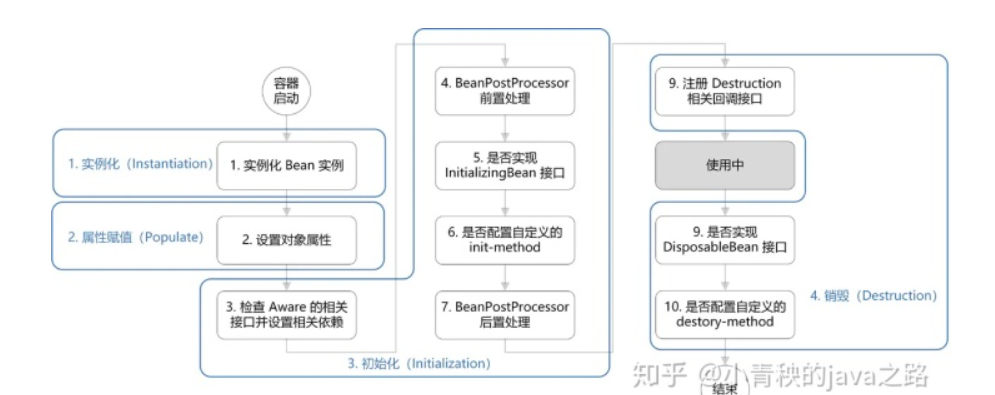

- 实例化一个Bean对象
- 为Bean设置相关属性和依赖
- 初始化
- 销毁

整体流程：

- Spring对Bean实例化。
- Spring将值和Bean的引用注入到Bean相应属性。
- 如果Bean实现了BeanNameAware接口将Bean的Id传给setBeanName接口方法。
- 如果Bean实现了BeanfactoryAware接口将调用setBeanFactory方法将Beanfactory容器实例传入。
- 如果实现了ApplicationContextAware接口，Spring将调用setApplicationContext()接口方法，将应用上下文的引用传入。
- 如果实现了BeanPostProcessor接口，将调用postProcessBeforeInitialization()接口方法。
- 如果实现了InitializationBean接口，将调用他们的afterPropertiesSet()接口方法。
- 如果使用了init-method生命初始化方法，该方法也会被调用。
- 如果实现了BeanPostProcessor接口，将调用postProcessAfterInitialization()接口方法试。
- 如果实现了DisposableBean接口，Spring将调用他的destroy()接口方法。
- 如果使用destroy-method生命了销毁方法，该方法也会被调用。

代码源码：

```java
// AbstractAutowireCapableBeanFactory.java
protected Object doCreateBean(final String beanName, final RootBeanDefinition mbd, final @Nullable Object[] args)
    throws BeanCreationException {
 
    // 1. 实例化
    BeanWrapper instanceWrapper = null;
    if (instanceWrapper == null) {
        instanceWrapper = createBeanInstance(beanName, mbd, args);
    }
   
    Object exposedObject = bean;
    try {
        // 2. 属性赋值
        populateBean(beanName, mbd, instanceWrapper);
        // 3. 初始化
        exposedObject = initializeBean(beanName, exposedObject, mbd);
    }
 
    // 4. 销毁-注册回调接口
    try {
        registerDisposableBeanIfNecessary(beanName, bean, mbd);
    }
 
    return exposedObject;
}
```

初始化代码：

```java
if(System.getSecurityManager() != null)
{
    AccessController.doPrivileged((PrivilegedAction < Object > )() - >
    {
        invokeAwareMethods(beanName, bean);
        return null;
    }, getAccessControlContext());
}
else
{
    invokeAwareMethods(beanName, bean);
} // 
4. BeanPostProcessor 前置处理 Object wrappedBean = bean;
if(mbd == null || !mbd.isSynthetic())
{
    wrappedBean = applyBeanPostProcessorsBeforeInitialization(wrappedBean, beanName);
} // 
5. 若实现 InitializingBean 接口， 调用 afterPropertiesSet() 方法 // 
6. 若配置自定义的 init - method方法， 则执行
try
{
    invokeInitMethods(beanName, wrappedBean, mbd);
}
catch(Throwable ex)
{
    throw new BeanCreationException((mbd != null ? mbd.getResourceDescription() : null), beanName, "Invocation of init method failed", ex);
} //
7. BeanPostProceesor 后置处理
if(mbd == null || !mbd.isSynthetic())
{
    wrappedBean = applyBeanPostProcessorsAfterInitialization(wrappedBean, beanName);
}
return wrappedBean;
}
```

销毁代码：

```java
 // DisposableBeanAdapter.java public void destroy() {     // 
 9. 若实现 DisposableBean 接口， 则执行 destory() 方法
 if(this.invokeDisposableBean)
 {
     try
     {
         if(System.getSecurityManager() != null)
         {
             AccessController.doPrivileged((PrivilegedExceptionAction < Object > )() - >
             {
                 ((DisposableBean) this.bean).destroy();
                 return null;
             }, this.acc);
         }
         else
         {
             ((DisposableBean) this.bean).destroy();
         }
     }
 } //
 10. 若配置自定义的 detory - method 方法， 则执行
 if(this.destroyMethod != null)
 {
     invokeCustomDestroyMethod(this.destroyMethod);
 }
 else if(this.destroyMethodName != null)
 {
     Method methodToInvoke = determineDestroyMethod(this.destroyMethodName);
     if(methodToInvoke != null)
     {
         invokeCustomDestroyMethod(ClassUtils.getInterfaceMethodIfPossible(methodToInvoke));
     }
 }
 }
```

# spring 控制反转IOC

IOC（控制反转）：一种设计思想，是Spring的核心。调用类的方法不是通过new操作，而是Spring配置来创建对象，然后交给IOC容器管理对象，使用时候找IOC容器要。

## 设计模式

### 工厂设计模式

### 单例模式

### 策略模式

一个类的行为可以在运行时改变。

当Bean需要访问资源配置文件时，有两种方式包括：代码中获取Resource实例；依赖注入。

在依赖注入的过程中会调用ApplicationContext获取resource实例。然而Resource接口封装了多种可能的资源类型，包括UrlResource以及ClassPathResource等，spring需要对不同资源采用不同的访问策略。在这Spring让ApplicationContext成为资源访问策略的决策者，直接使用getResource，而ApplicationContext调用getResource来获取资源。ApplicationContext 将会负责选择 Resource 的实现类，将应用程序和具体资源访问策略分开。

```java
ApplicationContext ctx = new Class PathXmlApplicationContext("bean.xml");
Resource res = ctx.getResource("book.xml");

```

### 装饰者模式

## 反射

这一段配置文件以及他的实现伪代码

```java
<bean id="courseDao" class="com.qcjy.learning.Dao.impl.CourseDaoImpl"></bean>
```

```java
//解析<bean .../>元素的id属性得到该字符串值为“courseDao”
String idStr = "courseDao";
//解析<bean .../>元素的class属性得到该字符串值为“com.qcjy.learning.Dao.impl.CourseDaoImpl”
String classStr = "com.qcjy.learning.Dao.impl.CourseDaoImpl";
//利用反射知识，通过classStr获取Class类对象
Class<?> cls = Class.forName(classStr);
//实例化对象
Object obj = cls.newInstance();
//container表示Spring容器
container.put(idStr, obj);
```

# spring依赖注入

对象不是在IOC容器中查找依赖类，而是在容器实例化对象的时候，已经将该对象所依赖的类注入给该对象。

## spring依赖注入的方式

### 基于注解的注入

```java
@Controller
public class HappyController {
    @Autowired //默认依赖的ClubDao 对象（Bean）必须存在
    //@Autowired(required = false) 改变默认方式
    @Qualifier("goodClubService")
    private ClubService clubService;
 
    // Control the people entering the Club
    // do something
}
```

### 构造方法注入

```java
<!--dao -->
<bean id="userTestDao" class="com.chenlw.java.web.utils.springwiki.UserTestDao">
</bean>
 
<!-- 注册userService -->
<bean id="userTestServiceImpl" class="com.chenlw.java.web.utils.springwiki.UserTestServiceImpl">
    <!-- 将DAO对象注入Service层 -->
    <constructor-arg ref="userTestDao"/>
</bean>
```

### setter注入

```java
<!-- 注册dao -->
<bean id="userTestDao" class="com.chenlw.java.web.utils.springwiki.UserTestDao">
</bean>
 
<!-- 注册userService -->
<bean id="userTestServiceImpl" class="com.chenlw.java.web.utils.springwiki.UserTestServiceImpl">
    <!-- 将DAO对象注入Service层 -->
    <property name="userTestDao" ref="userTestDao"/>
</bean>
```

## 何时进行依赖注入

当 Spring IOC 容器启动时完成定位、加载、注册操作，此时 IOC容器已经获取到 applicationContext.xml 配置文件中的全部配置，并以 BeanDefinition类的形式保存在一个名为：beanDefinitionMap 的 ConcurrentHashMap 中。如下所示

```java
//存储注册信息的BeanDefinition
private final Map<String, BeanDefinition> beanDefinitionMap = new ConcurrentHashMap<>(256);

```

此时容器只存储了这些对象定义，并没有创建真正的实例对象没有进行依赖注入操作。

当lazy-init属性默认为false，此时会在启动Spring容器时完成实例对象创建，即Spring容器启动时触发依赖注入。

当该为true，容器在启动时不会完成实例对象的创建。只有用户第一次通过调用Spring的getBean方法时候，才会向IOC容器索要Bean对象，此时IOC容器才会触发依赖注入。

## 源码分析入手处

getBean方法

## 实例化的Bean对象用什么类型存储

FactoryBean：由spring生成出来的Bean就是FactoryBean。

BeanFactory：Bean工厂，创建Bean对象的工厂。

## @Autowired、@Resource与@Qualifier区分

## 作用

让相互写作的软件组件保持松散耦合。

拦截指定方法，并且对方法增强，比如：日志、事务等，无侵入实现。

# spring切面

[Spring AOP全面详解(超级详细)-CSDN博客](https://blog.csdn.net/Cr1556648487/article/details/126777903)

## 作用

允许把遍布应用各处的功能分离出来形成可重用的组件。

## 概念

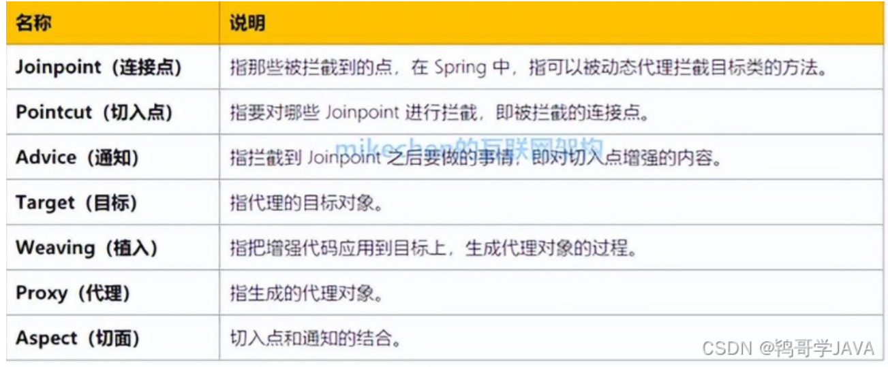

代码如下：

```java
import org.aspectj.lang.annotation.Aspect;
import org.aspectj.lang.annotation.Before;
import org.aspectj.lang.annotation.Pointcut;

@Aspect
public class MyAspect {

    @Pointcut("execution(* MyService.performTask(..))")
    public void performTaskPointcut() {
        // 切入点表达式
    }

    @Before("performTaskPointcut()")
    public void beforeTask() {
        System.out.println("Before executing task...");
    }
}

```

**连接点：**

@Pointcut("execution(* MyService.performTask(..))")

程序执行过程中可以插入切面的点，也就是能匹配上这个表达式的所有方法执行。

**切入点：**

```java
public void performTaskPointcut() {
// 切入点表达式
}
```

一个匹配连接点的表达式，这段代码定义了一个切入点的表达式。

@Pointcut("execution(* MyService.performTask(..))")

**通知：**

实际执行的代码

```java
@Before("performTaskPointcut()")
public void beforeTask() {
    System.out.println("Before executing task...");
}

```

**目标：**

被通知增强的对象，或者说被匹配的对象

```java
public class MyService {
    public void performTask() {
        System.out.println("Executing task...");
    }
}

```

**切面：**

通知和切入点的结合。一个切面定义了在什么情况下切入点执行什么操作。整个MyAaspect就是一个切面

```java
@Aspect
public class MyAspect {

    @Pointcut("execution(* MyService.performTask(..))")
    public void performTaskPointcut() {
        // 切入点表达式
    }

    @Before("performTaskPointcut()")
    public void beforeTask() {
        System.out.println("Before executing task...");
    }
}

```

**代理：**

包含切面逻辑的对象，代理目标对象的方法调用，通过代理对象执行目标方法。实际返回的Bean也是一个代理对象的。

```java
@Aspect
public class MyAspect {

    @Pointcut("execution(* MyService.performTask(..))")
    public void performTaskPointcut() {
        // 切入点表达式
    }

    @Before("performTaskPointcut()")
    public void beforeTask() {
        System.out.println("Before executing task...");
    }
}

```

通知的分类：

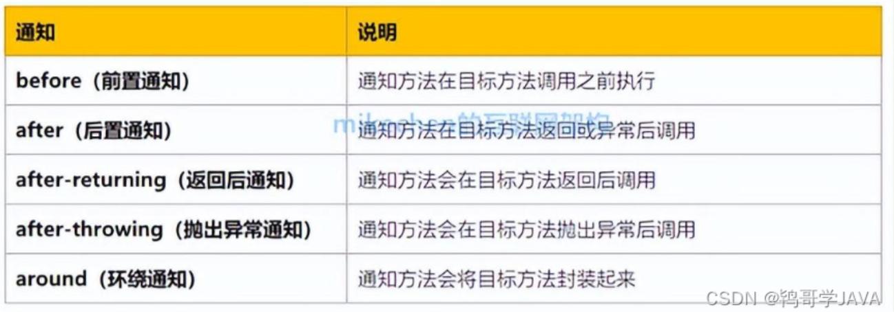

AOP织入时期

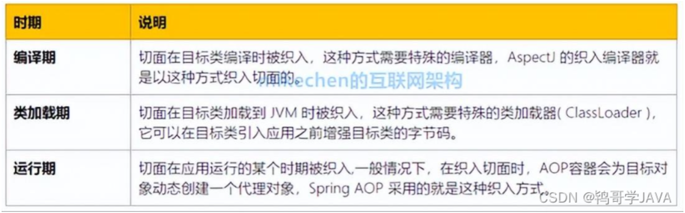

## 实现原理-动态代理

详情查看设计模式内容。

### 设计模式-代理

### JDK动态代理

### CGLib动态代理

### spring是如何选择

```java
@Override
public AopProxy createAopProxy(AdvisedSupport config) throws AopConfigException {
    // 1.config.isProxyTargetClass() 代表 配置中的proxy-target-class属性true/false，默认false
    // 
    if (config.isOptimize() || config.isProxyTargetClass() || hasNoUserSuppliedProxyInterfaces(config)) {
        // 目标代理类，如 com.service.impl.UserServiceImpl
        Class<?> targetClass = config.getTargetClass();
        if (targetClass == null) {
            throw new AopConfigException("TargetSource cannot determine target class: " +
                                         "Either an interface or a target is required for proxy creation.");
        }
        // 目标类如果是一个接口 或者 （Proxy是JDK动态代理用到的一个类）也就是说这里表示目标类是否为这个Proxy 类型
        if (targetClass.isInterface() || Proxy.isProxyClass(targetClass)) {
            return new JdkDynamicAopProxy(config);
        }
        return new ObjenesisCglibAopProxy(config);
    }
    else {
        return new JdkDynamicAopProxy(config);
    }
}
```

如果目标对象实现了接口默认使用JDK来代理实现AOP，如果目标对象实现了接口可以强制使用CGLIB，如果目标对象没有实现了接口，必须使用CGLIB。

JDK动态代理的效率要更高一些。

# spring 事务

通过@EnableTransactionManagement

## 概念

事务由事务开始与事务结束之间执行的全部数据库操作组成。

## 特性

原子性-要么全部完成要么全部不完成

一致性-一个事务执行前和之后都必须处于一致的状态

隔离性-每个事务都有自己的完整空间，并发事务的修改与其他并发事务的修改隔离

持久性-只要事务成功完成，对数据库的更新就必须保存下来

## @Transactional

加在方法上只会影响方法

加在类上，会影响类中所有方法

## 事务属性

### 只读（@Transactional(readOnly = true)）

说明只有读操作，如果其中由增删改，就会报错：connection is read only

### 超时（@Transactional(timeout=3)）

超时就会报错，TransactionTimedOutException

### 回滚策略（@Transactional(rollBackFor = XXX.class)）

rollBackFor;rollbackForClassName;noRollbackFor;noRollbackForClassName

className的往里传递全类名

## 隔离级别（@Transactional(isolation = ISOLATION.DEFAULT)）

Spring事务本质上使用的数据库事务，数据库事务本质上使用数据库锁，所以spring事务本质上使用数据库锁。

隔离级别值得也是事务与其他事务之间的隔离成都，隔离级别越高，一致性越好。

选项如下：

```java
@Transactional(isolation = Isolation.DEFAULT)//使用数据库默认的隔离级别
@Transactional(isolation = Isolation.READ_UNCOMMITTED)//读未提交
@Transactional(isolation = Isolation.READ_COMMITTED)//读已提交
@Transactional(isolation = Isolation.REPEATABLE_READ)//可重复读
@Transactional(isolation = Isolation.SERIALIZABLE)//串行化

```

读未提交-允许A读取B未提交的修改。

读已提交-A只能读取B提交的修改。

可重复读-A执行期间不允许其他事务更新字段。

串行化-A执行期间禁止其他事务对表做增删改。

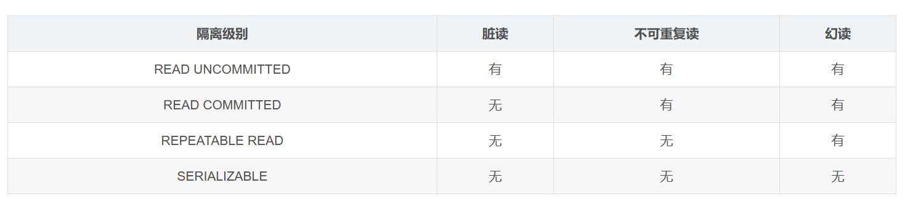

数据库对事务隔离级别的支持程度：

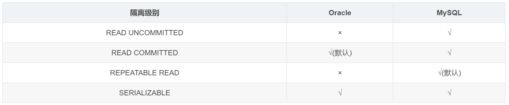

**脏读、不可重复读、幻读：**

- 脏读：B事务读取了A事务未提交的数据且A事务回滚。
- 不可重复读：A事务两次查询同一数据的内容不同，B在两次读取中修改了数据。
- 幻读：同义词食物中两次相同查询的数据条数不一致，第一次5第二次10，两次查询间隙，另外一个事务插入5条数据。

## 事务传播行为

service中有方法a和方法b，a和b上都有事务，a在执行过程中调用了b，事务是如何传递的，是开启新事物还是合并到一个事务。

- REQUIRED：支持当前事务，如果不存在就新建一个(默认)【没有就新建，有就加入】
- SUPPORTS：支持当前事务，如果当前没有事务，就以非事务方式执行**有就加入，没有就不管了**
- **MANDATORY：必须运行在一个事务中，如果当前没有事务正在发生，将抛出一个异常**【有就加入，没有就抛异常】
- REQUIRES_NEW：开启一个新的事务，如果一个事务已经存在，则将这个存在的事务挂起【不管有没有，直接开启一个新事务，开启的新事务和之前的事务不存在嵌套关系，之前事务被挂起】
- **NOT_SUPPORTED：以非事务方式运行，如果有事务存在，挂起当前事务**【不支持事务，存在就挂起】
- **NEVER：以非事务方式运行，如果有事务存在，抛出异常**【不支持事务，存在就抛异常】
- NESTED：如果当前正有一个事务在进行中，则该方法应当运行在一个嵌套式事务中。被嵌套的事务可以独立于外层事务进行提交或回滚。如果外层事务不存在，行为就像REQUIRED一样。【有事务的话，就在这个事务里再嵌套一个完全独立的事务，嵌套的事务可以独立的提交和回滚。没有事务就和REQUIRED一样。】

requires_new - 外部事务被挂起就意味着事务的执行会被暂停，上下文被保存以便后续回复；内部事务抛出异常也是，新事务存在独立性，该事务的提交或者回滚不影响挂起事务；外部事务抛出异常不会影响内部事务。会挂起当前事务和数据库连接，启动新的事务和连接，新的事务完成以后回复原来的事务和连接。

NESTED- 内部的子事务存在依赖于外部事务。子事务的回滚只影响子事务，但外部事务的回滚所有嵌套事务都会被回滚。子事务的异常只允许子事务（如果需要子事务的回滚也可以标记外部事务为回滚）；如果外部事务抛出异常并回滚，所有嵌套事务都会回滚。这种子事务是通过数据库的保存点机制，嵌套事务开启时候，会在数据库链接上创建保存点，如果嵌套事务回滚，spring会将连接回滚到保存点。

## 类型

编程式事务管理-声明式事务管理

编程式使用TransactionTemplate

## 原理

使用数据库锁；

通过AOP拦截注解方法并做动态代理，捕获异常，spring事务其实是把事务交给spring处理；spring事务只有捕获到异常才会终止回滚，如果做了try/catch那么事务就不会中止或者回滚。

spring事务回滚一个事务中的所有数据库操作，本质上是回滚同一数据库连接上的数据库操作。

### 动态代理

使用TransactionalInterceptor类来处理这些注解，并创建代理对象。

## 事务失效及其原因

### 底层数据库不支持

比如Mysql的Innodb支持事务，但是MyISAM不支持，那么如果底层表是基于MyIsam创建，那么@Transactional就会失效。

### 事务不回滚

#### 错误的传播特性

比如requires_new

#### 使用trycatch捕获了异常没有抛出

#### 手动抛了其他异常

```java
@Slf4j
@Service
public class UserService {
  
    @Transactional
    public void add(UserModel userModel) throws Exception {
        try {
             saveData(userModel);
             updateData(userModel);
        } catch (Exception e) {
            log.error(e.getMessage(), e);
            throw new Exception(e);
        }
    }
}
```

@Transactional默认只回滚RuntimeException以及Error，对于普通的Exception不会回滚

#### 自定义了回滚异常

#### 嵌套事务回滚太多

可以通过trycatch解决问题，如下图，这样回滚仅限于内部的doOtherThing

```java
@Slf4j
@Service
public class UserService {
 
    @Autowired
    private UserMapper userMapper;
 
    @Autowired
    private RoleService roleService;
 
    @Transactional
    public void add(UserModel userModel) throws Exception {
 
        userMapper.insertUser(userModel);
        try {
            roleService.doOtherThing();
        } catch (Exception e) {
            log.error(e.getMessage(), e);
        }
    }
}
```

### 大事务问题

在整个方法上添加@Transactional会十分耗时

### 事务不生效

主要因为代理的两种实现，默认使用JDK动态代理需要接口，或者使用CGLIB，需要将当前类设置为自己的父类。

#### 访问权限

被代理的方法是private，这样无论哪种代理都无法解决这个问题。

#### final

被代理的方法是final，无法被子类重写，也不在接口中。

#### 方法内部调用

方法的内部调用中使用的是this方法而不是代理对象的方法，所以也会失效。

```java
@Service
public class UserService {
 
    @Autowired
    private UserMapper userMapper;
 
  
    public void add(UserModel userModel) {
        userMapper.insertUser(userModel);
        updateStatus(userModel);
    }
 
    @Transactional
    public void updateStatus(UserModel userModel) {
        doSameThing();
    }
}
```

可以新建一个service或者在这个Service类中注入自己：@Autowired private ServiceA serviceA;spring ioc内部的三级缓存保证这里不会出现循环依赖

#### 类未被Spring管理

使用spring事务的前提，对象被spring管理，需要创建bean实例。

```java
//@Service
public class UserService {
 
    @Transactional
    public void add(UserModel userModel) {
         saveData(userModel);
         updateData(userModel);
    }  
}
```

#### 多线程调用

如下图中的方法，不在同一个数据库连接上，就是两个事务，那么doOtherThing回滚也不会影响外面的。

```java
@Slf4j
@Service
public class UserService {
 
    @Autowired
    private UserMapper userMapper;
    @Autowired
    private RoleService roleService;
 
    @Transactional
    public void add(UserModel userModel) throws Exception {
        userMapper.insertUser(userModel);
        new Thread(() -> {
            roleService.doOtherThing();
        }).start();
    }
}
 
@Service
public class RoleService {
 
    @Transactional
    public void doOtherThing() {
        System.out.println("保存role表数据");
    }
}
```

#### 未开启事务

springboot项目通过`DataSourceTransactionManagerAutoConfiguration`类，帮开启了事务。如果是传统Spring项目，需要手动配置。

# Spring常用注解

## @Configuration，@Component，@Service，@Controller

# spring容器的存储结构

## 循环依赖

```java
@Component
class A{
    @Autowire
    B b;
}

@Component
class B{
    @Autowire
    A a;
}
```

创建A发现引用了B，创建B发现引用了A

## 解决方式

### bean创建步骤简化

- 创建Bean前先通过扫描获取BeanDefinition
- BeanDefinition就绪后会读取BeanDefinition对应的类
- 实例化阶段：根据构造函数来完成实例化（未属性注入以及初始化的对象这里简称为原始对象）
- 属性注入阶段：对Bean属性进行依赖注入
- 如果Bean的某个方法有AOP操作，需要根据原始对象生成代理对象
- 最后把代理对象放入单例池

说明：

- 上面的Bean创建步骤是对于单例作用域的Bean
- Spring的AOP代理就是作为BeanPostProcessor实现的，而BeanPostProcessor是发生在属性注入阶段之后的，所以AOP是在属性注入后执行的。

### 为什么会出现循环依赖问题？

当A创建时候会先生产一个原始对象，然后属性注入时候发现需要B对应的Bean，此时就会去创建B，结果B实例化以后生成一个原始对象进行属性注入会发现也需要A对应的Bean，这样AB两个Bean都无法创建。

这样的情况只会出现在将Bean交给Spring管理的时候，因为上述的属性注入操作都是Spring在做的，如果只是我们自己在Java中创建对象可以不去注入属性，让成员属性为NULL也可以正常执行的，这样也就不会出现循环依赖的问题了。

### 哪些循环依赖可以被解决

#### spring循环场景

- 构造器的循环依赖
- field属性的循环依赖

Spring解决循环依赖存在前提

- 出现循环依赖的Bean必须是单例
- 依赖注入不能全是构造器注入的方式

对于第一点，因为Spring不会缓存原型作用域的Bean，而Spring依靠缓存解决循环以来问题，所以Spring无法解决原型作用域的Bean。Spring的Bean默认都是单例的。

原型作用域（prototype scope）：每次请求都会创建一个新的Bean实例。

```java
@Component

public class A {

    public A(B b) {

    }

}

@Component

public class B {

    public B(A a){

    }

}
```

A注入B的方式是通过构造器，B注入A也是通过构造器，这时候循环依赖无法被解决，因为构造器注入发生在实例化阶段，而Spring解决循环依赖问题依靠的三级缓存在属性注入阶段，也就是说调用构造函数时还不能放入三级缓存所有无法解决构造器注入的循环依赖问题。

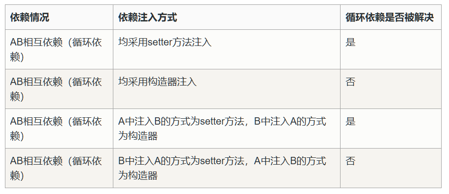

为什么第三种可以而第四种不可以。

**第三种情况**

Spring根据beanName字典序来进行创建，所以先创建A。A是通过setter方法注入B的，所以A可以正常执行完createBeanInstance()方法完成实例化，在执行完实例化方法之后，就会执行addSingletonFactory()方法来讲A的beanFactory加入到第三级缓存中，在后面对A进行属性注入时，发现它依赖了B，就进入到了创建B的流程，而B也依赖了A，是通过构造方法注入的A，所以B在执行到实例化阶段时候，在构造方法中就开始尝试注入A了，会通过前面已经加入到第三级缓存的beanFactory来获取到A，注入给B，所以B就顺利注入了A，完成了整个创建过程。然后A也就能顺利注入B，最终完成了创建过程。至此，A和B都完成了创建。

**第四种情况**
这个情况的循环依赖是没办法通过Spring自身解决的。

依然是先创建A，但是A是通过构造方法注入的B，也就是说A在注入B的时候，仍然还在实例化阶段，实例化方法还没有执行完。通过上面我们知道，将A的beanFactory加入到三级缓存的addSingletonFactory()方法是在完成实例化方法createBeanInstance()之后执行的，但是此时仍然在实例化的过程中，三级缓存中还没有A的beanFactory，这个时候就去注入B，在进入到创建B的流程中时，又会对B来注入A，但此时三级缓存中获取不到对应的beanFactory，也就无法得到A，无法完成对B的创建，后续的流程也就无法推进下去，这样就直接报错循环依赖问题了。


### spring如何解决循环依赖

#### 三级缓存

对于单例，在Spring容器的生命周期内，有且只有一个对象，这个对象存在Cache中，spring为了解决单例的循环依赖问题，使用了三级缓存。

三个缓存都定义在**DefaultSingletonBeanRegistry**中

```java
// 单例对象的cache：一级缓存

private final Map<String, Object> singletonObjects = new ConcurrentHashMap<String, Object>(64);

 

/** Cache of early singleton objects: bean name --> bean instance */

// 提前暴光的单例对象的Cache：二级缓存

private final Map<String, Object> earlySingletonObjects = new HashMap<String, Object>(16);

 

/** Cache of singleton factories: bean name --> ObjectFactory */

// 单例对象工厂的cache：三级缓存

private final Map<String, ObjectFactory<?>> singletonFactories = new HashMap<String, ObjectFactory<?>>(16);
```

三级缓存分别是：

- singletonObbjects：一级缓存单例池，主要存放最终形态的单例bean；我们一般获取一个bean都是从这个缓存中获取；需要说明的是并不是所有单例bean都存在这个缓存当中，有些特殊的单例bean不存在这个缓存当中
- earlySingletonObjects：二级缓存，主要存放的是过渡bean（原始对象/原始对象的代理对象）；也就是从三级缓存当中产生出来的对象；它的作用是防止在多级循环依赖的情况下重复从三级缓存当中创建对象，其他对象都可以直接从二级缓存中获取到原始对象（的代理对象）；因为三级缓存当中创建对象是需要牺牲一定得性能；有了这个缓存可以一定程度上提高效率（但是提高的效率并不明显）。只有在调用了三级缓存中的ObjectFactory的getObject() 方法获取原始对象（的代理对象）时，才会将原始对象（的代理对象）放入二级缓存，而调用三级缓存中的ObjectFactory的getObject() 方法获取原始对象（的代理对象）这种情况只会发生在有循环依赖的时候，所以，二级缓存在没有循环依赖的情况下不会被使用到。二级缓存是为了提前暴露 Bean 来解决循环依赖问题，此时的 Bean 可能还没有进行属性注入，只有等完成了属性注入、初始化后的 Bean 才会上移到一级缓存（单例池）中。
- singletonFactories 三级缓存，用于存放原始对象对应的ObjectFactory，它的作用主要是为了产生一个对象；每生成一个原始对象，都会将这个原始对象对应的ObjectFactory放到三级缓存中，通过调用ObjectFactory的getObject() 方法，就能够在需要动态代理的情况下为原始对象生成代理对象并返回，否则返回原始对象，以此来处理循环依赖时还需要动态代理的情况。

三级缓存的目的就是为了延迟代理对象的创建

为什么会存在三级缓存，主要原因就是：延迟代理对象的创建。设想一下，如果在实例化出一个原始对象的时候，就直接将这个原始对象的代理对象创建出来（如果需要创建的话），然后就放在二级缓存中，似乎感觉三级缓存就没有存在的必要了对吧，但是请打住，这里存在的问题就是，如果真这么做了，那么每一个对象在实例化出原始对象后，就都会去创建代理对象，而Spring的原始设计中，代理对象的创建应该是由AnnotationAwareAspectJAutoProxyCreator这个后置处理器的postProcessAfterInitialization() 来完成，也就是：在对象初始化完毕后，再去创建代理对象。如果真的只用两个缓存来解决循环依赖，那么就会打破Spring对AOP的一个设计思想。


如果不把代理对象创建出来而是把未初始化完的实例放到二级缓存中：

1. **Spring开始创建A** ：
   * A的实例化完成，但尚未经过AOP代理。
   * A被放入二级缓存。
2. **Spring开始创建B** ：
   * B依赖于A，从二级缓存中获取原始的A实例。
   * A的原始实例被注入到B中。
3. **代理对象的问题** ：
   * A的代理对象应该在初始化完成后创建，但此时原始A实例已经在B中被使用，无法再用代理对象替换。


具体流程：

- 首先会获取 AService 对应的 Bean 对象。
- 先是调用 doGetBean() 中的第一个 getSingleton(beanName) 判断是否有该 Bean 的实例，有就直接返回了。（显然这里没有）
- 然后调用 doGetBean() 中的第二个 getSingleton() 方法来执行 doCreateBean() 方法。
- 先进行实例化操作（也就是利用构造函数实例化），此时实例化后生成的是原始对象。
- 将原始对象通过 lambda表达式 进行封装成 ObjectFactory 对象，通过 addSingletonFactory 加入三级缓存中。
- 然后再进行属性注入，此时发现需要注入 BService 的 Bean，会通过 doGetBean() 去获取 BService 对应的 Bean。
- 同样调用 doGetBean() 中的第一个 getSingleton(beanName) 判断是否有该 Bean 的实例，显然这里也是不会有 BService 的 Bean 的。
- 然后只能调用 doGetBean() 中的第二个 getSingleton() 方法来执行 doCreateBean() 方法来创建一个 BService 的 Bean。
- 同样地先进行实例化操作，生成原始对象后封装成 ObjectFactory 对象放入三级缓存中。
- 然后进行属性注入，此时发现需要注入 AService 的 Bean，此时调用调用 doGetBean() 中的第一个 getSingleton(beanName) 查找是否有 AService 的 Bean。此时会触发三级缓存，也就是调用 singletonFactories.get(beanName)。
- 因为三级缓存中有 AService 的原始对象封装的 ObjectFactory 对象，所以可以获取到的代理对象或原始对象，并且上移到二级缓存中，提前暴露给 BService 调用。
- 所以 BService 可以完成属性注入，然后进行初始化后，将 Bean 放入一级缓存，这样 AService 也可以完成创建。


这样做有什么好处呢？让我们来分析一下“A的某个field或者setter依赖了B的实例对象，同时B的某个field或者setter依赖了A的实例对象”这种循环依赖的情况。A首先完成了创建的第一步（完成实例化），并且将自己提前曝光到singletonFactories中，此时进行创建的第二步（属性注入），发现自己依赖对象B，此时就尝试去get(B)，发现B还没有被create，所以走create(B)的流程，B在创建第一步的时候发现自己依赖了对象A，于是尝试get(A)，尝试一级缓存singletonObjects(肯定没有，因为A还没初始化完全)，尝试二级缓存earlySingletonObjects（也没有），尝试三级缓存singletonFactories，由于A通过ObjectFactory将自己提前曝光了，所以B能够通过ObjectFactory.getObject拿到A对象(虽然A还没有初始化完全，但是总比没有好呀)，B拿到A对象后顺利完成了创建的阶段1、2、3，B完成创建后之后将自己放入到一级缓存singletonObjects中。此时返回A的创建流程中，A此时能拿到B的对象顺利完成自己的创建阶段2、3，最终A也完成了创建，将创建好的A添加到一级缓存singletonObjects中，而且更加幸运的是，由于B拿到了A的对象引用，所以B现在持有的A对象也完成了创建。（简单来说，就是spring创造了一个循环依赖的结束点标识）

 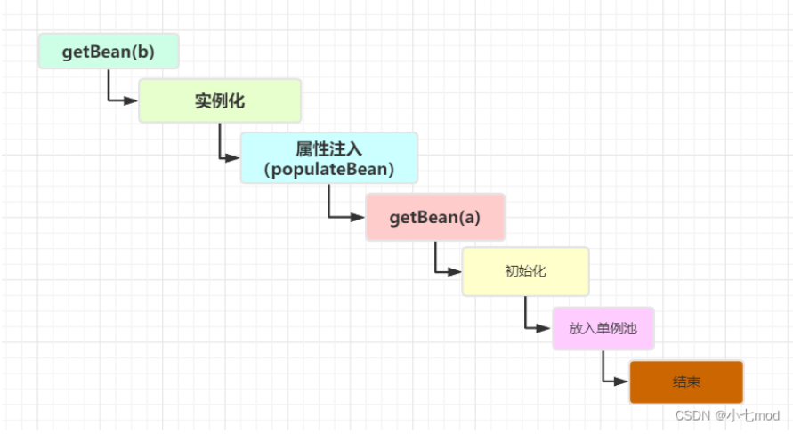

 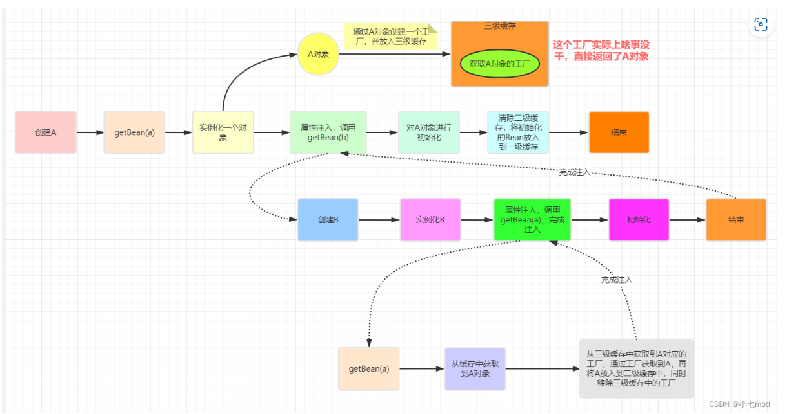

从上图中我们可以看到，虽然在创建B时会提前给B注入了一个还未初始化的A对象，但是在创建A的流程中一直使用的是注入到B中的A对象的引用，之后会根据这个引用对A进行初始化，所以这是没有问题的。

 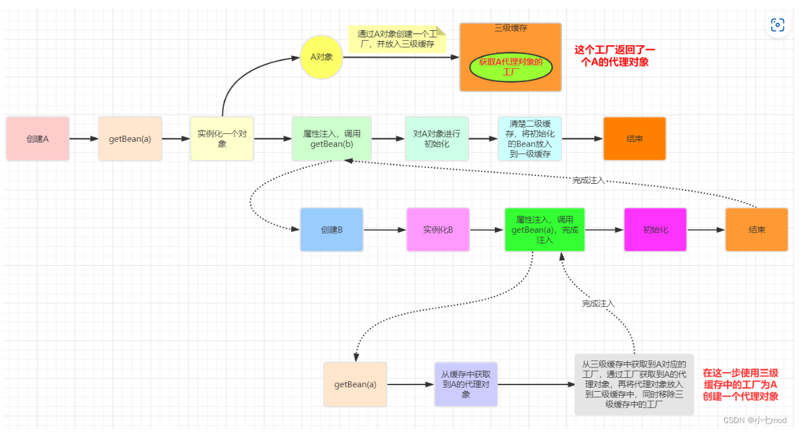

回到上面的例子，我们对A进行了AOP代理的话，那么此时getEarlyBeanReference将返回一个代理后的对象，而不是实例化阶段创建的对象，这样就意味着B中注入的A将是一个代理对象而不是A的实例化阶段创建后的对象。

**1、在给B注入的时候为什么要注入一个代理对象？**

答：当我们对A进行了AOP代理时，说明我们希望从容器中获取到的就是A代理后的对象而不是A本身，因此把A当作依赖进行注入时也要注入它的代理对象。

**2** **、明明在创建A的时候，到初始化这一步完成的时候仍然还是原始的A对象，那么如果对A有AOP增强的话，为什么最终在Spring容器中取出的A是代理增强的对象呢？Spring是在什么时候将代理对象放入到容器中的呢？**

由上图可见，创建A的流程中，在完成对A的初始化后，此时仍然还是原始的A对象。我们知道在A实例化之后，会将A的BeanFactory加入到第三级缓存中，这个BeanFactory可以返回AOP代理增强之后的A对象，但是此时在创建A的流程中，一直操作的是A的原始对象，并没有通过BeanFactory获取A的代理增强对象。只不过是在创建A所依赖的B时，因为B也同样依赖A，而根据自然顺序（按照BeanName的字典序）B在A之后创建，所以在对B注入A的时候三级缓存中已经存在了A的BeanFactory，所以B注入的A是通过BeanFactory返回的A的代理增强后的对象。但是针对A本身的创建流程来说，在A初始化后，操作的仍然是A的原始对象。


答案：由源码可知Spring又调用了一次getSingleton方法，但这一次传入的参数又不一样了，第二个参数传入的是false，false可以理解为禁用第三级缓存，前面图中已经提到过了，在为B中注入A后，就将A的BeanFactory返回的代理对象加到了二级缓存中，并就将A的BeanFactory从三级缓存中的移除。此时A的BeanFactory已经不在三级缓存中了，并且在本次调用getSingleton方法是传入的参数已经保证了禁用第三级缓存了，所以这里的这个getSingleton方法做的实际就是从二级缓存中获取到这个代理后的A对象。


**3、初始化的时候是对A对象本身进行初始化（初始化之前也都是对原始A对象进行的处理），而添加到Spring容器中以及注入到B中的都是代理对象，这样不会有问题吗？**
答：不会，这是因为不管是cglib代理还是jdk动态代理生成的代理类，内部都持有一个目标类的引用，当调用代理对象的方法时，实际会去调用目标对象的方法，A原始类完成初始化相当于代理对象自身也完成了初始化。

**4、三级缓存为什么要使用工厂而不是直接使用引用？换而言之，为什么需要这个三级缓存，直接通过二级缓存暴露一个引用不行吗？**
答：这个工厂的目的在于延迟对实例化阶段生成的对象的代理，只有真正发生循环依赖的时候，才去提前生成代理对象，否则只会创建一个工厂并将其放入到三级缓存中，但是不会去通过这个工厂去真正创建对象。

在普通的循环依赖中，三级缓存没有任何作用，三级缓存的目的是为了解决Spring的AOP问题。


#### 三级缓存真的提高了效率吗？

**没有进行aop的bean之间循环依赖？**

可见三级缓存没用

**进行了AOP的Bean间循环依赖**

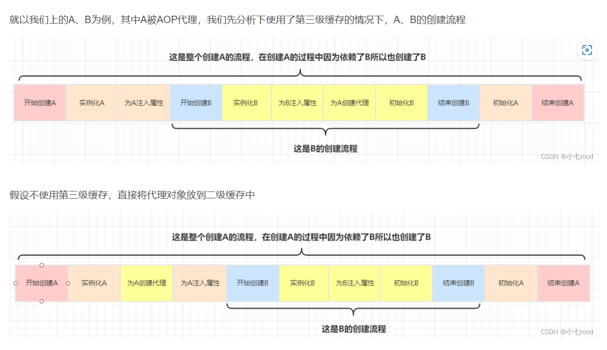

为什么不能二级缓存：

**未完成的初始化** ：如果在注入属性时创建代理对象，代理对象可能会在Bean未完全初始化时被使用。这会导致一些初始化逻辑（如`@PostConstruct`方法、`InitializingBean`接口的`afterPropertiesSet`方法等）未被正确执行，进而影响Bean的行为。

**代理对象的创建时机** ：AOP代理对象的创建通常应该在Bean完成所有属性的注入和初始化后进行。如果在注入属性时就创建代理对象，会导致代理对象的属性和方法未完全初始化，可能会出现不完整或错误的状态。

### Spring循环依赖的解决方案

#### 重新设计Bean

#### 使用setter/field注入

#### 使用@Lazy，

因为@Lazy用于延迟初始化Bean，当加了这个注解，spring容器不会在启动时立即创建该Bean而是在第一次需要使用的时候才会创建。

可以将依赖注入延迟到Bean实际被使用的时候。

```java
public class A {
    private final B b;

    @Autowired
    public A(@Lazy B b) {
        this.b = b;
    }
}

public class B {
    private final A a;

    @Autowired
    public B(@Lazy A a) {
        this.a = a;
    }
}

```

这样的B不会立即创建，而是会被代理对象替代，只有实际访问B时候才会创建B实例。

#### 使用@PostConstruct

打破循环的另一种方式是，在要注入的属性（该属性是一个bean）上使用 @Autowired，并使用@PostConstruct 标注在另一个方法，且该方法里设置对其他的依赖。

### 什么样的循环依赖无法处理

1、因为加入singletonFactories三级缓存的前提是执行了构造器来创建半成品的对象，所以构造器的循环依赖没法解决（指的是没办法通过Spring自身解决，但是可以通过程序员自己使用@Lazy注解来解决）。因此Spring不能解决“A的构造方法中依赖了B的实例对象，同时B的构造方法中依赖了A的实例对象”这类问题了！

2、spring不支持原型（prototype）bean属性注入循环依赖，不同于构造器注入循环依赖会在创建spring容器context时报错，它会在用户执行代码如context.getBean()时抛出异常。因为对于原型bean，spring容器会在每一次使用它的时候创建一个全新的Bean。
