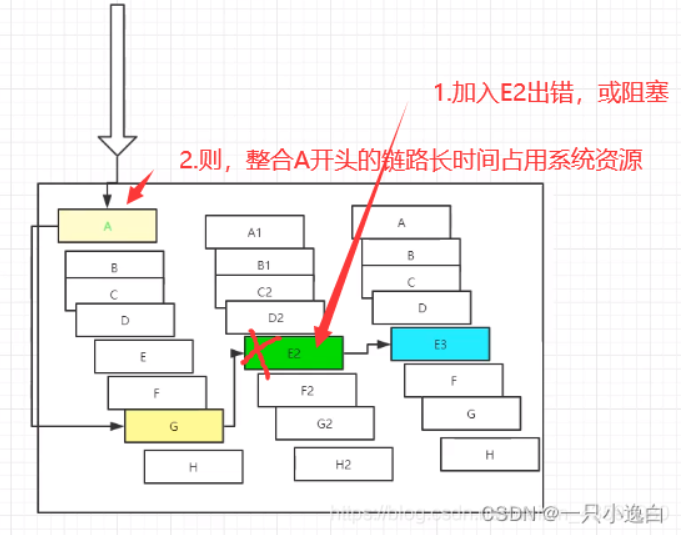

# 概述

## 结构

服务注册与发现:eureka;nacos

负载均衡：

- 客户端负载均衡-Netflix Ribbon
- 服务端负载均衡-Feign

断路器：netflix Hystix

网关：zuul;springcloud gateway

分布式配置：springcloud config;nacos

## 什么是微服务

一种架构模式，将单体应用划分成一组小服务，每个服务独立运行，服务间采用HTTP相互沟通

从技术的角度来说：将传统一站式应用，根据业务拆分成一个个小服务，彻底去耦合，拥有自己的数据库

## 微服务与微服务架构

微服务：强调的是服务大小，一个服务解决一个问题，可以看作idea中一个个微服务工程或者module

微服务架构：一种架构模式，将但亦拥有划分成一组小服务，服务之间相互协调配合，每个服务运行在独立的进程中，服务与服务之间通过轻量级通信机制（HTTP）互相协作。

## 优缺点

**优点：**

- 单一职责
- 服务足够内聚
- 开发简单高效
- 可以被小团队独立开发
- 松耦合的
- 能使用不同语言开发
- 易于与第三方继承
- 前后端分离
- 每个微服务有自己的存储能力

**缺点：**

- 服务间通信成本
- 分布式系统复杂
- 多服务运维难度
- 系统部署依赖
- 数据一致性

## 微服务技术栈

 

## 为什么用spring cloud

**选型依据**

* 整体解决方案和框架成熟度
* 社区热度
* 可维护性
* 学习曲线

dubbo与springcloud对比，个人理解dubbo只是一个rpc调用的解决方案。


二者之间最大区别在于dubbo使用的是rpg调用惊险与JAVA之间，而springcloud使用的是基于HTTP的rest灵活性加强。

**springcloud和springboot关系：**

- springboot专注于开发单个个体微服务
- springcloud是一个关注全局的微服务框架，将springboot开发的微服务整合管理起来。

# eureka

Netflix设计eureka时候遵循的就是API原则。是核心模块之一，基于rest服务，提供服务注册于发现的功能，基于Rest服务。有了服务注册与发现，只需要使用服务的标识符，就可以访问到服务，不需要修改服务调用的配置文件

## 原理

系统中其他微服务，使用eureka的客户端连接到eurekaserver并维持心跳。

 

与dubbo相对比

 

eureka包含两个组件：eureka server和eureka client

server提供服务注册，各个节点启动以后在server做注册，这样server会存储所有节点信息

client是一个客户端，在应用启动后会向eurekaserver发送心跳。如果eureka server在多个心跳周期内没有接收到某个节点的心跳，会在服务注册表将其移除，默认90s

**三大角色**

* Eureka Server：提供服务的注册与发现
* Service Provider：服务生产方，将自身服务注册到Eureka中，从而使服务消费方能狗找到
* Service Consumer：服务消费方，从Eureka中获取注册服务列表，从而找到消费服务

但是心跳周期内没有接收到某个节点心跳时候，会有一个自我保护机制

默认情况下，当eureka server在一定时间内没有收到实例的心跳，便会把该实例从注册表中删除（默认是90秒），但是，如果短时间内丢失大量的实例心跳，便会触发eureka server的自我保护机制，比如在开发测试时，需要频繁地重启微服务实例，但是我们很少会把eureka server一起重启（因为在开发过程中不会修改eureka注册中心），当一分钟内收到的心跳数大量减少时，会触发该保护机制。可以在eureka管理界面看到Renews threshold和Renews(last min)，当后者（最后一分钟收到的心跳数）小于前者（心跳阈值）的时候，触发保护机制，会出现红色的警告：EMERGENCY!EUREKA MAY BE INCORRECTLY CLAIMING INSTANCES ARE UP WHEN THEY'RE NOT.RENEWALS ARE LESSER THAN THRESHOLD AND HENCE THE INSTANCES ARE NOT BEGING EXPIRED JUST TO BE SAFE.从警告中可以看到，eureka认为虽然收不到实例的心跳，但它认为实例还是健康的，eureka会保护这些实例，不会把它们从注册表中删掉。

目的是为了避免业务网络连接故障导致的误删除，这样即使删除了微服务也不会重新注册到eurekaserver了

自我保护模式可以关闭：eureka.server.enable-self-preservation=false，初期的测试阶段可以开启。

## 集群配置

 

## 对比与zookeeper区别

RDBMS (MySQL\Oracle\sqlServer) ===> ACID

NoSQL (Redis\MongoDB) ===> CAP

### acid

**ACID是什么？**

* A (Atomicity) 原子性
* C (Consistency) 一致性
* I (Isolation) 隔离性
* D (Durability) 持久性

### cap

**CAP是什么?**

* C (Consistency) 强一致性
* A (Availability) 可用性
* P (Partition tolerance) 分区容错性
* CAP的三进二：CA、AP、CP

一个分布式系统不能很好的满足一致性，可用性和分区容错性。

* CA：单点集群，满足一致性，可用性的系统，通常可扩展性较差
* CP：满足一致性，分区容错的系统，通常性能不是特别高
* AP：满足可用性，分区容错的系统，通常可能对一致性要求低一些

### 区别

- zookeeper关注于CP，在网络异常的情况下无法提供服务，eureka则是AP，网络异常情况下仍然可以提供服务。
- eureka是一个独立的应用程序，可以通过部署多个实例来提升可用性，zookeeper是一个分布式系统
- 性能不同，eureka是ap就可能出现数据不一致的情况，而zookeppercp机制可以保证数据一致性，但在网络分区情况下可能会导致服务不可用
- 使用场景不同，eureka适用于微服务架构中的服务注册与发现，zookeeper使用于分布式系统中的协调管理
- 服务检测方式：eureka采用心跳机制，zookeeper使用tcp长连接检测服务可用性
- 服务发现方式，eureka客户端会向server发送心跳信息，并获取可用服务，zookeeper客户端需要向zookeeper服务器请求获取服务信息。
- zookeeper在主节点挂掉的时候会重选leader但时间很长且选举过程中会导致注册瘫痪，但是eureka每个节点都是平等的。只要有一台eurek，注册就是可用的，只是查询的信息不是最新的。
  - Eureka不在从注册列表中移除因为长时间没收到心跳而应该过期的服务
  - Eureka仍然能够接受新服务的注册和查询请求，但是不会被同步到其他节点上 (即保证当前节点依然可用)
  - 当网络稳定时，当前实例新的注册信息会被同步到其他节点中
    因此，Eureka可以很好的应对因网络故障导致部分节点失去联系的情况，而不会像zookeeper那样使整个注册服务瘫痪

# 负载均衡

就是在配置文件中列出 LoadBalancer (简称LB：负载均衡) 后面所有的及其，Ribbon 会自动的帮助你基于某种规则 (如简单轮询，随机连接等等) 去连接这些机器。我们也容易使用 Ribbon 实现自定义的负载均衡算法！

## 功能

 

- 将用户的请求平摊到多个服务上，从而达到高可用。
- 负载均衡分类：集中式-服务提供方和小飞飞之间用独立的LB比如nginx由该设施将访问清华求通过策略转发到服务提供方；进程式-将LB集成到消费方，消费者从服务注册中心获知哪些地址可以用，然后自己在从这些地址中选一个合适的服务器。ribbon就属于进程内LB，集成消费方进程，消费方通过他获取到服务提供方的地址。

## 使用ribbon实现负载均衡

 

# feign：负载均衡（基于服务端）

Feign是声明式Web Service客户端，它让微服务之间的调用变得更简单，类似controller调用service。SpringCloud集成了Ribbon和Eureka，可以使用Feigin提供负载均衡的http客户端。

feign默认集成了Ribbon

* 利用Ribbon维护了MicroServiceCloud-Dept的服务列表信息，并且通过轮询实现了客户端的负载均衡，而与Ribbon不同的是，通过Feign只需要定义服务绑定接口且以声明式的方法，优雅而简单的实现了服务调用。

工作流程：

* **服务注册与发现** ：
  * 服务提供者将服务实例注册到Eureka等服务发现组件。
  * 服务消费者通过Feign客户端调用远程服务。
* **Feign调用** ：
  * Feign通过Ribbon获取服务实例列表。
  * Ribbon根据配置的负载均衡策略选择一个服务实例。
  * Feign将请求发送到选定的服务实例。

feign和ribbon如何选择：

**根据个人习惯而定，如果喜欢REST风格使用Ribbon；如果喜欢社区版的面向接口风格使用Feign.**

Feign 本质上也是实现了 Ribbon，只不过后者是在调用方式上，为了满足一些开发者习惯的接口调用习惯！

```java
// @FeignClient:微服务客户端注解,value:指定微服务的名字,这样就可以使Feign客户端直接找到对应的微服务
@FeignClient(value = "SPRINGCLOUD-PROVIDER-DEPT")
public interface DeptClientService {

    @GetMapping("/dept/get/{id}")
    public Dept queryById(@PathVariable("id") Long id);
    @GetMapping("/dept/list")
    public List<Dept> queryAll();
    @GetMapping("/dept/add")
    public boolean addDept(Dept dept);
}

```

```java
@RestController
public class DeptConsumerController {
    @Autowired
    private DeptClientService deptClientService = null;
    /**
     * 消费方添加部门信息
     * @param dept
     * @return
     */
    @RequestMapping("/consumer/dept/add")
    public boolean add(Dept dept) {
        return this.deptClientService.addDept(dept);
    }
    /**
     * 消费方根据id查询部门信息
     * @param id
     * @return
     */
    @RequestMapping("/consumer/dept/get/{id}")
    public Dept get(@PathVariable("id") Long id) {
        return this.deptClientService.queryById(id);
    }
    /**
     * 消费方查询部门信息列表
     * @return
     */
    @RequestMapping("/consumer/dept/list")
    public List<Dept> list() {
        return this.deptClientService.queryAll();
    }
}

```

# hystrix:服务熔断

## 服务雪崩

A服务调用服务B和C，B和C又调用其他的，这就是扇出，如果扇出链路上某个微服务的调用响应时间过长或者不可用，服务A就会占用越来越多的资源，进而引发系统奔溃。

 


这些都表示需要对故障和延迟进行隔离和管理以达到单个依赖关系的失败而不影响整个应用程序。

## hystrix

一个用于处理分布式系统延迟和容错的开源库，能保证再一个依赖出问题的情况下不会导致整个体系服务失败，避免级联故障。

断路器本身是一个开关，当某个服务单元故障以后，通过断路器的故障监控向调用方返回一个服务预期的，可处理的备选响应，而不是长时间的等待或者抛出调用方法无法处理的异常，这样就可以保证服务调用方线程不会被长时间不必要的占用。

## 作用

作用：

- 服务降级
- 服务熔断
- 服务限流
- 接近实时的监控

当一切正常时，请求流如下：

 

当许多后端系统有一个潜在阻塞服务时，可以阻止整个用户请求

 

随着大容量通信增加，单个后端依赖项的潜在性会导致所有服务器的所有资源在几秒钟内饱和，并且可能因为级联导致服务间延迟增加，从而备份队列、线程等其他资源，导致更多跨系统的级联故障。

 

当使用hystrix包装每个基础依赖项时候，上面的图表中的体系结构变为下图归安息。每个依赖性相互隔离，限制在延迟发生时候它可以填充的资源中，并包含在回退逻辑中，该逻辑决定在依赖项中发生任何类型的故障时要做出什么样的反应。

 

## 服务熔断

服务熔断是对应雪崩效应的一种保护机制。

当扇出链路某个微服务不可用或者响应时间太长时，会进行服务降级，进而熔断该节点微服务调用，快速返回错误的响应信息。检测到节点微服务调用响应正常后恢复调用链路。

springcloud中熔断机制通过hystrix实现，会监控微服务调用情况，当失败调用达到5s20次调用失败就会启动熔断机制。

解决如下问题：

- 当所依赖对象不稳定时，可以起到快速失败的目的。
- 快速失败后，可以根据一定算法动态试探所依赖对象是否恢复。

## 服务降级

服务降级：当服务器压力剧增，根据实际业务和流量，对一些服务和页面有策略的不处理，或换种简单方式处理，从而释放服务器资源以保证核心业务正常运行或高效运作。将系统资源让给优先级高的服务。

**服务降级主要用于什么场景呢**：当整个微服务架构整体的负载超出了预设的上限阈值或即将到来的流量预计将会超过预设的阈值时，为了保证重要或基本的服务能正常运行，可以将一些 **不重要** 或 **不紧急** 的服务或任务进行服务的  **延迟使用 或 暂停使用** 。

降级的方式可以根据业务来，可以延迟服务，比如延迟给用户增加积分，只是放到一个缓存中，等服务平稳之后再执行 ；或者在粒度范围内关闭服务，比如关闭相关文章的推荐。

服务降级需要考虑的问题：

* 那些服务是核心服务，哪些服务是非核心服务
* 那些服务可以支持降级，那些服务不能支持降级，降级策略是什么
* 除服务降级之外是否存在更复杂的业务放通场景，策略是什么？（服务熔断；限流；缓存；多容和容灾）

自动降级分类：

- **超时降级** ：主要配置好超时时间和超时重试次数和机制，并使用异步机制探测回复情况
- **失败次数降级** ：主要是一些不稳定的api，当失败调用次数达到一定阀值自动降级，同样要使用异步机制探测回复情况
- **故障降级** ：比如要调用的远程服务挂掉了（网络故障、DNS故障、http服务返回错误的状态码、rpc服务抛出异常），则可以直接降级。降级后的处理方案有：默认值（比如库存服务挂了，返回默认现货）、兜底数据（比如广告挂了，返回提前准备好的一些静态页面）、缓存（之前暂存的一些缓存数据）
- **限流降级** ：秒杀或者抢购一些限购商品时，此时可能会因为访问量太大而导致系统崩溃，此时会使用限流来进行限制访问量，当达到限流阀值，后续请求会被降级；降级后的处理方案可以是：排队页面（将用户导流到排队页面等一会重试）、无货（直接告知用户没货了）、错误页（如活动太火爆了，稍后重试）。

## 服务熔断和降级的区别

服务熔断-服务端：当某个服务超时或异常，引起熔断

服务降级-客户端：从整体网站考虑，服务不再被调用，在客户端准备一个fallbackFactory返回一个默认值

触发原因不太一样：熔断一般是某个服务故障导致的，降级是整体符合；管理目标层次不一样。熔断是框架及的，每个微服务都要，降级需要对业务有层级之分（一般是最外围开始）

实现方式不太一样：服务降级具有代码侵入性，熔断一般称为自我熔断。

熔断、降级、限流：

熔断：依赖的下游服务故障触发熔断，避免引发本系统崩溃；系统自动执行和恢复
降级：服务分优先级，牺牲非核心服务（不可用），保证核心服务稳定；从整体负荷考虑；
限流：限制并发的请求访问量，超过阈值则拒绝；

# zuul路由网关

zuul包含对请求的路由和过滤两个最主要的功能。

zuul还是会注册进eureka

路由负责将外部请求转发到具体的微服务，过滤器则负责对请求的处理过程进行干预，是实现请求校验，服务聚合等功能的基础。

Zuul和Eureka进行整合，将Zuul自身注册为Eureka服务治理下的应用，同时从Eureka中获得其他服务的消息，也即以后的访问微服务都是通过Zuul跳转后获得。


实际使用：

```java
server:
  port: 9527
spring:
  application:
    name: springcloud-zuul #微服务名称
# eureka 注册中心配置
eureka:
  client:
    service-url:
      defaultZone: http://eureka7001.com:7001/eureka/,http://eureka7002.com:7002/eureka/,http://eureka7003.com:7003/eureka/
  instance: #实例的id
    instance-id: zuul9527.com
    prefer-ip-address: true # 显示ip
info:
  app.name: yang.springcloud # 项目名称
  company.name: 南阳师范学院计算机科学与技术学院 # 公司名称

zuul:
  # 路由相关配置
  # 原来访问路由          www.kuangstudy.com:9527/springcloud-provider-dept/dept/get/1
  # zull路由配置后访问路由 www.kuangstudy.com:9527/mydept/yang/dept/get/1
  routes:
    mydept.serviceId: springcloud-provider-dept # eureka注册中心的服务提供方路由名称
    mydept.path: /mydept/** # 将eureka注册中心的服务提供方路由名称 改为自定义路由名称
      # 不能再使用这个路径访问了，*： 忽略,隐藏全部的服务名称~
  ignored-services: "*"
  # 设置公共的前缀
  prefix: /yang

```


# spring cloud config

## 概述

由于每个服务都需要必要的配置信息才能运行，所以一套集中式的，动态的配置管理设施是必不可少的。

 

spring cloud config 为微服务架构中的微服务提供集中化的外部支持，配置服务器为各个不同微服务应用的所有环节提供了一个 **中心化的外部配置** 。

spring cloud config 分为服务端和客户端两部分。

服务端也称为 分布式配置中心，它是一个独立的微服务应用，用来连接配置服务器并为客户端提供获取配置信息，加密，解密信息等访问接口。

客户端则是通过指定的配置中心来管理应用资源，以及与业务相关的配置内容，并在启动的时候从配置中心获取和加载配置信息。配置服务器默认采用git来存储配置信息，这样就有助于对环境配置进行版本管理。并且可用通过git客户端工具来方便的管理和访问配置内容。
**springcloud config 作用**

集中式管理配置文件
不同环境，不同配置，动态化的配置更新，分环境部署，比如 /dev /test /prod /beta /release
运行期间动态调整配置，不再需要在每个服务部署的机器上编写配置文件，服务会向配置中心统一拉取配置自己的信息
当配置发生变动时，服务不需要重启，即可感知到配置的变化，并应用新的配置
将配置信息以REST接口的形式暴露
