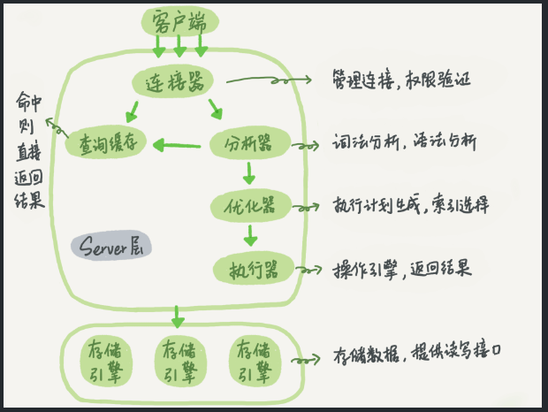
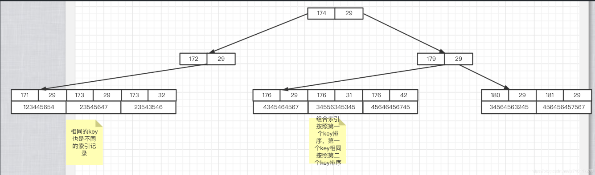
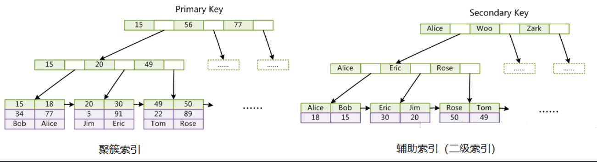
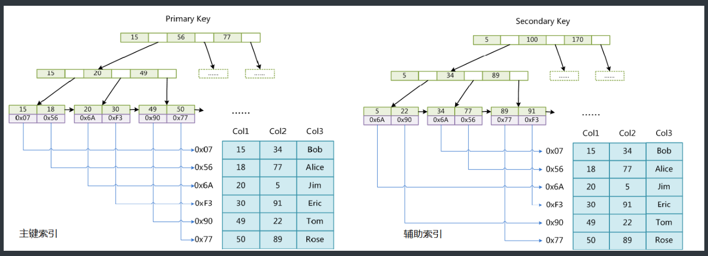
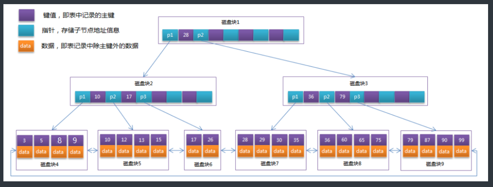
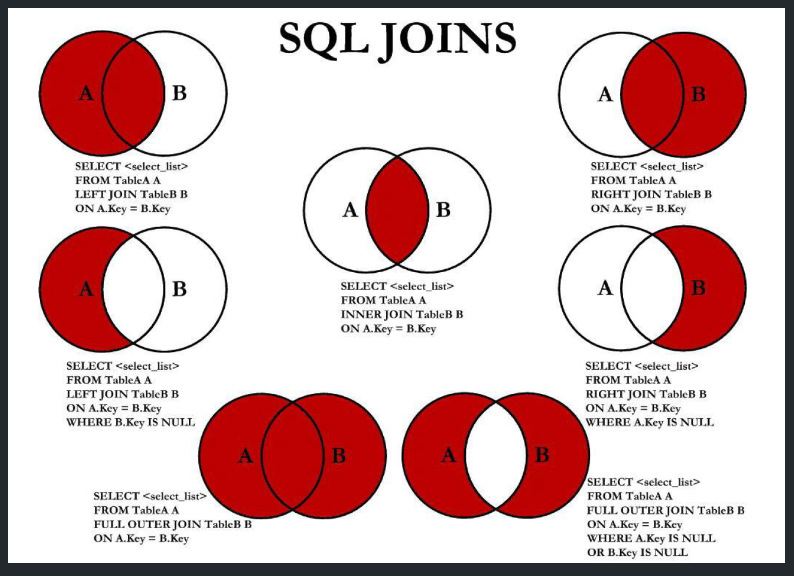

# Mysql

## 基本概念

关系型数据库；

## 查询流程

整体执行流程如下：



* 客户端发送一条查询给服务器
* 服务器先会检查查询缓存，如果命中了缓存，则立即返回存储在缓存中的结果（一般是 K-V 键值对），否则进入下一阶段
* 分析器进行 SQL 分析，再由优化器生成对应的执行计划
* 执行器根据优化器生成的执行计划，调用存储引擎的 API 来执行查询
* 将结果返回给客户端

大多数情况下不建议使用查询缓存，因为查询缓存往往弊大于利

* 查询缓存的**失效非常频繁**，只要有对一个表的更新，这个表上所有的查询缓存都会被清空。因此很可能费力地把结果存起来，还没使用就被一个更新全清空了，对于更新压力大的数据库来说，查询缓存的命中率会非常低
* 除非业务就是有一张静态表，很长时间才会更新一次，比如一个系统配置表，那这张表上的查询才适合使用查询缓存

### 分析器

没有命中查询缓存，就开始了 SQL 的真正执行，分析器会对 SQL 语句做解析。

处理语法和解析查询，生成对应的解析树。

* 先做**词法分析**，输入的是由多个字符串和空格组成的一条 SQL 语句，MySQL 需要识别出里面的字符串分别是什么代表什么。从输入的 select 这个关键字识别出来这是一个查询语句；把字符串 t 识别成 表名 t，把字符串 id 识别成列 id
* 然后做**语法分析**，根据词法分析的结果，语法分析器会根据语法规则，判断你输入的这个 SQL 语句是否满足 MySQL 语法。如果语句不对，就会收到 `You have an error in your SQL syntax` 的错误提醒

预处理器：进一步检查解析树的合法性，比如数据表和数据列是否存在、别名是否有歧义等

### 优化器

#### 成本分析

优化器是在表里面有多个索引的时候，决定使用哪个索引；或者在一个语句有多表关联（join）的时候，决定各个表的连接顺序

* 根据搜索条件找出所有可能的使用的索引
* 成本分析，执行成本由 I/O 成本和 CPU 成本组成，计算全表扫描和使用不同索引执行 SQL 的代价
* 找到一个最优的执行方案，用最小的代价去执行语句

在数据库里面，扫描行数是影响执行代价的因素之一，扫描的行数越少意味着访问磁盘的次数越少，消耗的 CPU 资源越少，优化器还会结合是否使用临时表、是否排序等因素进行综合判断

#### 统计数据

MySQL 中保存着两种统计数据：

* innodb_table_stats 存储了表的统计数据，每一条记录对应着一个表的统计数据
* innodb_index_stats 存储了索引的统计数据，每一条记录对应着一个索引的一个统计项的数据

MySQL 在真正执行语句之前，并不能精确地知道满足条件的记录有多少条，只能根据统计信息来估算记录，统计信息就是索引的区分度，一个索引上不同的值的个数（比如性别只能是男女，就是 2 ），称之为基数（cardinality），**基数越大说明区分度越好

本身通过采样统计来筛选索引。

#### 错选索引

采样统计本身是估算数据，或者 SQL 语句中的字段选择有问题时，可能导致 MySQL 没有选择正确的执行索引

解决方法：

* 采用 force index 强行选择一个索引

  ```sql
  SELECT * FROM user FORCE INDEX(name) WHERE NAME='seazean';
  ```
* 可以考虑修改 SQL 语句，引导 MySQL 使用期望的索引
* 新建一个更合适的索引，来提供给优化器做选择，或删掉误用的索引

### 执行器

开始执行的时候，要先判断一下当前连接对表有没有**执行查询的权限**，如果没有就会返回没有权限的错误，在工程实现上，如果命中查询缓存，会在查询缓存返回结果的时候，做权限验证。如果有权限，就打开表继续执行，执行器就会根据表的引擎定义，去使用这个引擎提供的接口

### 引擎层

Server 层和存储引擎层的交互是**以记录为单位的**，存储引擎会将单条记录返回给 Server 层做进一步处理，并不是直接返回所有的记录

工作流程：

* 首先根据二级索引选择扫描范围，获取第一条符合二级索引条件的记录，进行回表查询，将聚簇索引的记录返回 Server 层，由 Server 判断记录是否符合要求
* 然后在二级索引上继续扫描下一个符合条件的记录

## 索引

**索引是在存储引擎层实现的**，所以并没有统一的索引标准，即不同存储引擎的索引的工作方式并不一样。

索引的优点：

* 类似于书籍的目录索引，提高数据检索的效率，降低数据库的 IO 成本
* 通过索引列对数据进行排序，降低数据排序的成本，降低 CPU 的消耗

索引的缺点：

* 一般来说索引本身也很大，不可能全部存储在内存中，因此索引往往以索引文件的形式**存储在磁盘**上
* 虽然索引大大提高了查询效率，同时却也降低更新表的速度。对表进行 INSERT、UPDATE、DELETE 操作，MySQL 不仅要保存数据，还要保存一下索引文件每次更新添加了索引列的字段，还会调整因为更新所带来的键值变化后的索引信息，**但是更新数据也需要先从数据库中获取**，索引加快了获取速度，所以可以相互抵消一下。
* 索引会影响到 WHERE 的查询条件和排序 ORDER BY 两大功能

### 索引类型

索引一般的分类如下：

- 功能分类

  - 主键索引：一种特殊的唯一索引，不允许有空值，一般在建表时同时创建主键索引
  - 单列索引：一个索引只包含单个列，一个表可以有多个单列索引（普通索引）
  - 联合索引：顾名思义，就是将单列索引进行组合
  - 唯一索引：索引列的值必须唯一，**允许有空值**，如果是联合索引，则列值组合必须唯一
    * NULL 值可以出现多次，因为两个 NULL 比较的结果既不相等，也不不等，结果仍然是未知
    * 可以声明不允许存储 NULL 值的非空唯一索引
  - 外键索引：只有 InnoDB 引擎支持外键索引，用来保证数据的一致性、完整性和实现级联操作
- 结构分类

  - BTree 索引：MySQL 使用最频繁的一个索引数据结构，是 InnoDB 和 MyISAM 存储引擎默认的索引类型，底层基于 B+Tree
  - Hash 索引：MySQL中 Memory 存储引擎默认支持的索引类型
  - R-tree 索引（空间索引）：空间索引是 MyISAM 引擎的一个特殊索引类型，主要用于地理空间数据类型
  - Full-text 索引（全文索引）：快速匹配全部文档的方式。MyISAM 支持， InnoDB 不支持 FULLTEXT 类型的索引，但是 InnoDB 可以使用 sphinx 插件支持全文索引，MEMORY 引擎不支持


  | 索引      | InnoDB           | MyISAM | Memory |
  | ----------- | ------------------ | -------- | -------- |
  | BTREE     | 支持             | 支持   | 支持   |
  | HASH      | 不支持           | 不支持 | 支持   |
  | R-tree    | 不支持           | 支持   | 不支持 |
  | Full-text | 5.6 版本之后支持 | 支持   | 不支持 |

联合索引图示：根据身高年龄建立的组合

### 聚簇索引

#### 索引对比

聚簇索引是一种数据存储方式，并不是一种单独的索引类型

* 聚簇索引的叶子节点存放的是主键值和数据行，支持覆盖索引
* 非聚簇索引的叶子节点存放的是主键值或指向数据行的指针（由存储引擎决定）

在 Innodb 下主键索引是聚簇索引，在 MyISAM 下主键索引是非聚簇索引

#### Innodb

##### 聚簇索引

在 Innodb 存储引擎，B+ 树索引可以分为聚簇索引（也称聚集索引、clustered index）和辅助索引（也称非聚簇索引或二级索引、secondary index、non-clustered index）

InnoDB 中，聚簇索引是按照每张表的主键构造一颗 B+ 树，叶子节点中存放的就是整张表的数据，将聚簇索引的叶子节点称为数据页

* 这个特性决定了**数据也是索引的一部分**，所以一张表只能有一个聚簇索引
* 辅助索引的存在不影响聚簇索引中数据的组织，所以一张表可以有多个辅助索引

聚簇索引的优点：

* 数据访问更快，聚簇索引将索引和数据保存在同一个 B+ 树中，因此从聚簇索引中获取数据比非聚簇索引更快
* 聚簇索引对于主键的排序查找和范围查找速度非常快，因为数据行按照索引值的顺序存储所以数据库连续读取一大块即可，就会更快。还可以减少IO操作，顺序存储的数据更容易命中缓存。

例子：

```java
SELECT * FROM employees WHERE id BETWEEN 100 AND 200;

```

聚簇索引的缺点：

* 插入速度严重依赖于插入顺序，按照主键的顺序（递增）插入是最快的方式，否则将会出现页分裂，严重影响性能，所以对于 InnoDB 表，一般都会定义一个自增的 ID 列为主键
* 更新主键的代价很高，将会导致被更新的行移动，所以对于 InnoDB 表，一般定义主键为不可更新
* 二级索引访问需要两次索引查找，第一次找到主键值，第二次根据主键值找到行数据

---

##### 辅助索引

在聚簇索引之上创建的索引称之为辅助索引，非聚簇索引都是辅助索引，像复合索引、前缀索引、唯一索引等

辅助索引叶子节点存储的是主键值，而不是数据的物理地址，所以访问数据需要二次查找，推荐使用覆盖索引，可以减少回表查询

**检索过程**：辅助索引找到主键值，再通过聚簇索引（二分）找到数据页，最后通过数据页中的 Page Directory（二分）找到对应的数据分组，遍历组内所所有的数据找到数据行

补充：无索引走全表查询，查到数据页后和上述步骤一致

##### 索引实现

InnoDB 使用 B+Tree 作为索引结构，并且 InnoDB 一定有索引

主键索引：

* 在 InnoDB 中，表数据文件本身就是按 B+Tree 组织的一个索引结构，这个索引的 key 是数据表的主键，叶子节点 data 域保存了完整的数据记录
* InnoDB 的表数据文件**通过主键聚集数据**，如果没有定义主键，会选择非空唯一索引代替，如果也没有这样的列，MySQL 会自动为 InnoDB 表生成一个**隐含字段 row_id** 作为主键，这个字段长度为 6 个字节，类型为长整形

辅助索引：

* InnoDB 的所有辅助索引（二级索引）都引用主键作为 data 域
* InnoDB 表是基于聚簇索引建立的，因此 InnoDB 的索引能提供一种非常快速的主键查找性能。不过辅助索引也会包含主键列，所以不建议使用过长的字段作为主键，过长的主索引会令辅助索引变得过大



#### MyISAM

##### 非聚簇

MyISAM 的主键索引使用的是非聚簇索引，索引文件和数据文件是分离的，**索引文件仅保存数据的地址**

* 主键索引 B+ 树的节点存储了主键，辅助键索引 B+ 树存储了辅助键，表数据存储在独立的地方，这两颗 B+ 树的叶子节点都使用一个地址指向真正的表数据，对于表数据来说，这两个键没有任何差别
* 由于索引树是独立的，通过辅助索引检索**无需回表查询**访问主键的索引树


---

##### 索引实现

MyISAM 的索引方式也叫做非聚集的，之所以这么称呼是为了与 InnoDB 的聚集索引区分

主键索引：MyISAM 引擎使用 B+Tree 作为索引结构，叶节点的 data 域存放的是数据记录的地址

辅助索引：MyISAM 中主索引和辅助索引（Secondary key）在结构上没有任何区别，只是主索引要求 key 是唯一的，而辅助索引的 key 可以重复。



### 索引结构

#### B树

BTree 的索引类型是基于 B+Tree 树型数据结构的，B+Tree 又是 BTree 数据结构的变种，用在数据库和操作系统中的文件系统，特点是能够保持数据稳定有序

BTree 又叫多路平衡搜索树，一颗 m 叉的 BTree 特性如下：

- 树中每个节点最多包含 m 个孩子
- 除根节点与叶子节点外，每个节点至少有 [ceil(m/2)] 个孩子
- 若根节点不是叶子节点，则至少有两个孩子
- 所有的叶子节点都在同一层
- 每个非叶子节点由 n 个 key 与 n+1 个指针组成，其中 [ceil(m/2)-1] <= n <= m-1

缺点：当进行范围查找时会出现回旋查找

#### B+Tree

##### 数据结构

BTree 数据结构中每个节点中不仅包含数据的 key 值，还有 data 值。磁盘中每一页的存储空间是有限的，如果 data 数据较大时将会导致每个节点（即一个页）能存储的 key 的数量很小，当存储的数据量很大时同样会导致 B-Tree 的深度较大，增大查询时的磁盘 I/O 次数，进而影响查询效率，所以引入 B+Tree

B+Tree 为 BTree 的变种，B+Tree 与 BTree 的区别为：

* n 叉 B+Tree 最多含有 n 个 key（哈希值），而 BTree 最多含有 n-1 个 key

- 所有**非叶子节点只存储键值 key** 信息，只进行数据索引，使每个非叶子节点所能保存的关键字大大增加
- 所有**数据都存储在叶子节点**，所以每次数据查询的次数都一样
- **叶子节点按照 key 大小顺序排列，左边结尾数据都会保存右边节点开始数据的指针，形成一个链表**
- 所有节点中的 key 在叶子节点中也存在（比如 5)，**key 允许重复**，B 树不同节点不存在重复的 key


B* 树：是 B+ 树的变体，在 B+ 树的非根和非叶子结点再增加指向兄弟的指针

##### 优化结构

MySQL 索引数据结构对经典的 B+Tree 进行了优化，在原 B+Tree 的基础上，增加一个指向相邻叶子节点的链表指针，就形成了带有顺序指针的 B+Tree，**提高区间访问的性能，防止回旋查找.



通常在 B+Tree 上有两个头指针，**一个指向根节点，另一个指向关键字最小的叶子节点**，而且所有叶子节点（即数据节点）之间是一种链式环结构。可以对 B+Tree 进行两种查找运算：

- 有范围：对于主键的范围查找和分页查找
- 有顺序：从根节点开始，进行随机查找，顺序查找

InnoDB 中每个数据页的大小默认是 16KB，

* 索引行：一般表的主键类型为 INT（4 字节）或 BIGINT（8 字节），指针大小在 InnoDB 中设置为 6 字节节，也就是说一个页大概存储 16KB/(8B+6B)=1K 个键值（估值）。则一个深度为 3 的 B+Tree 索引可以维护 `10^3 * 10^3 * 10^3 = 10亿` 条记录
* 数据行：一行数据的大小可能是 1k，一个数据页可以存储 16 行

### 设计原则

创建索引时的原则：

- 对查询频次较高，且数据量比较大的表建立索引
- 使用唯一索引，区分度越高，使用索引的效率越高
- 索引字段的选择，最佳候选列应当从 where 子句的条件中提取，使用覆盖索引
- 使用短索引，索引创建之后也是使用硬盘来存储的，因此提升索引访问的 I/O 效率，也可以提升总体的访问效率。假如构成索引的字段总长度比较短，那么在给定大小的存储块内可以存储更多的索引值，相应的可以有效的提升 MySQL 访问索引的 I/O 效率
- 索引可以有效的提升查询数据的效率，但索引数量不是多多益善，索引越多，维护索引的代价越高。对于插入、更新、删除等 DML 操作比较频繁的表来说，索引过多，会引入相当高的维护代价，降低 DML 操作的效率，增加相应操作的时间消耗；另外索引过多的话，MySQL 也会犯选择困难病，虽然最终仍然会找到一个可用的索引，但提高了选择的代价

* MySQL 建立联合索引时会遵守**最左前缀匹配原则**，即最左优先，在检索数据时从联合索引的最左边开始匹配

  N 个列组合而成的组合索引，相当于创建了 N 个索引，如果查询时 where 句中使用了组成该索引的**前**几个字段，那么这条查询 SQL 可以利用组合索引来提升查询效率

  ```mysql
  -- 对name、address、phone列建一个联合索引
  ALTER TABLE user ADD INDEX index_three(name,address,phone);
  -- 查询语句执行时会依照最左前缀匹配原则，检索时分别会使用索引进行数据匹配。
  (name,address,phone)
  (name,address)
  (name,phone)	-- 只有name字段走了索引
  (name)

  -- 索引的字段可以是任意顺序的，优化器会帮助我们调整顺序，下面的SQL语句可以命中索引
  SELECT * FROM user WHERE address = '北京' AND phone = '12345' AND name = '张三';
  ```

```mysql
-- 如果联合索引中最左边的列不包含在条件查询中，SQL语句就不会命中索引，比如：
SELECT * FROM user WHERE address = '北京' AND phone = '12345';
```

哪些情况不要建立索引：

* 记录太少的表
* 经常增删改的表
* 频繁更新的字段不适合创建索引
* where 条件里用不到的字段不创建索引

### 索引优化

#### 覆盖索引

覆盖索引：包含所有满足查询需要的数据的索引（SELECT 后面的字段刚好是索引字段），可以利用该索引返回 SELECT 列表的字段，而不必根据索引去聚簇索引上读取数据文件

回表查询：要查找的字段在非主键索引树上时，需要通过叶子节点的主键值去主键索引上获取对应的行数据

使用覆盖索引，防止回表查询：

* 表 user 主键为 id，普通索引为 age，查询语句：

  ```mysql
  SELECT * FROM user WHERE age = 30;
  ```

  查询过程：先通过普通索引 age=30 定位到主键值 id=1，再通过聚集索引 id=1 定位到行记录数据，需要两次扫描 B+ 树
* 使用覆盖索引：

  ```mysql
  DROP INDEX idx_age ON user;
  CREATE INDEX idx_age_name ON user(age,name);
  SELECT id,age FROM user WHERE age = 30;
  ```

  在一棵索引树上就能获取查询所需的数据，无需回表速度更快

使用覆盖索引，要注意 SELECT 列表中只取出需要的列，不可用 SELECT *，所有字段一起做索引会导致索引文件过大，查询性能下降。

#### 索引下推

可以在索引遍历过程中，对索引中包含的字段先做判断，直接过滤掉不满足条件的记录，减少回表次数。

索引下推充分利用了索引中的数据，在查询出整行数据之前过滤掉无效的数据，再去主键索引树上查找。

* 不使用索引下推优化时存储引擎通过索引检索到数据，然后回表查询记录返回给 Server 层，**服务器判断数据是否符合条件**

  
* 使用索引下推优化时，如果**存在某些被索引的列的判断条件**时，由存储引擎在索引遍历的过程中判断数据是否符合传递的条件，将符合条件的数据进行回表，检索出来返回给服务器，由此减少 IO 次数

  

**适用条件**：

* 需要存储引擎将索引中的数据与条件进行判断（所以**条件列必须都在同一个索引中**），所以优化是基于存储引擎的，只有特定引擎可以使用，适用于 InnoDB 和 MyISAM
* 存储引擎没有调用跨存储引擎的能力，跨存储引擎的功能有存储过程、触发器、视图，所以调用这些功能的不可以进行索引下推优化
* 对于 InnoDB 引擎只适用于二级索引，InnoDB 的聚簇索引会将整行数据读到缓冲区，不再需要去回表查询了

工作过程：用户表 user，(name, age) 是联合索引

```mysql
SELECT * FROM user WHERE name LIKE '张%' AND　age = 10;	-- 头部模糊匹配会造成索引失效
```

* 优化前：在非主键索引树上找到满足第一个条件的行，然后通过叶子节点记录的主键值再回到主键索引树上查找到对应的行数据，再对比 AND 后的条件是否符合，符合返回数据，需要 4 次回表

  
* 优化后：检查索引中存储的列信息是否符合索引条件，然后交由存储引擎用剩余的判断条件判断此行数据是否符合要求，**不满足条件的不去读取表中的数据**，满足下推条件的就根据主键值进行回表查询，2 次回表
  

当使用 EXPLAIN 进行分析时，如果使用了索引条件下推，Extra 会显示 Using index condition

#### 前缀索引

当要索引的列字符很多时候，索引会变大变慢，可以只索引列开始的部分字符串，节约索引空间

注意：使用前缀索引就系统忽略了覆盖索引对查询性能的优化。

优化原则：降低重复索引值

示例：

```mysql
area			gdp		code
chinaShanghai	100		aaa
chinaDalian		200		bbb
usaNewYork		300		ccc
chinaFuxin		400		ddd
chinaBeijing	500		eee
```

发现 area 字段很多都是以 china 开头的，那么如果以前 1-5 位字符做前缀索引就会出现大量索引值重复的情况，索引值重复性越低，查询效率也就越高，所以需要建立前 6 位字符的索引：

```mysql
CREATE INDEX idx_area ON table_name(area(7));
```

#### 索引合并


### 索引失效

## sql优化

## 数据库事务

## 单表操作

### SQL分类：

- DDL（Data Definition Language）数据定义语言
  - 用来定义数据库对象：数据库，表，列等。关键字：create、drop,、alter 等
- DML（Data Manipulation Language）数据操作语言
  - 用来对数据库中表的数据进行增删改。关键字：insert、delete、update 等
- DQL（Data Query Language）数据查询语言
  - 用来查询数据库中表的记录(数据)。关键字：select、where 等
- DCL（Data Control Language）数据控制语言
  - 用来定义数据库的访问权限和安全级别，及创建用户。关键字：grant， revoke等

### 函数

#### 聚合函数

- COUNT(列名)统计数量（一般选用不为 null 的列）
- MAX(列名)最大值
- MIN(列名)最小值
- SUM(列名)求和
- AVG(列名)平均值（会忽略 null 行）

#### 文本函数

* LENGTH计算字符串长度函数，返回字符串的字节长度
* CONCAT合并字符串函数，返回结果为连接参数产生的字符串，参数可以使一个或多个
* INSERT替换字符串函数
* LOWER将字符串中的字母转换为小写
* UPPER将字符串中的字母转换为大写
* LEFT从左侧字截取符串，返回字符串左边的若干个字符
* RIGHT从右侧字截取符串，返回字符串右边的若干个字符
* TRIM删除字符串左右两侧的空格
* REPLACE字符串替换函数，返回替换后的新字符串
* SUBSTRING截取字符串，返回从指定位置开始的指定长度的字符换
* REVERSE字符串反转（逆序）函数，返回与原始字符串顺序相反的字符串

#### 数字函数

- ABS求绝对值
- SQRT求二次方根
- MOD求余数
- CEIL 和 CEILING两个函数功能相同，都是返回不小于参数的最小整数，即向上取整
- FLOOR向下取整，返回值转化为一个BIGINT
- RAND生成一个0~1之间的随机数，传入整数参数是，用来产生重复序列ROUND对所传参数进行四舍五入
- SIGN返回参数的符号
- POW 和 POWER两个函数的功能相同，都是所传参数的次方的结果值
- SIN求正弦值ASIN求反正弦值，与函数 SIN 互为反函数COS求余弦值ACOS求反余弦值，与函数 COS 互为反函数TAN求正切值ATAN求反正切值，与函数 TAN 互为反函数COT求余切值

#### 日期函数

- CURDATE 和 CURRENT_DATE两个函数作用相同，返回当前系统的日期值
- CURTIME 和 CURRENT_TIME两个函数作用相同，返回当前系统的时间值
- NOW 和  SYSDATE两个函数作用相同，返回当前系统的日期和时间值
- MONTH获取指定日期中的月份
- MONTHNAME获取指定日期中的月份英文名称
- DAYNAME获取指定曰期对应的星期几的英文名称
- DAYOFWEEK获取指定日期对应的一周的索引位置值
- WEEK获取指定日期是一年中的第几周，返回值的范围是否为 0〜52 或 1〜53
- DAYOFYEAR获取指定曰期是一年中的第几天，返回值范围是1~366~
- DAYOFMONTH获取指定日期是一个月中是第几天，返回值范围是1~31
- YEAR获取年份，返回值范围是 1970〜2069
- TIME_TO_SEC将时间参数转换为秒数
- SEC_TO_TIME将秒数转换为时间，与TIME_TO_SEC 互为反函数
- DATE_ADD 和 ADDDATE两个函数功能相同，都是向日期添加指定的时间间隔
- DATE_SUB 和 SUBDATE两个函数功能相同，都是向日期减去指定的时间间隔
- ADDTIME时间加法运算，在原始时间上添加指定的时间
- SUBTIME时间减法运算，在原始时间上减去指定的时间
- DATEDIFF获取两个日期之间间隔，返回参数 1 减去参数 2 的值
- DATE_FORMAT格式化指定的日期，根据参数返回指定格式的值
- WEEKDAY获取指定日期在一周内的对应的工作日索引

#### 正则查询

```mysql
SELECT * FROM emp WHERE name REGEXP '^T';	-- 匹配以T开头的name值
SELECT * FROM emp WHERE name REGEXP '2$';	-- 匹配以2结尾的name值
SELECT * FROM emp WHERE name REGEXP '[uvw]';-- 匹配包含 uvw 的name值
```

- ^在字符串开始处进行匹配
- $在字符串末尾处进行匹配
- .匹配任意单个字符, 包括换行符
- [...]匹配出括号内的任意字符
- [^...]匹配不出括号内的任意字符
- a*匹配零个或者多个a(包括空串)
- a+匹配一个或者多个a(不包括空串)
- a?匹配零个或者一个a
- a1\|a2匹配a1或a2
- a(m)匹配m个a
- a(m,)至少匹配m个a
- a(m,n)匹配m个a 到 n个a
- a(,n)匹配0到n个a
- (...)将模式元素组成单一元素

#### 排序、分组

排序查询语法：

SELECT 列名 FROM 表名 [WHERE 条件] ORDER BY 列名1 排序方式1,列名2 排序方式2;

分组查询语法：

SELECT 列名 FROM 表名 [WHERE 条件] GROUP BY 分组列名 [HAVING 分组后条件过滤] [ORDER BY 排序列名 排序方式];

```mysql
-- 按照品牌分组，获取每组商品的总金额
SELECT brand,SUM(price) FROM product GROUP BY brand;

-- 对金额大于4000元的商品，按照品牌分组,获取每组商品的总金额
SELECT brand,SUM(price) FROM product WHERE price > 4000 GROUP BY brand;

-- 对金额大于4000元的商品，按照品牌分组，获取每组商品的总金额，只显示总金额大于7000元的
SELECT brand,SUM(price) AS getSum FROM product WHERE price > 4000 GROUP BY brand HAVING getSum > 7000;

-- 对金额大于4000元的商品，按照品牌分组，获取每组商品的总金额，只显示总金额大于7000元的、并按照总金额的降序排列
SELECT brand,SUM(price) AS getSum FROM product WHERE price > 4000 GROUP BY brand HAVING getSum > 7000 ORDER BY getSum DESC;
```

分组规定：

* GROUP BY 子句出现在 WHERE 子句之后，ORDER BY 子句之前
* NULL 的行会单独分为一组
* 大多数 SQL 实现不支持 GROUP BY 列具有可变长度的数据类型

#### 分页查询

语法：

```mysql
SELECT 列名 FROM 表名 [WHERE 条件] GROUP BY 分组列名 [HAVING 分组后条件过滤] [ORDER BY 排序列名 排序方式] LIMIT 开始记录数,查询条数;
```

```mysql
SELECT * FROM product LIMIT 0,2; 
SELECT * FROM product LIMIT 2,2; 
SELECT * FROM product LIMIT 4,2; 
SELECT * FROM product LIMIT 6,2; 
```

## 多表操作

### 约束

#### 约束分类

- PRIMARY KEY主键约束
- PRIMARY KEY AUTO_INCREMENT主键、自动增长
- UNIQUE唯一约束
- NOT NULL非空约束
- FOREIGN KEY外键约束
- FOREIGN KEY ON UPDATE CASCADE外键级联更新
- FOREIGN KEY ON DELETE CASCADE外键级联删除

#### 主键约束

* 主键约束默认包含**非空和唯一约束**两个功能
* 一张表只能有一个主键
* 主键一般用于表中数据的唯一标识

#### 唯一约束

唯一约束：约束不能有重复的数据

#### 外键约束

外键约束：让表和表之间产生关系，从而保证数据的准确性

```mysql
ALTER TABLE 表名 ADD CONSTRAINT 外键名 FOREIGN KEY (本表外键列名) REFERENCES 主表名(主表主键列名);
```

例如：

```mysql
-- 创建user用户表
CREATE TABLE USER(
	id INT PRIMARY KEY AUTO_INCREMENT,    -- id
	name VARCHAR(20) NOT NULL             -- 姓名
);
-- 添加用户数据
INSERT INTO USER VALUES (NULL,'张三'),(NULL,'李四'),(NULL,'王五');

-- 创建orderlist订单表
CREATE TABLE orderlist(
	id INT PRIMARY KEY AUTO_INCREMENT,    -- id
	number VARCHAR(20) NOT NULL,          -- 订单编号
	uid INT,                              -- 订单所属用户
	CONSTRAINT ou_fk1 FOREIGN KEY (uid) REFERENCES USER(id)   -- 添加外键约束
);
-- 添加订单数据
INSERT INTO orderlist VALUES (NULL,'hm001',1),(NULL,'hm002',1),
(NULL,'hm003',2),(NULL,'hm004',2),
(NULL,'hm005',3),(NULL,'hm006',3);

-- 添加一个订单，但是没有所属用户。无法添加
INSERT INTO orderlist VALUES (NULL,'hm007',8);
-- 删除王五这个用户，但是订单表中王五还有很多个订单呢。无法删除
DELETE FROM USER WHERE NAME='王五';
```

#### 外键级联

级联操作：当把主表中的数据进行删除或更新时，从表中有关联的数据的相应操作，包括 RESTRICT、CASCADE、SET NULL 和 NO ACTION

* RESTRICT 和 NO ACTION相同， 是指限制在子表有关联记录的情况下， 父表不能更新
* CASCADE 表示父表在更新或者删除时，更新或者删除子表对应的记录
* SET NULL 则表示父表在更新或者删除的时候，子表的对应字段被SET NULL

添加级联更新

```mysql
ALTER TABLE 表名 ADD CONSTRAINT 外键名 FOREIGN KEY (本表外键列名) REFERENCES 主表名(主表主键列名) ON UPDATE [CASCADE | RESTRICT | SET NULL];
```

添加级联删除

```mysql
ALTER TABLE 表名 ADD CONSTRAINT 外键名 FOREIGN KEY (本表外键列名) REFERENCES 主表名(主表主键列名) ON DELETE CASCADE;
```

### 连接

#### 内连接

inner join，笛卡尔积

SELECT 列名 FROM 表名1 [INNER] JOIN 表名2 ON 条件;

#### 外连接

left join;right join



#### 关联查询

自关联查询：同一张表中有数据关联，可以多次查询这同一个表

#### 原理

### 嵌套

查询语句中嵌套了查询语句，**将嵌套查询称为子查询**，FROM 子句后面的子查询的结果集称为派生表.

结果是单行单列

```mysql
SELECT 列名 FROM 表名 WHERE 列名=(SELECT 列名/聚合函数(列名) FROM 表名 [WHERE 条件]);
```

结果是多行单列

```mysql
SELECT 列名 FROM 表名 WHERE 列名 [NOT] IN (SELECT 列名 FROM 表名 [WHERE 条件]);
```

结果是多行多列,查询的结果可以作为一张虚拟表参与查询

```mysql
SELECT 列名 FROM 表名 [别名],(SELECT 列名 FROM 表名 [WHERE 条件]) [别名] [WHERE 条件];

-- 查询订单表orderlist中id大于4的订单信息和所属用户USER信息
SELECT 
	* 
FROM 
	USER u,
	(SELECT * FROM orderlist WHERE id>4) o 
WHERE 
	u.id=o.uid;
```

### 联合查询

UNION 是取这两个子查询结果的并集，并进行去重，同时进行默认规则的排序（union 是行加起来，join 是列加起来）

UNION ALL 是对两个结果集进行并集操作不进行去重，不进行排序

```mysql
(select 1000 as f) union (select id from t1 order by id desc limit 2); #t1表中包含id 为 1-1000 的数据
```

语句的执行流程：

* 创建一个内存临时表，这个临时表只有一个整型字段 f，并且 f 是主键字段
* 执行第一个子查询，得到 1000 这个值，并存入临时表中
* 执行第二个子查询，拿到第一行 id=1000，试图插入临时表中，但由于 1000 这个值已经存在于临时表了，违反了唯一性约束，所以插入失败，然后继续执行
* 取到第二行 id=999，插入临时表成功
* 从临时表中按行取出数据，返回结果并删除临时表，结果中包含两行数据分别是 1000 和 999

## 高级结构

### 视图

视图概念：一种虚拟数据表，不在数据库中实际存储

本质：将一个SELECT查询语句的结果封装到了虚拟表中

作用：将一些复杂的查询语句结果封装到虚拟表，再有相同查询需求时候直接查询该表。

优点：

* 简单：使用视图的用户不需要关心表的结构、关联条件和筛选条件，因为虚拟表中已经是过滤好的结果集
* 安全：使用视图的用户只能访问查询的结果集，对表的权限管理并不能限制到某个行某个列
* 数据独立，一旦视图的结构确定，可以屏蔽表结构变化对用户的影响，源表增加列对视图没有影响；源表修改列名，则可以通过修改视图来解决，不会造成对访问者的影响

创建视图：

```mysql
CREATE [OR REPLACE] 
VIEW 视图名称 [(列名列表)] 
AS 查询语句
[WITH [CASCADED | LOCAL] CHECK OPTION];
```


`WITH [CASCADED | LOCAL] CHECK OPTION` 决定了是否允许更新数据使记录不再满足视图的条件：

* LOCAL：只要满足本视图的条件就可以更新
* CASCADED：必须满足所有针对该视图的所有视图的条件才可以更新， 默认值

#### 视图查询

show tables会查询出视图

#### 视图修改

视图表数据修改，会**自动修改源表中的数据**，因为更新的是视图中的基表中的数据。

#### 视图删除

```mysql
DROP VIEW IF EXISTS 视图名称;
```

### 存储过程

存储过程和函数：存储过程和函数是事先经过编译并存储在数据库中的一段 SQL 语句的集合

存储过程和函数的好处：

* 提高代码的复用性
* 减少数据在数据库和应用服务器之间的传输，提高传输效率
* 减少代码层面的业务处理
* **一次编译永久有效**

存储过程和函数的区别：

* 存储函数必须有返回值
* 存储过程可以没有返回值

#### 基本操作

DELIMITER：

* DELIMITER 关键字用来声明 sql 语句的分隔符，告诉 MySQL 该段命令已经结束
* MySQL 语句默认的分隔符是分号，但是有时需要一条功能 sql 语句中包含分号，但是并不作为结束标识，这时使用 DELIMITER 来指定分隔符：

  ```mysql
  DELIMITER 分隔符
  ```

存储过程的创建调用查看和删除：

* 创建存储过程

  ```mysql
  -- 修改分隔符为$
  DELIMITER $

  -- 标准语法
  CREATE PROCEDURE 存储过程名称(参数...)
  BEGIN
  	sql语句;
  END$

  -- 修改分隔符为分号
  DELIMITER ;
  ```
* 调用存储过程

  ```mysql
  CALL 存储过程名称(实际参数);
  ```
* 查看存储过程

  ```mysql
  SELECT * FROM mysql.proc WHERE db='数据库名称';
  ```
* 删除存储过程

  ```mysql
  DROP PROCEDURE [IF EXISTS] 存储过程名称;
  ```

#### 存储语法

##### 变量使用

存储过程是可以进行编程的，意味着可以使用变量、表达式、条件控制语句等，来完成比较复杂的功能

* 定义变量：DECLARE 定义的是局部变量，只能用在 BEGIN END 范围之内

  ```mysql
  DECLARE 变量名 数据类型 [DEFAULT 默认值];
  ```
* 变量的赋值

  ```mysql
  SET 变量名 = 变量值;
  SELECT 列名 INTO 变量名 FROM 表名 [WHERE 条件];
  ```
* 数据准备：表 student

  ```mysql
  id	NAME	age		gender	score
  1	张三		23		男		95
  2	李四		24		男		98
  3	王五		25		女		100
  4	赵六		26		女		90
  ```
* 定义两个 int 变量，用于存储男女同学的总分数

  ```mysql
  DELIMITER $
  CREATE PROCEDURE pro_test3()
  BEGIN
  	-- 定义两个变量
  	DECLARE men,women INT;
  	-- 查询男同学的总分数，为men赋值
  	SELECT SUM(score) INTO men FROM student WHERE gender='男';
  	-- 查询女同学的总分数，为women赋值
  	SELECT SUM(score) INTO women FROM student WHERE gender='女';
  	-- 使用变量
  	SELECT men,women;
  END$
  DELIMITER ;
  -- 调用存储过程
  CALL pro_test3();
  ```

##### IF语法使用

```mysql
IF 判断条件1 THEN 执行的sql语句1;
[ELSEIF 判断条件2 THEN 执行的sql语句2;]
...
[ELSE 执行的sql语句n;]
END IF;
```

```mysql
DELIMITER $

CREATE PROCEDURE stu_group()
BEGIN
	SELECT gender,SUM(score) getSum FROM student GROUP BY gender ORDER BY getSum ASC; 
END$

DELIMITER ;

-- 调用存储过程
CALL stu_group();
-- 删除存储过程
DROP PROCEDURE IF EXISTS stu_group;
```

##### 参数传递

- 参数传递语法：
  IN：代表输入参数，需要由调用者传递实际数据，默认的；
  OUT：代表输出参数，该参数可以作为返回值
  INOUT：代表既可以作为输入参数，也可以作为输出参数

```mysql
DELIMITER $

-- 标准语法
CREATE PROCEDURE 存储过程名称([IN|OUT|INOUT] 参数名 数据类型)
BEGIN
	执行的sql语句;
END$

DELIMITER ;
```

示例：

```mysql
DELIMITER $

CREATE PROCEDURE pro_test6(IN total INT, OUT description VARCHAR(10))
BEGIN
	-- 判断总分数
	IF total >= 380 THEN 
		SET description = '学习优秀';
	ELSEIF total >= 320 AND total < 380 THEN 
		SET description = '学习不错';
	ELSE 
		SET description = '学习一般';
	END IF;
END$

DELIMITER ;
-- 调用pro_test6存储过程
CALL pro_test6(310,@description);
CALL pro_test6((SELECT SUM(score) FROM student), @description);
-- 查询总成绩描述
SELECT @description;
```

##### case

- 语法1：

  ```mysql
  CASE 表达式
      WHEN 值1 THEN 执行sql语句1;
      [WHEN 值2 THEN 执行sql语句2;]
      ...
      [ELSE 执行sql语句n;]
  END CASE;
  ```
- 语法2：

  ```mysql
  CASE
      WHEN 判断条件1 THEN 执行sql语句1;
      [WHEN 判断条件2 THEN 执行sql语句2;]
      ...
      [ELSE 执行sql语句n;]
  END CASE;
  ```

示例：

```mysql
DELIMITER $
CREATE PROCEDURE pro_test7(IN total INT)
BEGIN
	-- 定义变量
	DECLARE description VARCHAR(10);
	-- 使用case判断
	CASE
	WHEN total >= 380 THEN
		SET description = '学习优秀';
	WHEN total >= 320 AND total < 380 THEN
		SET description = '学习不错';
	ELSE 
		SET description = '学习一般';
	END CASE;

	-- 查询分数描述信息
	SELECT description;
END$
DELIMITER ;
-- 调用pro_test7存储过程
CALL pro_test7(390);
CALL pro_test7((SELECT SUM(score) FROM student));
```

##### while

语法：

```mysql
WHILE 条件判断语句 DO
	循环体语句;
	条件控制语句;
END WHILE;
```

示例：

```mysql
DELIMITER $
CREATE PROCEDURE pro_test6()
BEGIN
	-- 定义求和变量
	DECLARE result INT DEFAULT 0;
	-- 定义初始化变量
	DECLARE num INT DEFAULT 1;
	-- while循环
	WHILE num <= 100 DO
		IF num % 2 = 0 THEN
			SET result = result + num;
		END IF;
		SET num = num + 1;
	END WHILE;
	-- 查询求和结果
	SELECT result;
END$
DELIMITER ;

-- 调用pro_test6存储过程
CALL pro_test6();
```

##### repeat

语法：

```mysql
初始化语句;
REPEAT
	循环体语句;
	条件控制语句;
	UNTIL 条件判断语句
END REPEAT;
```

示例：

```mysql
DELIMITER $
CREATE PROCEDURE pro_test9()
BEGIN
	-- 定义求和变量
	DECLARE result INT DEFAULT 0;
	-- 定义初始化变量
	DECLARE num INT DEFAULT 1;
	-- repeat循环
	REPEAT
		-- 累加
		SET result = result + num;
		-- 让num+1
		SET num = num + 1;
		-- 停止循环
		UNTIL num > 10
	END REPEAT;
	-- 查询求和结果
	SELECT result;
END$

DELIMITER ;
-- 调用pro_test9存储过程
CALL pro_test9();
```

##### loop

语法：

```mysql
[循环名称:] LOOP
	条件判断语句
		[LEAVE 循环名称;]
	循环体语句;
	条件控制语句;
END LOOP 循环名称;
```

示例：

```mysql
DELIMITER $
CREATE PROCEDURE pro_test10()
BEGIN
	-- 定义求和变量
	DECLARE result INT DEFAULT 0;
	-- 定义初始化变量
	DECLARE num INT DEFAULT 1;
	-- loop循环
	l:LOOP
		-- 条件成立，停止循环
		IF num > 10 THEN
			LEAVE l;
		END IF;
		-- 累加
		SET result = result + num;
		-- 让num+1
		SET num = num + 1;
	END LOOP l;
	-- 查询求和结果
	SELECT result;
END$
DELIMITER ;
-- 调用pro_test10存储过程
CALL pro_test10();
```

##### 游标

游标是用来存储查询结果集的数据类型，在存储过程和函数中可以使用光标对结果集进行循环的处理

* 游标可以遍历返回的多行结果，每次拿到一整行数据
* 简单来说游标就类似于集合的迭代器遍历
* MySQL 中的游标只能用在存储过程和函数中

游标的语法

* 创建游标

  ```mysql
  DECLARE 游标名称 CURSOR FOR 查询sql语句;
  ```
* 打开游标

  ```mysql
  OPEN 游标名称;
  ```
* 使用游标获取数据

  ```mysql
  FETCH 游标名称 INTO 变量名1,变量名2,...;
  ```
* 关闭游标

  ```mysql
  CLOSE 游标名称;
  ```
* Mysql 通过一个 Error handler 声明来判断指针是否到尾部，并且必须和创建游标的 SQL 语句声明在一起：

  ```mysql
  DECLARE EXIT HANDLER FOR NOT FOUND (do some action，一般是设置标志变量)
  ```

#### 存储函数

语法：

```mysql
DELIMITER $
-- 标准语法
CREATE FUNCTION 函数名称(参数 数据类型)
RETURNS 返回值类型
BEGIN
	执行的sql语句;
	RETURN 结果;
END$

DELIMITER ;
```

调用存储函数，因为有返回值，所以使用 SELECT 调用

```mysql
SELECT 函数名称(实际参数);
```

删除存储函数

```mysql
DROP FUNCTION 函数名称;
```

使用示例

```mysql
DELIMITER $
CREATE FUNCTION fun_test()
RETURN INT
BEGIN
	-- 定义统计变量
	DECLARE result INT;
	-- 查询成绩大于95分的学生数量，给统计变量赋值
	SELECT COUNT(score) INTO result FROM student WHERE score > 95;
	-- 返回统计结果
	SELECT result;
END
DELIMITER ;
-- 调用fun_test存储函数
SELECT fun_test();
```

### 触发器

#### 基本介绍

触发器是与表有关的数据库对象，在 insert/update/delete 之前或之后触发并执行触发器中定义的 SQL 语句

* 触发器的这种特性可以协助应用在数据库端确保数据的完整性 、日志记录 、数据校验等操作

- 使用别名 NEW 和 OLD 来引用触发器中发生变化的记录内容，这与其他的数据库是相似的
- 现在触发器还只支持行级触发，不支持语句级触发


| 触发器类型      | OLD的含义                      | NEW的含义                      |
| ----------------- | -------------------------------- | -------------------------------- |
| INSERT 型触发器 | 无 (因为插入前状态无数据)      | NEW 表示将要或者已经新增的数据 |
| UPDATE 型触发器 | OLD 表示修改之前的数据         | NEW 表示将要或已经修改后的数据 |
| DELETE 型触发器 | OLD 表示将要或者已经删除的数据 | 无 (因为删除后状态无数据)      |

---

#### 基本操作

* 创建触发器
  ```mysql
  DELIMITER $

  CREATE TRIGGER 触发器名称
  BEFORE|AFTER  INSERT|UPDATE|DELETE
  ON 表名
  [FOR EACH ROW]  -- 行级触发器
  BEGIN
  	触发器要执行的功能;
  END$

  DELIMITER ;
  ```
* 查看触发器的状态、语法等信息
  ```mysql
  SHOW TRIGGERS;
  ```
* 删除触发器，如果没有指定 schema_name，默认为当前数据库
  ```mysql
  DROP TRIGGER [schema_name.]trigger_name;
  ```

示例：

```mysql
-- 创建账户表account
CREATE TABLE account(
	id INT PRIMARY KEY AUTO_INCREMENT,	-- 账户id
	NAME VARCHAR(20),					-- 姓名
	money DOUBLE						-- 余额
);
-- 添加数据
INSERT INTO account VALUES (NULL,'张三',1000),(NULL,'李四',2000);

-- 创建日志表account_log
CREATE TABLE account_log(
	id INT PRIMARY KEY AUTO_INCREMENT,	-- 日志id
	operation VARCHAR(20),				-- 操作类型 (insert update delete)
	operation_time DATETIME,			-- 操作时间
	operation_id INT,					-- 操作表的id
	operation_params VARCHAR(200)       -- 操作参数
);
-- 创建插入型触发器

DELIMITER $

CREATE TRIGGER account_insert
AFTER INSERT
ON account
FOR EACH ROW
BEGIN
	INSERT INTO account_log VALUES (NULL,'INSERT',NOW(),new.id,CONCAT('插入后{id=',new.id,',name=',new.name,',money=',new.money,'}'));
END$

DELIMITER ;

-- 创建更新型触发器
DELIMITER $

CREATE TRIGGER account_update
AFTER UPDATE
ON account
FOR EACH ROW
BEGIN
	INSERT INTO account_log VALUES (NULL,'UPDATE',NOW(),new.id,CONCAT('修改前{id=',old.id,',name=',old.name,',money=',old.money,'}','修改后{id=',new.id,',name=',new.name,',money=',new.money,'}'));
END$

DELIMITER ;
```

## 存储引擎

存储引擎的介绍：

- MySQL 数据库使用不同的机制存取表文件 , 机制的差别在于不同的存储方式、索引技巧、锁定水平等不同的功能和能力，在 MySQL 中，将这些不同的技术及配套的功能称为存储引擎
- Oracle、SqlServer 等数据库只有一种存储引擎，MySQL **提供了插件式的存储引擎架构**，所以 MySQL 存在多种存储引擎 , 就会让数据库采取了不同的处理数据的方式和扩展功能
- 在关系型数据库中数据的存储是以表的形式存进行，所以存储引擎也称为表类型（存储和操作此表的类型）
- 通过选择不同的引擎，能够获取最佳的方案,  也能够获得额外的速度或者功能，提高程序的整体效果。

MySQL 支持的存储引擎：

- MySQL 支持的引擎包括：InnoDB、MyISAM、MEMORY、Archive、Federate、CSV、BLACKHOLE 等
- MySQL5.5 之前的默认存储引擎是 MyISAM，5.5 之后就改为了 InnoDB

### 引擎对比

MyISAM 存储引擎：

* 特点：不支持事务和外键，读取速度快，节约资源
* 应用场景：**适用于读多写少的场景**，对事务的完整性要求不高，比如一些数仓、离线数据、支付宝的年度总结之类的场景，业务进行只读操作，查询起来会更快
* 存储方式：
  * 每个 MyISAM 在磁盘上存储成 3 个文件，其文件名都和表名相同，拓展名不同
  * 表的定义保存在 .frm 文件，表数据保存在 .MYD (MYData) 文件中，索引保存在 .MYI (MYIndex) 文件中

InnoDB 存储引擎：(MySQL5.5 版本后默认的存储引擎)

- 特点：**支持事务**和外键操作，支持并发控制。对比 MyISAM 的存储引擎，InnoDB 写的处理效率差一些，并且会占用更多的磁盘空间以保留数据和索引
- 应用场景：对事务的完整性有比较高的要求，在并发条件下要求数据的一致性，读写频繁的操作
- 存储方式：

  - 使用共享表空间存储， 这种方式创建的表的表结构保存在 .frm 文件中， 数据和索引保存在 innodb_data_home_dir 和 innodb_data_file_path 定义的表空间中，可以是多个文件
  - 使用多表空间存储，创建的表的表结构存在 .frm 文件中，每个表的数据和索引单独保存在 .ibd 中
- MEMORY 存储引擎：

  - 特点：每个 MEMORY 表实际对应一个磁盘文件 ，该文件中只存储表的结构，表数据保存在内存中，且默认**使用 HASH 索引**，所以数据默认就是无序的，但是在需要快速定位记录可以提供更快的访问，**服务一旦关闭，表中的数据就会丢失**，存储不安全
  - 应用场景：**缓存型存储引擎**，通常用于更新不太频繁的小表，用以快速得到访问结果
  - 存储方式：表结构保存在 .frm 中


| 特性         | MyISAM                         | InnoDB        | MEMORY               |
| -------------- | -------------------------------- | --------------- | ---------------------- |
| 存储限制     | 有（平台对文件系统大小的限制） | 64TB          | 有（平台的内存限制） |
| **事务安全** | **不支持**                     | **支持**      | **不支持**           |
| **锁机制**   | **表锁**                       | **表锁/行锁** | **表锁**             |
| B+Tree 索引  | 支持                           | 支持          | 支持                 |
| 哈希索引     | 不支持                         | 不支持        | 支持                 |
| 全文索引     | 支持                           | 支持          | 不支持               |
| 集群索引     | 不支持                         | 支持          | 不支持               |
| 数据索引     | 不支持                         | 支持          | 支持                 |
| 数据缓存     | 不支持                         | 支持          | N/A                  |
| 索引缓存     | 支持                           | 支持          | N/A                  |
| 数据可压缩   | 支持                           | 不支持        | 不支持               |
| 空间使用     | 低                             | 高            | N/A                  |
| 内存使用     | 低                             | 高            | 中等                 |
| 批量插入速度 | 高                             | 低            | 高                   |
| **外键**     | **不支持**                     | **支持**      | **不支持**           |

只读场景 MyISAM 比 InnoDB 更快：

* 底层存储结构有差别，MyISAM 是非聚簇索引，叶子节点保存的是数据的具体地址，不用回表查询
* InnoDB 每次查询需要维护 MVCC 版本状态，保证并发状态下的读写冲突问题

## 系统优化

## 锁机制

## 主从

# redis

## nosql

## 数据库

### 过期删除

### 键空间

### 排序机制

## 数据结构

## 数据类型

## 持久机制

## 事务机制

## lua脚本

## 分布式锁

## 主从赋值

## 集群模式

## 其他操作

### 发布订阅

### 解决方案

#### 缓存方案
