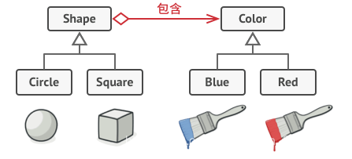

# 创建型

## 工厂方法

**工厂模式** （Factory Pattern）通常指的是工厂方法模式（Factory Method Pattern），它定义了一个创建对象的方法，由子类决定要实例化的类。工厂方法让类的实例化推迟到子类。

抽象类：

```java
public abstarct OrderPizza{
 abstract Pizza createPizza();
}
```

抽象工厂-将具体的实现交给子类，这样有需要新增的产品直接一个新的子类实现就可以了。

```java
public class LDOrderPizza extends OrderPizza {
       Pizza createPizza(String ordertype) {
              Pizza pizza =  new LDCheesePizza();
              return pizza;
       }
}
public class NYOrderPizza extends OrderPizza {
 
	Pizza createPizza(String ordertype) {
		Pizza pizza = new NYCheesePizza();
		return pizza;
	}
 
}
```

## 抽象工厂方法

**抽象工厂模式** （Abstract Factory Pattern）提供了一个接口，用于创建相关或依赖对象的家族，而不需要明确指定具体类。抽象工厂允许客户端使用抽象的接口来创建一组相关的产品，而不需要知道（或关心）实际生产的具体产品是什么。

抽象工厂的问题：

1. 当增加一个新的产品族时只需增加一个新的具体工厂，不需要修改原代码，满足开闭原则。
2. 当产品族中需要增加一个新种类的产品时，则所有的工厂类都需要进行修改，不满足开闭原则。
3. 当系统中只存在一个等级结构的产品时，抽象工厂模式将退化到工厂方法模式。

接口：

```java
public interface IProductFactory {

    /**
     * 生产手机
     * @return
     */
    IPhoneProduct produceTelPhone();

    /**
     * 生产路由器
     * @return
     */
    IRouterProduct produceRouter();
}
```

```java
public class HuaweiProductFactory implements IProductFactory{
    @Override
    public IPhoneProduct produceTelPhone() {
        System.out.println(">>>>>>生产华为手机");
        return new HuaweiPhone();
    }

    @Override
    public IRouterProduct produceRouter() {
        System.out.println(">>>>>>生产华为路由器");
        return new HuaweiRouter();
    }

    @Override
    public IComputer produceComput() {
        return null;
    }
}
```

## 单例模式

懒汉式和饿汉式

饿汉式：

```java
public class SingleObj {
    private static volatile SingleObj singleObj = new SingleObj();
    private SingleObj(){}
    public static SingleObj getSingleObj(){
        return singleObj;
    }
}
```

线程安全的懒汉式：

```java
public class SingleObj {
    private static volatile SingleObj singleObj;
    private SingleObj(){}
    public static SingleObj getSingleObj(){
        if(singleObj==null){
            synchronized (SingleObj.class){
                if(singleObj == null){
                    singleObj = new SingleObj();
                }
            }
        }
        return singleObj;
    }
}
```

## 建造者模式

将一个复杂对象的构建过程与其表示相分离，从而可以创建具有不同表示形式的对象。

### 关键代码

* **建造者** ：创建并提供实例。
* **导演** ：管理建造出来的实例的依赖关系和控制构建过程。

### 应用实例

* 去肯德基，汉堡、可乐、薯条、炸鸡翅等是不变的，而其组合是经常变化的，生成出不同的"套餐"。
* Java 中的 `StringBuilder`。


## 原型模式

这种模式是实现了一个原型接口，该接口用于创建当前对象的克隆。当直接创建对象的代价比较大时，则采用这种模式。例如，一个对象需要在一个高代价的数据库操作之后被创建。我们可以缓存该对象，在下一个请求时返回它的克隆，在需要的时候更新数据库，以此来减少数据库调用。

线程池也是原型模式

```java
public abstract class Shape implements Cloneable {
   
   private String id;
   protected String type;
   
   abstract void draw();
   
   public String getType(){
      return type;
   }
   
   public String getId() {
      return id;
   }
   
   public void setId(String id) {
      this.id = id;
   }
   
   public Object clone() {
      Object clone = null;
      try {
         clone = super.clone();
      } catch (CloneNotSupportedException e) {
         e.printStackTrace();
      }
      return clone;
   }
}
```

以上是抽象类

```java
public class Rectangle extends Shape {
 
   public Rectangle(){
     type = "Rectangle";
   }
 
   @Override
   public void draw() {
      System.out.println("Inside Rectangle::draw() method.");
   }
}
```

以上是实现类

```java
import java.util.Hashtable;
 
public class ShapeCache {
  
   private static Hashtable<String, Shape> shapeMap 
      = new Hashtable<String, Shape>();
 
   public static Shape getShape(String shapeId) {
      Shape cachedShape = shapeMap.get(shapeId);
      return (Shape) cachedShape.clone();
   }
 
   // 对每种形状都运行数据库查询，并创建该形状
   // shapeMap.put(shapeKey, shape);
   // 例如，我们要添加三种形状
   public static void loadCache() {
      Circle circle = new Circle();
      circle.setId("1");
      shapeMap.put(circle.getId(),circle);
 
      Square square = new Square();
      square.setId("2");
      shapeMap.put(square.getId(),square);
 
      Rectangle rectangle = new Rectangle();
      rectangle.setId("3");
      shapeMap.put(rectangle.getId(),rectangle);
   }
}
```

以上是缓存，所以使用的时候每次返回的都是一个clone复制品。

# 结构型

## 适配器模式

充当两个不兼容接口之间的桥梁，通过一个中间件将一个类的接口转换成客户期望的另一个接口，使类协调工作。

- Target：目标抽象类

  - 可以是一个抽象类或接口，也可以是具体类。
  - 目标抽象类的接口被客户端调用。
  - 目标抽象类定义客户所需接口
- Adapter：适配器类

  - 作为一个转换器，对Adaptee和Target进行适配。
  - 对象适配器中，它通过继承Target并关联一个Adaptee对象使二者产生联系。
  - 类适配器中，它继承继承Target和Adaptee使二者产生联系。
- Adaptee：适配者类

  - 包含了客户端需要的方法。但由于某些原因不能直接调用，所以需要被适配。
- Client：客户类

  - 客户类。在客户类中针对目标抽象类进行编程，调用在目标抽象类中定义的业务方法。

核心就是，类适配器通过实现目标接口，并且继承被适配的类。从而一边可以调用被适配的类，一边实现了用户所需要的这个接口。

对象适配器通过内部持有被适配的类的对象

```java
// 目标接口
public interface Target {
    void request();
}

// 已存在的类，需要适配
public class Adaptee {
    public void specificRequest() {
        System.out.println("Adaptee's specificRequest");
    }
}

// 类适配器，通过继承实现适配器
public class ClassAdapter extends Adaptee implements Target {
    @Override
    public void request() {
        specificRequest();
    }
}

// 对象适配器，通过组合实现适配器
public class ObjectAdapter implements Target {
    private Adaptee adaptee;

    public ObjectAdapter(Adaptee adaptee) {
        this.adaptee = adaptee;
    }

    @Override
    public void request() {
        adaptee.specificRequest();
    }
}

// 客户端代码
public class AdapterPatternDemo {
    public static void main(String[] args) {
        Target target1 = new ClassAdapter();
        target1.request();

        Target target2 = new ObjectAdapter(new Adaptee());
        target2.request();
    }
}

```

适配器模式和代理模式区别：

代理模式是为了包裹被代理对象，限制访问等操作，他的那个接口是实际的被代理类的功能接口。而适配器类的这个用户接受的接口是之前就存在的，要把被适配的类转换成这个接口来用。

## 装饰器模式

向现有对象添加新功能，并且不改变结构，也就是说类还是那个类。

结构：

* **Component接口** ：定义了可以被装饰的对象的标准。
* **ConcreteComponent类** ：实现Component接口的具体类。
* **Decorator抽象类** ：实现Component接口，并包含一个Component接口的引用。
* **ConcreteDecorator类** ：扩展Decorator类，添加额外的功能。

```java
public interface Shape {
   void draw();
}

public class Rectangle implements Shape {
 
   @Override
   public void draw() {
      System.out.println("Shape: Rectangle");
   }
}

// 抽象装饰类
public abstract class ShapeDecorator implements Shape {
   protected Shape decoratedShape;
 
   public ShapeDecorator(Shape decoratedShape){
      this.decoratedShape = decoratedShape;
   }
}
// 装饰类实现类
public class RedShapeDecorator extends ShapeDecorator {
 
   public RedShapeDecorator(Shape decoratedShape) {
      super(decoratedShape);   
   }
 
   @Override
   public void draw() {
      decoratedShape.draw();   
      setRedBorder(decoratedShape);
   }
 
   private void setRedBorder(Shape decoratedShape){
      System.out.println("Border Color: Red");
   }
}
```

## 代理模式

### 目标

解决直接访问对象可能遇到问题，对象粗黄健成本高、需要安全控制或远程访问。

### 原理

创建一个代理类，作为真实对象的中间层，代理类持有真实对象的引用并在访问中进行控制。

代理对象和被代理对象实现同一个接口

### 与适配器模式和装饰器模式的区别

代理模式用于控制对对象的访问；适配器模式用于让不兼容的接口可以协同工作；装饰器模式动态的为对象添加行为。

### 静态代理

代理类和被代理类实现一个接口：

```java
public class RealImage implements Image {
 
   private String fileName;
 
   public RealImage(String fileName){
      this.fileName = fileName;
      loadFromDisk(fileName);
   }
 
   @Override
   public void display() {
      System.out.println("Displaying " + fileName);
   }
 
   private void loadFromDisk(String fileName){
      System.out.println("Loading " + fileName);
   }
}
```

```java
public class ProxyImage implements Image{
 
   private RealImage realImage;
   private String fileName;
 
   public ProxyImage(String fileName){
      this.fileName = fileName;
   }
 
   @Override
   public void display() {
      if(realImage == null){
         realImage = new RealImage(fileName);
      }
      realImage.display();
   }
}
```

```java
public class ProxyPatternDemo {
   
   public static void main(String[] args) {
      Image image = new ProxyImage("test_10mb.jpg");
 
      // 图像将从磁盘加载
      image.display(); 
      System.out.println("");
      // 图像不需要从磁盘加载
      image.display();  
   }
}
```

### 动态代理

#### JDK动态代理

代理对象不需要实现接口，但是目标对象要实现，利用JDK的api动态的在内存中构建代理对象。

即使用java.lang.reflect.Proxy中的newProxyInstance方法来动态创建目标对象。

loader-当前对象的类加载器

interfaces-对象实现的接口类型

InvocationHandler-执行目标对象方法时候会触发事情处理器，把当前执行的目标对象方法作为参数传入。

```java
static Object newProxyInstance(ClassLoader loader, Class<?>[] interfaces,InvocationHandler h )
```

示例：在上面spring下的文件夹里。

#### CGLIB动态代理

cglib就不需要实现接口，而是在内存创建一个子类对象从而事先目标功能的扩展。因为是通过实现子类，所以代理的类不能为final，否则会报错java.lang.IllegalArgumentException.如果目标对象的方法为final或者static就不会被拦截。

示例：在上面spring下的文件夹里

#### jdk代理与cglib代理比较

jdk代理是JDK原生的；必须要实现接口，而且也只能解决实现接口的动态代理。

cglib代理在字节码的基础上，目标对象必须是非final的，方法也有相应的子父类继承的限制，非final非static。

jdk更快。

## 外观模式

外观模式（Facade Pattern）隐藏系统的复杂性，并向客户端提供了一个客户端可以访问系统的接口。

```java
// 接口
public interface Shape {
   void draw();
}

//实体类
public class Rectangle implements Shape {
 
   @Override
   public void draw() {
      System.out.println("Rectangle::draw()");
   }
}

// 实现接口的功能类
public class Circle implements Shape {
 
   @Override
   public void draw() {
      System.out.println("Circle::draw()");
   }
}

// 外观类
public class ShapeMaker {
   private Shape circle;
   private Shape rectangle;
   private Shape square;
 
   public ShapeMaker() {
      circle = new Circle();
      rectangle = new Rectangle();
      square = new Square();
   }
 
   public void drawCircle(){
      circle.draw();
   }
   public void drawRectangle(){
      rectangle.draw();
   }
   public void drawSquare(){
      square.draw();
   }
}

// 调用外观类

public class FacadePatternDemo {
   public static void main(String[] args) {
      ShapeMaker shapeMaker = new ShapeMaker();
 
      shapeMaker.drawCircle();
      shapeMaker.drawRectangle();
      shapeMaker.drawSquare();    
   }
}
```


## 桥接模式

我们存在一个类，比如图案。如果刚开始只是想加个几何图形，那么需要m个子类，如果又想添加n种颜色，那么就是m*n个子类，会出现严重问题。解决办法就是使用桥接模式，由使用继承改为使用组合。

 

抽取其中一个维度使之成为独立的类层次，就可以在初始类中引用这个新层次的对象，让一个类不需要拥有所有的状态和行为。

```java
// 之前的接口
public interface DrawAPI {
   public void drawCircle(int radius, int x, int y);
}
// 接口实现类
public class RedCircle implements DrawAPI {
   @Override
   public void drawCircle(int radius, int x, int y) {
      System.out.println("Drawing Circle[ color: red, radius: "
         + radius +", x: " +x+", "+ y +"]");
   }
}
// 接口实现类2
public class GreenCircle implements DrawAPI {
   @Override
   public void drawCircle(int radius, int x, int y) {
      System.out.println("Drawing Circle[ color: green, radius: "
         + radius +", x: " +x+", "+ y +"]");
   }
}
// 抽取一个维度作为独立的类
public abstract class Shape {
   protected DrawAPI drawAPI;
   protected Shape(DrawAPI drawAPI){
      this.drawAPI = drawAPI;
   }
   public abstract void draw();  
}
// shape维度的实现
public class Circle extends Shape {
   private int x, y, radius;
 
   public Circle(int x, int y, int radius, DrawAPI drawAPI) {
      super(drawAPI);
      this.x = x;  
      this.y = y;  
      this.radius = radius;
   }
 
   public void draw() {
      drawAPI.drawCircle(radius,x,y);
   }
}
// 使用
public class BridgePatternDemo {
   public static void main(String[] args) {
      Shape redCircle = new Circle(100,100, 10, new RedCircle());
      Shape greenCircle = new Circle(100,100, 10, new GreenCircle());
 
      redCircle.draw();
      greenCircle.draw();
   }
}
```

如以上代码在需要新增形状的时候就只需要新增一个类即可，而不是创建一个红色一个绿色的形状

## 组合模式

把一组相似的对象当作一个单一的对象。让用户对单个对象和组合对象的使用具有一致性。树结构就是这样的。

```java
import java.util.ArrayList;
import java.util.List;
 
public class Employee {
   private String name;
   private String dept;
   private int salary;
   private List<Employee> subordinates;
 
   //构造函数
   public Employee(String name,String dept, int sal) {
      this.name = name;
      this.dept = dept;
      this.salary = sal;
      subordinates = new ArrayList<Employee>();
   }
 
   public void add(Employee e) {
      subordinates.add(e);
   }
 
   public void remove(Employee e) {
      subordinates.remove(e);
   }
 
   public List<Employee> getSubordinates(){
     return subordinates;
   }
 
   public String toString(){
      return ("Employee :[ Name : "+ name 
      +", dept : "+ dept + ", salary :"
      + salary+" ]");
   }   
}
```

## 享元模式

参考线程池维持一个基础的核心线程数量。

```java
public class Circle implements Shape {
   private String color;
   private int x;
   private int y;
   private int radius;
 
   public Circle(String color){
      this.color = color;   
   }
 
   public void setX(int x) {
      this.x = x;
   }
 
   public void setY(int y) {
      this.y = y;
   }
 
   public void setRadius(int radius) {
      this.radius = radius;
   }
 
   @Override
   public void draw() {
      System.out.println("Circle: Draw() [Color : " + color 
         +", x : " + x +", y :" + y +", radius :" + radius);
   }
}

//创建一个工厂用于存储
import java.util.HashMap;
 
public class ShapeFactory {
   private static final HashMap<String, Shape> circleMap = new HashMap<>();
 
   public static Shape getCircle(String color) {
      Circle circle = (Circle)circleMap.get(color);
 
      if(circle == null) {
         circle = new Circle(color);
         circleMap.put(color, circle);
         System.out.println("Creating circle of color : " + color);
      }
      return circle;
   }
}
```

# 行为型

## 策略模式

一个类的行为或算法可以在运行时更改

### 实现方式

* **定义策略接口** ：所有策略类都将实现这个统一的接口。
* **创建具体策略类** ：每个策略类封装一个具体的算法或行为。
* **上下文类** ：包含一个策略对象的引用，并通过该引用调用策略。

```java
public interface Strategy {
   public int doOperation(int num1, int num2);
}

public class OperationAdd implements Strategy{
   @Override
   public int doOperation(int num1, int num2) {
      return num1 + num2;
   }
}

public class OperationSubtract implements Strategy{
   @Override
   public int doOperation(int num1, int num2) {
      return num1 - num2;
   }
}
// 使用了策略的某种类
public class Context {
   private Strategy strategy;
 
   public Context(Strategy strategy){
      this.strategy = strategy;
   }
 
   public int executeStrategy(int num1, int num2){
      return strategy.doOperation(num1, num2);
   }
}
// 实际使用
public class StrategyPatternDemo {
   public static void main(String[] args) {
      Context context = new Context(new OperationAdd());  
      System.out.println("10 + 5 = " + context.executeStrategy(10, 5));
 
      context = new Context(new OperationSubtract());  
      System.out.println("10 - 5 = " + context.executeStrategy(10, 5));
 
      context = new Context(new OperationMultiply());  
      System.out.println("10 * 5 = " + context.executeStrategy(10, 5));
   }
}
```

## 模板方法模式

一个抽象类公开定义了执行它的方法的方式/模板。它的子类可以按需要重写方法实现，但实际运行将以抽象类中定义的方式进行。这种类型的设计模式属于行为型模式。

总结就是调用调抽象类的。

```java
// 抽象类
public abstract class Game {
   abstract void initialize();
   abstract void startPlay();
   abstract void endPlay();
 
   //模板
   public final void play(){
 
      //初始化游戏
      initialize();
 
      //开始游戏
      startPlay();
 
      //结束游戏
      endPlay();
   }
}

// 实现类
public class Cricket extends Game {
 
   @Override
   void endPlay() {
      System.out.println("Cricket Game Finished!");
   }
 
   @Override
   void initialize() {
      System.out.println("Cricket Game Initialized! Start playing.");
   }
 
   @Override
   void startPlay() {
      System.out.println("Cricket Game Started. Enjoy the game!");
   }
}
// 使用
public class TemplatePatternDemo {
   public static void main(String[] args) {
 
      Game game = new Cricket();
      game.play();
      System.out.println();
      game = new Football();
      game.play();    
   }
}
```

## 观察者模式

当一个对象的状态发生改变的时候，所有的依赖者都会收到通知并更新

```java
// 一个状态以及一堆的观察者
import java.util.ArrayList;
import java.util.List;
 
public class Subject {
   
   private List<Observer> observers 
      = new ArrayList<Observer>();
   private int state;
 
   public int getState() {
      return state;
   }
 
   public void setState(int state) {
      this.state = state;
      notifyAllObservers();
   }
 
   public void attach(Observer observer){
      observers.add(observer);  
   }
 
   public void notifyAllObservers(){
      for (Observer observer : observers) {
         observer.update();
      }
   }  
}
// 观察者抽象类
public abstract class Observer {
   protected Subject subject;
   public abstract void update();
}

// 观察者实体
public class BinaryObserver extends Observer{
 
   public BinaryObserver(Subject subject){
      this.subject = subject;
      this.subject.attach(this);
   }
 
   @Override
   public void update() {
      System.out.println( "Binary String: " 
      + Integer.toBinaryString( subject.getState() ) ); 
   }
}
// 观察者实体
public class HexaObserver extends Observer{
 
   public HexaObserver(Subject subject){
      this.subject = subject;
      this.subject.attach(this);
   }
 
   @Override
   public void update() {
      System.out.println( "Hex String: " 
      + Integer.toHexString( subject.getState() ).toUpperCase() ); 
   }
}
// 使用
public class ObserverPatternDemo {
   public static void main(String[] args) {
      Subject subject = new Subject();
 
      new HexaObserver(subject);
      new OctalObserver(subject);
      new BinaryObserver(subject);
 
      System.out.println("First state change: 15");   
      subject.setState(15);
      System.out.println("Second state change: 10");  
      subject.setState(10);
   }
}
```

## 迭代子模式

提供一种方法顺序访问一个聚合对象中的各个元素，而又不暴露其内部的表示

```java
public interface Iterator {
   public boolean hasNext();
   public Object next();
}

public interface Container {
   public Iterator getIterator();
}

public class NameRepository implements Container {
   public String[] names = {"Robert" , "John" ,"Julie" , "Lora"};
 
   @Override
   public Iterator getIterator() {
      return new NameIterator();
   }
 
   private class NameIterator implements Iterator {
 
      int index;
 
      @Override
      public boolean hasNext() {
         if(index < names.length){
            return true;
         }
         return false;
      }
 
      @Override
      public Object next() {
         if(this.hasNext()){
            return names[index++];
         }
         return null;
      }   
   }
}
```

## 责任链模式

为请求创建了一个接收者对象的链。对请求的发送者和接收者进行解耦。


## 命令模式

## 备忘录模式

## 状态模式

## 访问者模式

## 中介者模式

## 解释器模式
